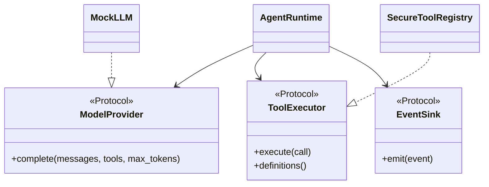
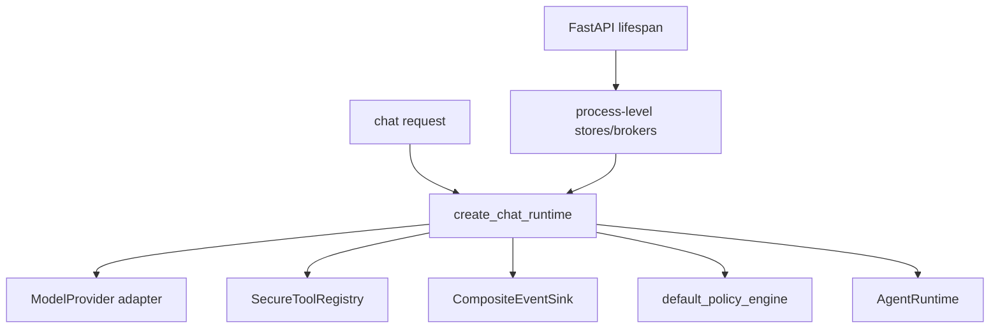

# OOP, Protocols, and dependency injection

## Beginner explanation

Object-oriented design groups behavior with the state and invariants it owns.
A Python `Protocol` states which methods a collaborator must provide without requiring inheritance.
Dependency injection (DI) supplies collaborators from outside, making control flow explicit and allowing small test doubles.

## Prerequisites and vocabulary

- **Class/object:** blueprint and one runtime instance.
- **Value object:** small value whose validated fields carry meaning, often immutable.
- **Port:** behavior required by core logic.
- **Adapter:** concrete implementation of a port for a provider, database, or transport.
- **Structural typing:** compatibility by available methods rather than shared base class.
- **Composition root:** place where concrete objects are constructed and connected.
- **Dependency inversion:** high-level policy depends on abstractions, not vendor details.
- **Test double:** fake, stub, spy, or recorder used to observe behavior.

## Problem and mental model

Core runtime logic should say “complete these typed messages” rather than “call this vendor SDK and read its global configuration.”
Protocols form sockets; adapters are plugs; the composition root chooses which valid plug powers each socket.





## Code-grounded Archon tour

- [`ModelProvider`, `ToolExecutor`, `PolicyAwareToolExecutor`, `ToolAuthorizer`, and `PreparatoryToolAuthorizer`](../../../backend/app/runtime/ports.py) are runtime ports.
- [`EventSink`](../../../backend/app/runtime/events.py) decouples execution from SSE, persistence, logging, and tracing adapters.
- [`AgentRuntime.__init__`](../../../backend/app/runtime/engine.py) receives model, tools, events, budget, clock, policy, authorizer, and recorder instead of constructing globals.
- [`Message`, `ToolCall`, `TokenUsage`, and `ModelResponse`](../../../backend/app/runtime/models.py) are frozen, slotted value objects with boundary validation.
- [`SecureToolRegistry`](../../../backend/app/tools/registry.py) satisfies `ToolExecutor`; its `policy_request` extension satisfies runtime-checkable `PolicyAwareToolExecutor`.
- [`RunContext` and `create_chat_runtime`](../../../backend/app/runtime/factory.py) form the request-scoped composition path.
- [`lifespan`](../../../backend/app/main.py) constructs process-lifetime resources that request factories consume.

Structural typing means an adapter need not inherit `ModelProvider`; type checkers accept the matching method shape.
`@runtime_checkable` is used only where `AgentRuntime` performs `isinstance` checks for optional protocol extensions.
Frozen dataclasses prevent normal field assignment, but nested mutable values still need defensive snapshots; [`AgentRuntime._snapshot_history`](../../../backend/app/runtime/engine.py) performs that deeper copy.

## Behavior-focused tests—and their limits

- [`test_adapters.py`](../../../backend/tests/unit/test_adapters.py) exercises provider adapter conversion behavior. It does not prove vendor availability or semantic answer quality.
- [`test_typed_tool_round_trip_and_events`](../../../backend/tests/unit/test_runtime_v2.py) injects scripted collaborators and proves runtime orchestration. It does not prove the production factory selected every desired adapter.
- [`test_policy_mode_requires_policy_aware_executor`](../../../backend/tests/unit/test_runtime_policy.py) proves policy mode fails closed when the optional port is absent. It does not establish correct metadata from every registered tool.
- [`test_wiring_gaps.py`](../../../backend/tests/unit/test_wiring_gaps.py) guards selected wiring expectations. It cannot detect every future misconfiguration unless assertions evolve.

## Bounded read exercise

Timebox: 15 minutes. Read `runtime/ports.py`, then trace only `create_chat_runtime` into `AgentRuntime.__init__`.
Draw a table with columns: port, injected implementation, lifetime, and failure behavior.
Optionally verify one substitution path:

```bash
cd backend
pytest -q tests/unit/test_runtime_v2.py::test_typed_tool_round_trip_and_events
```

## Security and failure modes

- A Protocol proves shape to tooling, not trustworthiness, authorization, or semantic correctness.
- Duck-typed malicious collaborators can retain references or mutate nested objects; snapshot untrusted boundary data.
- Hidden service locators and module globals obscure ownership and make tenant leakage easier.
- Mis-scoped dependencies can share request state across users or recreate expensive clients per call.
- An optional adapter silently omitted at composition can weaken behavior; Archon's live factory installs policy and fails `ASK` closed without an authorizer.
- Dependency cycles often signal confused responsibility and make shutdown ordering unsafe.

## Observability and evidence

Record adapter/provider names, configuration profile, run context, and lifecycle failures without serializing secrets.
Composition tests should assert object behavior—such as policy actually blocking execution—not only class identity.
Startup evidence includes successful store initialization and health checks; request evidence includes event ordering and stop reasons.
A mock-based unit test proves the consumer's protocol use, not the real adapter's remote contract.

## Alternatives and tradeoffs

Abstract base classes provide nominal inheritance and shared implementation, but couple adapters more tightly.
Plain callables are excellent for one-method dependencies such as clocks or result recorders.
A DI container can manage large graphs but may hide construction and lifetime; explicit constructors remain easy to audit here.
Functional cores with imperative shells minimize objects, though stateful repositories and brokers still need clear ownership.

## Lab versus production

A lab can instantiate `AgentRuntime` directly with `MockLLM`, fake tools, and `RecordingEventSink`.
Production should use the canonical factory, validate settings, manage client/pool lifetimes in `lifespan`, and test sync/SSE routes against the same control semantics.
Direct construction is useful in tests but becomes a risk if application paths bypass production wiring.

## 30-second interview answer

“Archon applies dependency inversion around a custom runtime. `AgentRuntime` depends on structural Protocols such as `ModelProvider`, `ToolExecutor`, `EventSink`, and `ToolAuthorizer`; adapters implement those behaviors without inheritance. Frozen value objects carry validated boundary data, while deeper snapshots handle nested mutation. `create_chat_runtime` is the request composition root and `lifespan` owns process resources. This improves substitutability and tests, but Protocols do not provide security or prevent wiring mistakes.”

## Self-check questions

1. **Must an adapter inherit a Protocol?** No; Python Protocols use structural typing.
2. **Why inject a clock?** Deterministic deadline tests and no hidden time dependency.
3. **What is the composition root?** The code that chooses and wires concrete collaborators.
4. **Are frozen dataclasses deeply immutable?** No; nested containers need freezing or snapshots.
5. **What does `runtime_checkable` enable?** Selected runtime `isinstance` checks of protocol shape.
6. **Can DI guarantee safe configuration?** No; canonical factories and behavior tests are still required.

## Related modules and concepts

- Module: [Python architecture](../modules/01-python-architecture/README.md).
- Concepts: [typed runtime](typed-runtime.md), [tool contracts](tool-contracts.md), [async Python](async-python.md), and [state machines](state-machines.md).
