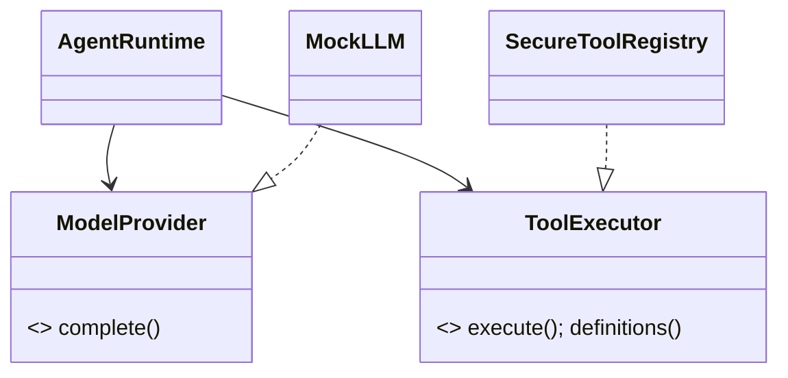

# OOP, Protocols, and dependency injection

## Mental model

Objects bundle state and behavior; immutable value objects preserve boundary facts. A Python `Protocol` describes required behavior structurally: an implementation need not inherit from it. Dependency injection (DI) gives an object its collaborators instead of constructing hidden globals.

## Why it matters

`AgentRuntime` remains provider-neutral and testable because its constructor accepts ports. `create_chat_runtime` is the request composition root; FastAPI `lifespan` builds process-level stores. Frozen, slotted dataclasses such as `Message`, `ToolCall`, and `RunContext` reduce accidental mutation, though nested values still require defensive snapshots.

## Archon anchors

[`runtime/ports.py`](../../../backend/app/runtime/ports.py), [`runtime/models.py`](../../../backend/app/runtime/models.py), [`AgentRuntime.__init__`](../../../backend/app/runtime/engine.py), [`create_chat_runtime`](../../../backend/app/runtime/factory.py), and [`lifespan`](../../../backend/app/main.py). Test structural substitutability in [`test_adapters.py`](../../../backend/tests/unit/test_adapters.py) and [`test_tools.py`](../../../backend/tests/unit/test_tools.py).

## Limits

Protocols do not enforce security, deployment topology, or semantic correctness. DI can still be misconfigured; the canonical factory matters. Runtime validation remains necessary at untrusted boundaries.
