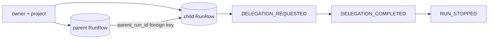
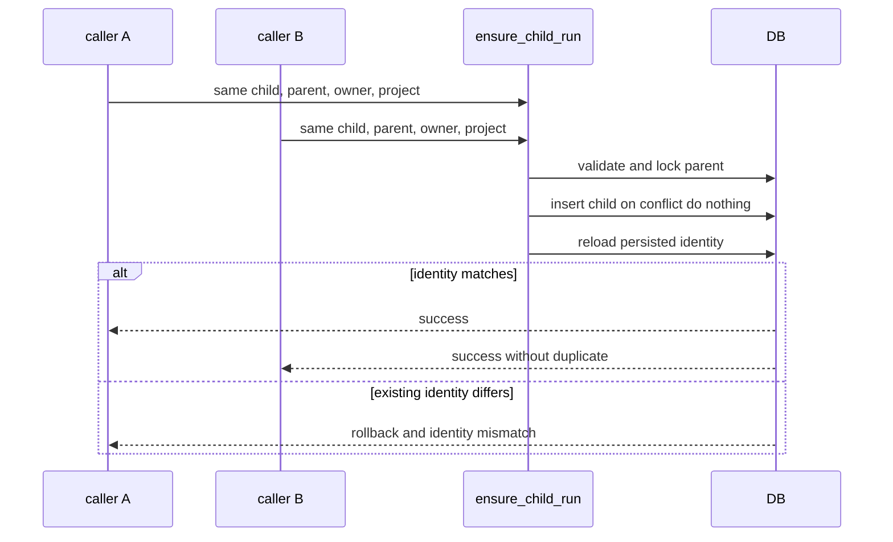

# Parent-child run lineage

> **Documentation status:** Draft
> **Concept status:** `implemented`
> **Status boundary:** A durable `parent_run_id` edge is owner/project constrained and inspectable; it is not causal proof that a child improved an answer.
> **Used by:** [Module 11](../modules/11-bounded-delegation/README.md)

## Definition

Lineage records that one run was created as a child of another run.
It answers “which bounded review belongs to this parent?”
It also supports listing a parent's direct children and reading each child's ordered events.
It does not answer whether the child's judgment was correct or improved the parent.
Learn the [Run Ledger](run-ledger.md) before treating lineage as an extension of ledger identity.

## Creation invariant

`RunRepository.ensure_child_run` accepts explicit run, parent, user, project, provider, and model values.
It locks and reads the parent before creating the child.
A missing parent raises `ValueError("parent run does not exist")`.
A different user or project raises `ValueError("parent run owner mismatch")`.
These failures happen before a child row or child event is committed.

The child row stores the same `user_id` and `project_id` as the validated parent scope.
Its `parent_run_id` points to the parent.
For this verifier use, `conversation_id` is set to the parent run ID and `correlation_id` to the child ID.
The initial child status is `running` and event sequence starts at one.
The database foreign key provides referential integrity.
Parent deletion is restricted while a child references it.

## Idempotency and collision view

PostgreSQL and SQLite use conflict-safe inserts for the child run ID.
After insertion or conflict, code reloads the persisted row.
The existing row must have the same user, project, and parent.
A same-ID collision with different identity is rejected rather than silently reused.
Repeated matching ensures are therefore idempotent.

## Reading lineage

`RunRepository.get(user_id, run_id)` owner-scopes a single run lookup.
`RunRepository.list_children(user_id, parent_run_id, limit, offset)` returns direct children.
It bounds pagination and orders newest runs first.
The list query includes user scope and the parent edge.
Callers must still ensure the parent itself is in their allowed scope when exposing a route.
Lineage traversal should never become a way to enumerate foreign parent IDs.

Child events use `RunRepository.append`.
That method allocates sequence numbers only while the owner-scoped run is still `running`.
`RUN_STOPPED` atomically transitions the terminal state and records reason, usage, iteration, and latency data.
Safe payload filtering occurs before JSON persistence.
The result is inspectable lifecycle evidence, not a transcript dump.

## Exact implementation landmarks

- [`RunRepository.ensure_child_run`](../../../backend/app/services/run_ledger.py) validates and creates the edge.
- [`RunRepository.append`](../../../backend/app/services/run_ledger.py) allocates ordered child events.
- [`RunRepository.get`](../../../backend/app/services/run_ledger.py) reads a run under user scope.
- [`RunRepository.list_children`](../../../backend/app/services/run_ledger.py) reads direct child edges.
- [`RunRow.parent_run_id`](../../../backend/app/services/db_store.py) stores the durable relationship.
- [`EvidenceVerifierSpecialist.verify`](../../../backend/app/delegation/service.py) creates the verifier child.
- [`EvidenceVerifierSpecialist._append`](../../../backend/app/delegation/service.py) records child lifecycle events.

## Tests and proof boundaries

- [`test_child_requires_exact_parent_project_and_creates_nothing_on_rejection`](../../../backend/tests/unit/test_run_lineage.py) checks owner/project identity and no partial writes.
- [`test_concurrent_child_ensures_are_idempotent_and_parent_delete_is_restricted`](../../../backend/tests/unit/test_run_lineage.py) checks races and retention integrity.
- [`test_run_parent_fk_migrates_valid_rows_and_roundtrips`](../../../backend/tests/integration/test_run_parent_migration.py) checks schema migration and round-trip behavior.
- [`test_valid_call_is_isolated_bounded_and_durable`](../../../backend/tests/unit/test_evidence_verifier.py) checks a real verifier lifecycle against the ledger abstraction.
- [`test_models_are_frozen_slotted_and_exclude_context_and_secrets`](../../../backend/tests/unit/test_delegation_contract.py) checks that lineage metadata does not imply broad child context.
- Evidence status is centralized in [implementation evidence](../../IMPLEMENTATION-EVIDENCE.md).

The tests prove association, scope, idempotency, migration, and event durability under fixtures.
They do not prove causal impact, model quality, distributed tracing completeness, or cross-region recovery.

## Security and failure analysis

Never create an edge from a caller-provided `parent_run_id` without owner and project validation.
Never reveal whether a rejected parent exists for another owner.
Reject a reused child ID when any identity field differs.
Do not delete or rewrite a parent while retained child evidence depends on it.
Avoid unbounded recursive lineage queries; the implemented listing is direct children with bounded pages.
Do not persist raw prompts or evidence merely because a child relationship exists.
A database foreign key protects referential integrity, not tenant authorization by itself.
Application scope checks remain required.

## Observability and interpretation

Useful lineage fields are parent ID, child ID, owner/project scope, provider, model, status, timestamps, event count, usage, and stop reason.
Trace and ledger IDs can be correlated, but absence from a trace does not erase the durable edge.
Count orphan-prevention failures and identity mismatches as security-relevant signals.
Measure child completion, timeout, failure, and cancellation separately.
Measure answer quality using a versioned evaluation fixture joined by explicit run identity.
Never chart “number of children” as if it were “quality gained.”

## Lab versus production

The lab supports a direct parent edge and owner-scoped direct-child listing.
Production may need deeper trees, lineage depth limits, retention holds, legal deletion workflows, and partition-aware foreign keys.
Cross-service creation would need transaction or idempotency semantics that survive retries and network partitions.
High-volume systems may need indexes for owner plus parent and archival policies for terminal children.
Any export must preserve scope and redact safe payloads.
These are deployment extensions, not properties proven by the current tests.

## Alternatives and trade-offs

A trace span link is useful for live observability but may expire or be sampled.
An event-only `parent_id` can work but makes referential integrity and direct queries harder.
Embedding child output in the parent record hides independent lifecycle and retries.
A durable database edge costs schema and retention complexity but remains queryable after transient streams disappear.
Archon uses both the edge and ordered child events for inspectable association.

## Exercise: test an attempted foreign edge

1. Create two parent runs under different project or user IDs using existing test helpers.
2. Call `ensure_child_run` with the first parent and the second scope.
3. Assert the call fails and no child row or event exists.
4. Repeat two matching ensures concurrently and assert one logical child exists.
5. Run `pytest backend/tests/unit/test_run_lineage.py backend/tests/integration/test_run_parent_migration.py -q`.
6. Explain why this proves integrity but not verifier benefit.

Expected conclusion: the database and repository preserve a scoped association; semantic causality needs separate evidence.

## 30-second answer

“Archon gives verifier children a durable `parent_run_id`. `ensure_child_run` locks and validates the parent under the same owner and project before a conflict-safe insert, then verifies any existing child has identical identity. The foreign key prevents orphaning and events record lifecycle. This proves scoped traceability and idempotency—not that the child improved the answer.”

## Self-check

1. **What does `parent_run_id` prove?** A durable association between two ledger runs.
2. **What does it not prove?** Causality, correctness, or quality improvement.
3. **Which scope fields must match?** User/owner and project.
4. **What happens on a missing or foreign parent?** Creation fails before child data is written.
5. **Why reload after a conflict-safe insert?** To verify an existing run ID has the exact expected identity.
6. **Can the parent be deleted while referenced?** The tested foreign key restricts that deletion.
7. **Are child events automatically raw transcripts?** No; safe payload filtering persists bounded lifecycle evidence.
8. **How are direct children read?** Through owner-scoped, bounded `list_children` pagination.

## Related concepts

- [Run ledger](run-ledger.md)
- [Bounded delegation](bounded-delegation.md)
- [Evidence-only verifier child](verifier-child.md)
- [Idempotency](idempotency.md)
- [Replay, fork, and compare](replay-fork-compare.md)
