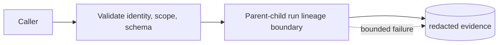
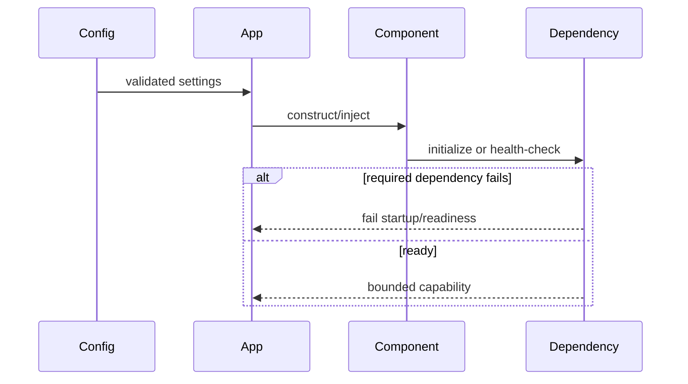
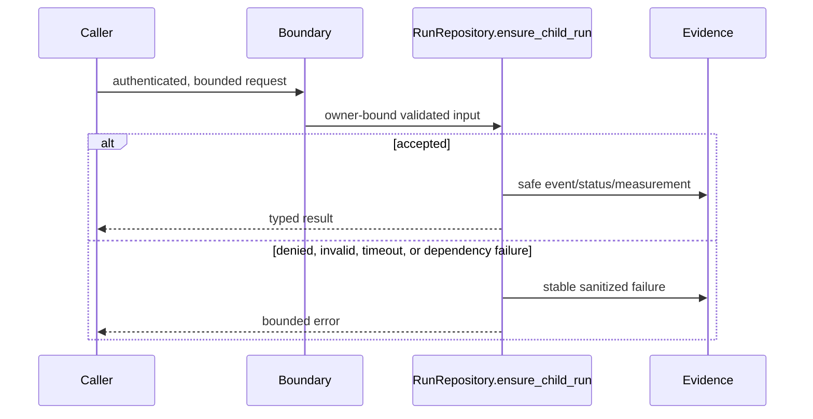
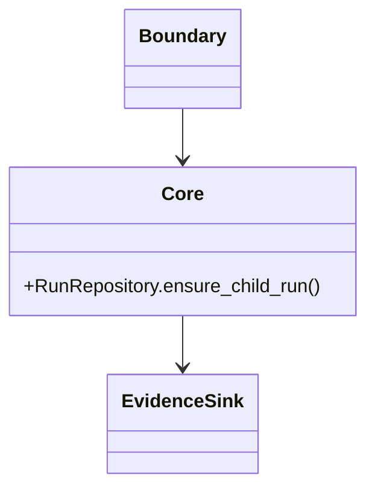
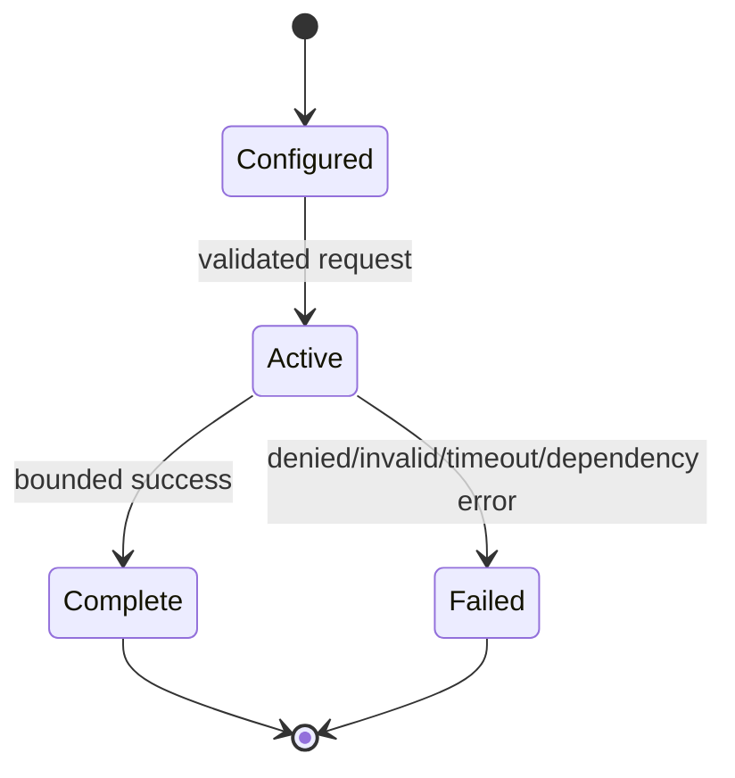

# Concept: Parent-child run lineage

> **Implementation status:** `implemented`
> **Status boundary:** Verifier child runs persist a parent_run_id and owner/project scope in the Run Ledger; lineage is evidence, not causal proof.
> **Reviewed revision:** `3577b00` (documentation review; runtime evidence links may name their own revision)
> **Used by modules:** [Module 11](../modules/11-bounded-delegation/README.md)
> **Catalog ID:** `parent-child-lineage`

## Beginner explanation

Lineage records which parent requested a child run so operators can inspect cost, status, and evidence together. **It is not:** Arbitrary execution trees and workspace inheritance are not implemented.

## Prerequisites and vocabulary

### Learn first

- [Agent anatomy](agent-anatomy.md) — separates runtime decisions from tools and evidence.
- [Policy engine](policy-engine.md) — explains fail-closed action control.
- [Run Ledger](run-ledger.md) — explains durable evidence versus transient signals.

### Vocabulary

| Term | Plain-English meaning | Related concept |
|---|---|---|
| boundary | The point where input is validated and authority is limited. | [Policy engine](policy-engine.md) |
| scope | Identity/project/resource dimensions that constrain an operation. | [Authorization and ownership](authorization-ownership.md) |
| evidence | Inspectable record supporting a specific, bounded claim. | [Run Ledger](run-ledger.md) |

## Problem and mental model

It is a family-tree edge between durable run records. The analogy stops at semantics: a database edge does not prove the child improved the answer. Inputs cross a validation boundary; outputs are bounded outcomes plus evidence. Important invariants are explicit scope, finite resources, sanitized failures, and no authority inferred from untrusted payloads.

## Architecture and components



| Component | Role | Out of scope |
|---|---|---|
| API/runtime boundary | Validates request and binds trusted context. | Trusting caller-supplied ownership. |
| `RunRepository.ensure_child_run` | Implements the central contract. | Production guarantees beyond its wired path. |
| Evidence path | Records safe status and identifiers. | Raw secrets, prompts, or chain-of-thought. |

## Startup sequence



Configuration and dependencies become authority only through application construction; user payloads cannot create deployment-owned capabilities.

## Per-request sequence



## Class and dependency view



Archon uses composition and injected dependencies; this diagram does not imply inheritance.

## State and lifecycle



Persistent state, when applicable, is owner-scoped; transient telemetry never silently becomes authorization state.

## Archon implementation and source walkthrough

### Source symbols

| Source symbol | Role | Status boundary |
|---|---|---|
| [`backend/app/services/run_ledger.py:RunRepository.ensure_child_run`](../../../backend/app/services/run_ledger.py) | Central implemented behavior. | Inspect call sites before extending the claim. |
| [`app.main:lifespan`](../../../backend/app/main.py) | Constructs application-scoped services and readiness dependencies. | Presence at startup is not public deployment. |

### Tests

| Test | Contract proved | Not proved |
|---|---|---|
| [`backend/tests/integration/test_run_parent_migration.py`](../../../backend/tests/integration/test_run_parent_migration.py) | Deterministic contract for the listed implementation. | External-provider parity, load, public deployment, or SLOs. |

### Runtime evidence

| Evidence | Claim supported | Revision/environment/limit |
|---|---|---|
| [Implementation evidence](../../IMPLEMENTATION-EVIDENCE.md) | Separates exists, wired, tested, observed, UI, and deployed. | Local/test evidence; mutable status source. |
| [Architecture diagrams](../../ARCHITECTURE-DIAGRAMS.md) | Current wider system context. | Read with the evidence matrix. |

## Try it: command or bounded exercise

### Goal

Confirm the contract without external credentials.

### Setup and safety

From repository root; `uv` and backend dependencies are required. Tests use fixtures/local dependencies and should not receive real secrets.

### Steps

```bash
cd backend
uv run pytest -q tests/integration/test_run_parent_migration.py
```

Then locate `RunRepository.ensure_child_run` in `backend/app/services/run_ledger.py` and write one sentence naming what the test proves and one sentence naming what it cannot prove.

### Done criteria

- [ ] The focused test passes and its assertion is identified.
- [ ] The result is tied to `RunRepository.ensure_child_run`, not merely to a file.
- [ ] No external credential, service, or persistent lab data was introduced.

## Security and failure modes

| Threat/failure | Control or boundary | Failure behavior | Residual risk |
|---|---|---|---|
| Malformed/unbounded input | Typed validation, schema and finite budgets | Reject or stable bounded error | New formats require new validation. |
| Dependency timeout/cancellation | Deadline and explicit cleanup path where wired | Failure is observable; no invented success | End-to-end deadlines are path-specific. |
| Cross-owner access/concurrency | Authenticated scope and atomic/idempotent storage where applicable | Owner-scoped miss/denial or guarded update | Audit all new queries and side effects. |
| Secret/PII leakage | Redaction before operational persistence/log rendering | Sanitized metadata, not raw exception text | Redaction is defense-in-depth, not certification. |
| Resource exhaustion | Count/byte/time limits and rate limits | Fail closed or stop with evidence | Local measurements do not establish capacity. |

## Observability and evidence path

```text
authenticated input → scoped decision/state → redacted runtime event → Run Ledger/log → metric/trace/UI → evaluation
```

Use correlation ID and run ID, stable reason codes, counters and spans. Never log raw credentials, provider exceptions, hidden reasoning, or tool payloads merely to make debugging easier.

## Alternatives and trade-offs

| Alternative | Benefit | Cost/risk | Decision |
|---|---|---|---|
| Implicit/unbounded behavior | Less setup | Authority and failures become unauditable | Rejected. |
| Deterministic local contract tests | Fast and reproducible | Cannot establish provider or production behavior | Used for contract proof. |
| Managed production service | Scale/operations features | Cost, external trust and deployment work | Deferred unless directly evidenced. |

## Lab vs production

| Dimension | Demonstrated | Unverified, partial, or deferred |
|---|---|---|
| Wiring | Real repository path invokes the listed symbol. | Every historical/alternate path and future change. |
| Testing/observation | Focused automated test and linked local evidence. | External providers, sustained traffic, multi-host scale. |
| Security | Scope, validation, bounded failures and redaction. | Independent audit, rotation program and threat-model signoff. |
| Operations | Reproducible local target where relevant. | Public deployment, hosted SLOs and on-call operation. |

Status is **implemented** within the stated boundary. Local Compose is not deployment; one verifier child is not a swarm; runtime feedback is not generic self-reflection.

## Interview answer

### 30-second answer

> Lineage records which parent requested a child run so operators can inspect cost, status, and evidence together. In Archon the boundary is `RunRepository.ensure_child_run`; `backend/tests/integration/test_run_parent_migration.py` exercises its contract. The honest limit is: Verifier child runs persist a parent_run_id and owner/project scope in the Run Ledger; lineage is evidence, not causal proof.

### Follow-up prompts

- Why is this boundary safer than trusting caller/model output?
- Which identifier or budget prevents authority from expanding?
- What failure is recorded and where?
- What would need direct evidence before claiming production readiness?

## Self-check

1. Define Parent-child run lineage without naming an Archon class.
2. What nearby concept must not be conflated with it?
3. Trace configuration and one request through the diagram.
4. Which symbol and test provide the strongest contract evidence?
5. How are malformed input, ownership, secrets, and exhaustion handled?
6. What is demonstrated locally and what remains unverified?

<details>
<summary>Answer guide</summary>

1. Lineage records which parent requested a child run so operators can inspect cost, status, and evidence together.
2. Arbitrary execution trees and workspace inheritance are not implemented.
3. Settings construct the component; authenticated scoped input is validated; success or a stable failure emits safe evidence.
4. `backend/app/services/run_ledger.py:RunRepository.ensure_child_run` and `backend/tests/integration/test_run_parent_migration.py`.
5. Typed bounds, owner scope, redaction, deadlines/rate limits, and fail-closed errors; new paths still need review.
6. The source/test/local evidence establish the stated boundary, not public deployment, provider parity, scale, or an SLO.

</details>

## Related concepts and modules

- **Prerequisites:** [Policy engine](policy-engine.md), [Run Ledger](run-ledger.md)
- **Module:** [Module 11](../modules/11-bounded-delegation/README.md)
- **Evidence:** [Implementation evidence](../../IMPLEMENTATION-EVIDENCE.md)
