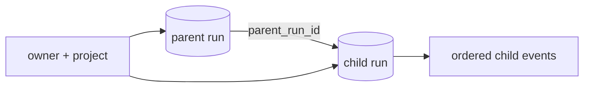

# Parent-child run lineage

> **Documentation status:** Draft
> **Concept status:** `implemented`
> **Status boundary:** A durable `parent_run_id` edge is owner/project constrained and inspectable; it is not causal proof that a child improved an answer.
> **Used by:** [Module 11](../modules/11-bounded-delegation/README.md)

## Definition

Lineage records that one run was created as a child of another. It answers “which bounded review belongs to this parent?” without inferring why an output improved. Learn the [Run Ledger](run-ledger.md) first.

## Persistence invariant

`RunRepository.ensure_child_run` looks up the parent under the same user and project before creating the child. The database foreign key preserves referential integrity, parent deletion is restricted, and repeated child creation is idempotent. A rejected foreign/missing parent creates neither a child nor an event.

## Source and proof

- [`RunRepository.ensure_child_run`](../../../backend/app/services/run_ledger.py) enforces the scoped edge.
- [`RunRow.parent_run_id`](../../../backend/app/services/db_store.py) stores it.
- [`test_child_requires_exact_parent_project_and_creates_nothing_on_rejection`](../../../backend/tests/unit/test_run_lineage.py) checks scope and no partial writes.
- [`test_concurrent_child_ensures_are_idempotent_and_parent_delete_is_restricted`](../../../backend/tests/unit/test_run_lineage.py) checks races and retention.
- [`test_run_parent_fk_migrates_valid_rows_and_roundtrips`](../../../backend/tests/integration/test_run_parent_migration.py) checks schema migration.
- Evidence status is centralized in [implementation evidence](../../IMPLEMENTATION-EVIDENCE.md).

## Failure and interpretation

Never accept `parent_run_id` without owner/project validation. Do not expose a foreign parent’s existence through distinguishable errors. A lineage edge proves association in this ledger revision; it does not prove process isolation, reviewer truth, or benefit. Benefit requires a separate versioned comparison.

## Interview answer

“Child runs carry a database-backed parent edge and the same owner/project scope. Creation fails before writing when the parent is missing or foreign. That gives durable traceability, while quality remains a separately measured claim.”
