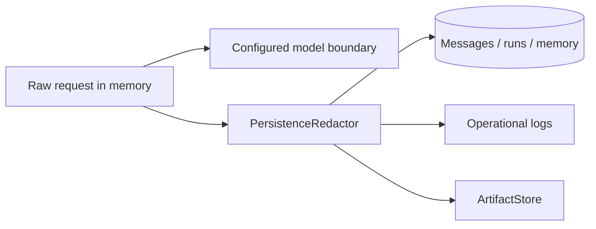
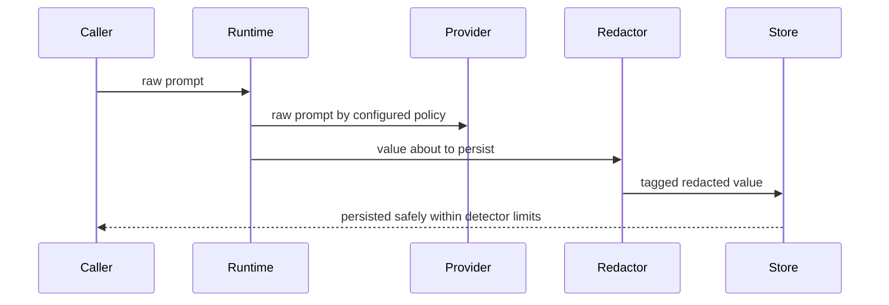

# PII redaction and data boundaries

> **Implementation status:** `implemented`
> **Status boundary:** Supported message, run-event, memory, artifact, audit, and log persistence paths redact detected PII before storage; this is not a claim that detection is exhaustive or that provider-bound prompts are redacted.
> **Reviewed revision:** `6e3e13f`
> **Used by module:** [Module 06-context-and-memory](../modules/06-context-and-memory/README.md)
> **Catalog ID:** `pii-redaction-data-boundaries`

## Beginner explanation

A data boundary is the point where information changes trust or retention scope. Persistence redaction replaces recognized personal data before bytes are written, while allowing the current model request to use the original prompt. Encryption and redaction solve different problems: encrypted PII is still PII after decryption.

## Problem and mental model

Treat the boundary as a contract with explicit inputs, outputs, state, failure behavior, and evidence. The important question is not whether a similarly named class or file exists, but whether the behavior is wired into a real path and whether a test or observation proves it.

## Architecture and components

## Startup and request sequence

## Archon implementation and source walkthrough

At revision `6e3e13f`, the mapped symbols implement the bounded behavior below. Regex/optional NER can miss identifiers; provider transmission, backups, and every future sink need separate review.

### Source symbols

| Source symbol | Role and boundary |
|---|---|
| [`backend/app/security/persistence_redactor.py:PersistenceRedactor`](../../../backend/app/security/persistence_redactor.py) | Recursively redacts strings and mapping keys before persistence. |
| [`backend/app/memory/scoped.py:ScopedEncryptedMemoryRepository.add`](../../../backend/app/memory/scoped.py) | Redacts content/provenance before encryption and database write. |
| [`backend/app/observability/runtime_events.py:DurableEventSink.emit`](../../../backend/app/observability/runtime_events.py) | Redacts event payloads before persistence. |

### Tests

| Test | Contract proved and limit |
|---|---|
| [`backend/tests/integration/test_pii_resilience_live.py::test_sync_and_sse_redact_user_assistant_and_artifact_persistence`](../../../backend/tests/integration/test_pii_resilience_live.py) | Checks raw SQLite text excludes user/assistant secrets across live sync and SSE paths. |
| [`backend/tests/security/test_persistence_redaction.py::test_scoped_memory_redacts_content_and_provenance_before_encryption`](../../../backend/tests/security/test_persistence_redaction.py) | Checks redaction precedes encrypted memory persistence. |

### Evidence boundary

Current implementation dimensions are centralized in [Implementation Evidence](../../IMPLEMENTATION-EVIDENCE.md). Source/tests below are repository evidence; they are not public-deployment or production-certification evidence.

## Try it: bounded study exercise

From the repository root, inspect the mapped source and test, then run the named focused test with the project test environment if available. Confirm both the passing contract and this gap: Regex/optional NER can miss identifiers; provider transmission, backups, and every future sink need separate review.

**Done criteria:** identify the trust boundary, one proved behavior, and one unproved behavior without changing repository state.

## Risks, failures, and trade-offs

| Topic | Assessment |
|---|---|
| Principal risk | False negatives retain PII; false positives destroy useful information. |
| Current gap/failure | Regex/optional NER can miss identifiers; provider transmission, backups, and every future sink need separate review. |
| Trade-off | Redact at persistence to preserve model utility, while accepting that provider disclosure requires a separate policy. |
| Evidence hygiene | Do not log secrets or hidden chain-of-thought; record revision, environment, command, and only redacted outcomes. |

## Lab vs production

The status remains **implemented** at `6e3e13f`. Supported message, run-event, memory, artifact, audit, and log persistence paths redact detected PII before storage; this is not a claim that detection is exhaustive or that provider-bound prompts are redacted. Unit tests, manifests, or local observations do not prove external-provider parity, sustained load, public deployment, legal compliance, or a production SLO.

## Interview answer

> A data boundary is the point where information changes trust or retention scope. Persistence redaction replaces recognized personal data before bytes are written, while allowing the current model request to use the original prompt. Encryption and redaction solve different problems: encrypted PII is still PII after decryption. In Archon the honest status is **implemented**: Supported message, run-event, memory, artifact, audit, and log persistence paths redact detected PII before storage; this is not a claim that detection is exhaustive or that provider-bound prompts are redacted.

## Self-check

1. What problem does this concept solve, and what nearby concept is it not?
2. Trace the diagram’s trust boundary and failure path.
3. Which mapped symbol/test proves current behavior, or why are the lists empty?
4. What exact gap prevents a stronger status?
5. Which risk would you test first before production use?

Answer guide

A good answer names the contract in the beginner explanation, follows the sequence, cites the exact table entry (or the explicit absence), repeats the status boundary, and chooses a risk from the table rather than claiming unrecorded behavior.

## Related concepts and modules

- **Module:** [Module 06-context-and-memory](../modules/06-context-and-memory/README.md)
- **Course-day map:** [AIAMastery Days 1–30 coverage](../course-concept-coverage.md)
- **Evidence:** [Implementation Evidence](../../IMPLEMENTATION-EVIDENCE.md)
- **Historical context only:** [Feature and Course Audit v2](../../FEATURE-AND-COURSE-AUDIT-V2.md)
