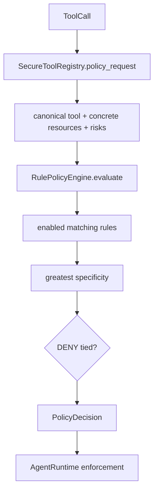
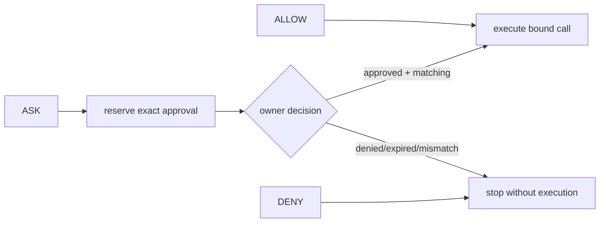

# Policy engine

## Beginner explanation

A policy engine answers a narrow question: given a canonical tool, concrete resources, and declared risks, should the runtime `ALLOW`, `ASK`, or `DENY`?
It is deterministic code, not an LLM judgment.
It neither executes the tool nor collects the human response; those are separate responsibilities.

## Prerequisites and vocabulary

- **Policy request:** normalized facts about a proposed call.
- **Rule:** action plus resource patterns, risk constraints, ID, description, and enabled flag.
- **Resource:** canonical tool identity plus optional concrete path or host.
- **Risk class:** `READ`, `WRITE`, `EXECUTE`, `NETWORK`, `SECRET`, or `EXTERNAL_SIDE_EFFECT`.
- **Specificity:** tuple favoring exact resources, longer literals, and explicit risk constraints.
- **Default/fallback:** behavior when no rule matches.
- **TOCTOU:** resource changes between authorization check and use.
- **Fail closed:** metadata or engine failure denies rather than bypassing controls.

## Problem and mental model

Keep proposal, classification, human consent, and execution as separate gates.
Policy is a pure decision table over trusted canonical facts; the runtime enforces its answer and verifies that the facts cannot change before dispatch.





## Code-grounded Archon semantics

[`PolicyAction`, `RiskClass`, `ResourceKind`, `ResourcePattern`, `PolicyRule`, `PolicyRequest`, and `PolicyDecision`](../../../backend/app/security/policy.py) define the policy domain.
[`canonical_tool_name`](../../../backend/app/security/policy.py) normalizes concrete tool identity; host/path helpers reject ambiguous wildcard forms in requests.
[`RulePolicyEngine.evaluate`](../../../backend/app/security/policy.py) rejects empty risk classification, matches every rule resource, applies risk semantics, and selects greatest specificity.
For tied best rules, a `DENY` wins; among remaining ties, the later rule wins deterministically.
A `DENY` risk rule matches any overlapping request risk; `ALLOW`/`ASK` risk constraints require the request risks to be a subset.
If no rule matches, a legacy approval hint produces `ASK`; unmatched side effects are denied; pure reads use `default_action`.
[`SecureToolRegistry.policy_request`](../../../backend/app/tools/registry.py) validates arguments and resolves concrete resources; missing risks or resolver errors raise `PolicyMetadataError`.
[`AgentRuntime._enforce_policy`](../../../backend/app/runtime/engine.py) verifies name/hash binding, decision type and risk binding, emits evidence, and blocks execution on failure.
[`default_policy_engine`](../../../backend/app/security/default_policy.py) supplies the live profile used by [`create_chat_runtime`](../../../backend/app/runtime/factory.py).

## Behavior-focused tests—and their limits

- [`test_policy_engine.py`](../../../backend/tests/security/test_policy_engine.py) covers canonicalization, matching, specificity, tie behavior, and fallbacks. It does not prove live registration metadata describes every real effect.
- [`test_default_policy_is_explicit_and_fail_closed`](../../../backend/tests/unit/test_runtime_policy.py) checks selected live defaults. It does not prove deployment configuration cannot bypass the canonical factory.
- [`test_metadata_error_fails_closed_without_leaking_exception`](../../../backend/tests/unit/test_runtime_policy.py) proves resolver/metadata failure blocks a fake executor and sanitizes events. It does not prove handler-level containment.
- [`test_policy_batch_allowed_then_denied_executes_none`](../../../backend/tests/unit/test_runtime_policy.py) proves a mixed provider batch is preauthorized before dispatch. It does not make separate runs atomic.
- [`test_policy_decision_is_bound_before_policy_event_mutation`](../../../backend/tests/unit/test_runtime_policy.py) tests hostile mutation isolation. It does not replace code review of every callback boundary.

## Bounded executable exercise

Timebox: 15 minutes. Run one engine file and one runtime case:

```bash
cd backend
pytest -q \
  tests/security/test_policy_engine.py \
  tests/unit/test_runtime_policy.py::test_policy_batch_allowed_then_denied_executes_none
```

For one matching rule, calculate its `(exact, literal_length, risk_constrained)` specificity and explain the fallback if it is disabled.

## Security and failure modes

- Tool descriptions and model intent are untrusted; only registered metadata creates policy facts.
- Lexical path normalization is not filesystem containment. `resolve_workspace_path` documents that the handler must recheck after symlink resolution immediately before access.
- DNS, symlinks, credentials, and remote state can change after policy evaluation: classic TOCTOU.
- Empty risks, unknown tools, resolver exceptions, invalid decisions, or risk-binding mismatch fail closed.
- Broad wildcard `ALLOW` rules can shadow intended protection unless more specific denies are designed and tested.
- Approval resolves only `ASK`; it must never convert `DENY` to permission.

## Observability and evidence

`POLICY_DECIDED` carries action, sanitized reason code, risk classes, argument digest, and optionally a safe matched rule ID.
`TOOL_DENIED` and terminal `StopReason.POLICY_DENIED` establish enforcement outcome.
Monitor actions by tool/risk/rule, fallback rate, metadata failures, approval rate, and denied execution count.
Evidence should show event order and zero handler calls after denial; raw arguments and outputs should not enter policy events.

## Alternatives and tradeoffs

Hard-coded `if` statements are simple for tiny surfaces but become difficult to audit and compare.
External policy systems such as OPA centralize languages and administration but add network/cache consistency and deployment failure modes.
Capability tokens move authorization into signed grants but require issuance, scope, expiry, and revocation design.
Archon's pure in-process rules are fast and testable; changing them requires application configuration/deployment discipline.

## Lab versus production

A lab can evaluate immutable rules against synthetic path/host requests.
Production needs reviewed policy profiles, exact resource resolvers, owner authorization, default-deny side effects, safe reload/version evidence, handler containment, and adversarial canonicalization tests.
A green policy unit suite does not prove an unregistered effect inside a handler is governed.

## 30-second interview answer

“Archon's `RulePolicyEngine` is a pure deterministic classifier over canonical tool identity, concrete resources, and non-empty risk classes. Matching rules are ranked by specificity, tied denies win, unmatched side effects deny, and reads use the configured default. `SecureToolRegistry.policy_request` derives facts, while `AgentRuntime._enforce_policy` binds the decision to the original call and fails closed. `ASK` invokes exact approval; it never overrides `DENY`. Lexical policy matching still requires execution-time containment checks.”

## Self-check questions

1. **What are the three actions?** `ALLOW`, `ASK`, and `DENY`.
2. **Who executes a policy decision?** The runtime; the engine only classifies.
3. **What wins an equally specific tie?** A tied `DENY`; otherwise the later tied rule.
4. **What happens with empty risks?** The request is denied by safety fallback.
5. **Does canonical path text prove containment?** No; handlers must recheck mutable filesystem state.
6. **Can human approval override `DENY`?** No; approval is only for `ASK`.

## Related modules and concepts

- Module: [Policy and approvals](../modules/05-policy-and-approvals/README.md).
- Concepts: [durable approvals](durable-approvals.md), [tool contracts](tool-contracts.md), [authorization and ownership](authorization-ownership.md), and [state machines](state-machines.md).
