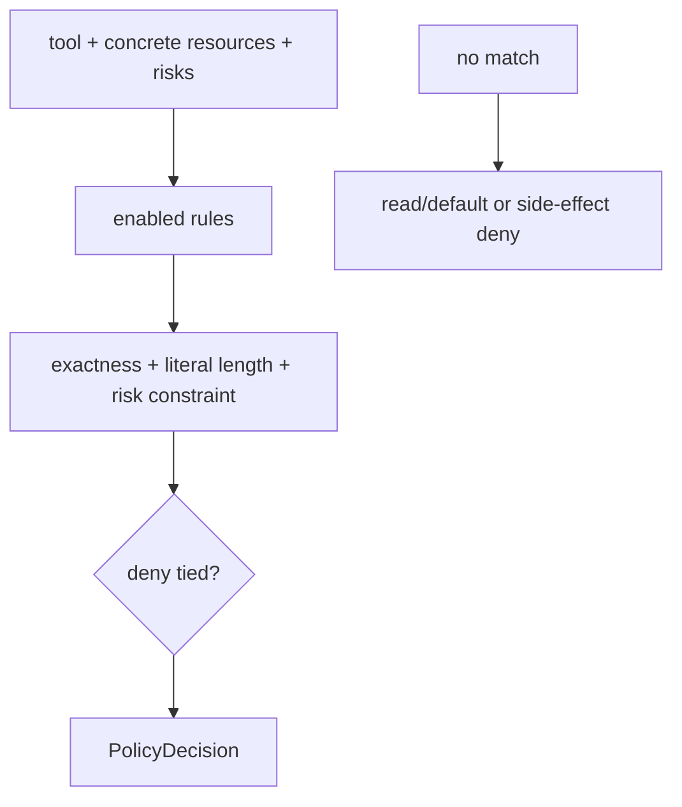

# Policy engine

## Definition

A policy engine deterministically maps a canonical request to `ALLOW`, `ASK`, or `DENY`. It classifies authorization; it does not execute tools or collect human decisions.

## Archon semantics

`RulePolicyEngine.evaluate` matches every rule resource, applies risk rules, selects greatest specificity, and lets a tied DENY win. Empty risks are denied. Unmatched side effects are denied; a legacy approval marker becomes ASK; pure read uses the configured default. Live defaults explicitly allow reads and exact `web_search` network access, ask for side effects, and otherwise deny.

Sources: [`security/policy.py`](../../../backend/app/security/policy.py), [`security/default_policy.py`](../../../backend/app/security/default_policy.py), and registry [`policy_request`](../../../backend/app/tools/registry.py). Tests: [`test_policy_engine.py`](../../../backend/tests/security/test_policy_engine.py) and [`test_runtime_policy.py`](../../../backend/tests/unit/test_runtime_policy.py).

## Limits

Path matching is lexical—not containment—and mutable filesystem/network state creates TOCTOU risk. Policy metadata failures must fail closed. Approval cannot turn a DENY into permission; it only resolves ASK.
