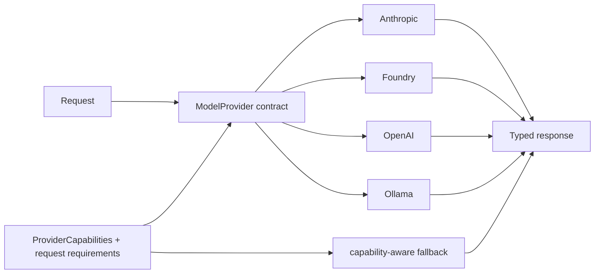
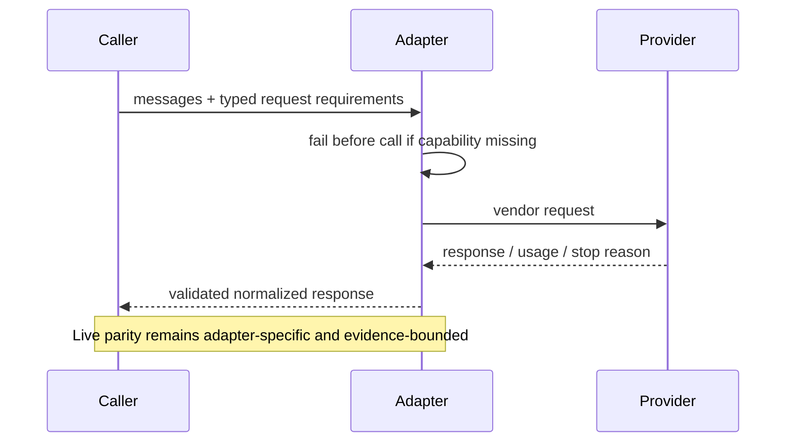

# Provider adapters and capability parity

> **Implementation status:** `partial`
> **Status boundary:** Archon declares capabilities, automatically enforces native tools/images/JSON requirements, validates structured terminal output locally, and preserves typed contracts through fallback. OpenAI and Ollama have typed adapters, but model/endpoint-dependent capabilities are conservatively disabled unless explicitly configured. Full parity remains partial because cache billing semantics and cross-provider behavior are not live-verified.
> **Reviewed revision:** current S8 provider-contract branch
> **Used by module:** [Module 02-typed-runtime](../modules/02-typed-runtime/README.md)
> **Catalog ID:** `provider-adapters-capability-parity`

## Beginner explanation

A provider adapter translates Archon’s model request into one vendor’s API and translates the reply back. Capability parity means changing providers does not silently remove a feature. A shared method name alone is not parity: a text-only fallback cannot safely replace a request that requires typed tools.

## Problem and mental model

Treat the boundary as a contract with explicit inputs, outputs, state, failure behavior, and evidence. The important question is not whether a similarly named class or file exists, but whether the behavior is wired into a real path and whether a test or observation proves it.

## Architecture and components

## Startup and request sequence

## Archon implementation and source walkthrough

The mapped symbols implement explicit `ProviderCapabilities`, immutable `ResponseContract`, runtime fail-before-call for images/JSON/explicit requirements, local terminal validation, normalized stop reasons, and capability-aware typed fallback. OpenAI-compatible endpoints vary, so their tool, image, JSON, schema, and cache-usage settings default to false. Ollama similarly requires opt-ins through `ARCHON_OLLAMA_NATIVE_TOOLS_ENABLED`, `ARCHON_OLLAMA_JSON_MODE_ENABLED`, and `ARCHON_OLLAMA_JSON_SCHEMA_ENABLED`; images are enabled only by a nonblank `ARCHON_OLLAMA_VISION_MODEL`. Ollama performs no model discovery or silent vision fallback. Requests combining images with native tools require the separate `ARCHON_OLLAMA_VISION_NATIVE_TOOLS_ENABLED=true` opt-in; support is never inferred from text-model tool support. JSON Schema opt-in also enables JSON mode. These are unit-tested contracts, not claims of live model compatibility.

### Source symbols

| Source symbol | Role and boundary |
|---|---|
| [`backend/app/runtime/capabilities.py:ProviderCapabilities`](../../../backend/app/runtime/capabilities.py) | Explicit capability declaration and missing-capability calculation. |
| [`backend/app/runtime/structured_output.py:ResponseContract`](../../../backend/app/runtime/structured_output.py) | Strict JSON parsing plus mandatory local validation. |
| [`backend/app/runtime/engine.py:AgentRuntime.run`](../../../backend/app/runtime/engine.py) | Request requirement enforcement and terminal stop normalization. |
| [`backend/app/agents/fallback_chain.py:FallbackLLMChain.complete`](../../../backend/app/agents/fallback_chain.py) | Selects one compatible typed candidate and preserves response metadata. |
| [`backend/app/agents/llm_factory.py:create_llm_client`](../../../backend/app/agents/llm_factory.py) | Selects configured adapters and fallback order. |
| [`backend/app/agents/ollama_adapter.py:OllamaAdapter`](../../../backend/app/agents/ollama_adapter.py) | Typed `/api/chat` conversion, strict response parsing, explicit vision selection, and legacy chat compatibility. |

### Tests

| Test | Contract proved and limit |
|---|---|
| [`backend/tests/unit/test_provider_capabilities.py`](../../../backend/tests/unit/test_provider_capabilities.py) | Capability declarations, strict values, wrappers, and usage semantics. |
| [`backend/tests/unit/test_runtime_provider_contracts.py`](../../../backend/tests/unit/test_runtime_provider_contracts.py) | Fail-before-call, structured validation, cache propagation, and stop reasons. |
| [`backend/tests/unit/test_fallback_wire.py`](../../../backend/tests/unit/test_fallback_wire.py) | One-candidate requirement matching, typed exhaustion, metadata preservation, and legacy compatibility. |
| [`backend/tests/unit/test_ollama_typed_adapter.py`](../../../backend/tests/unit/test_ollama_typed_adapter.py) | Ollama tools/history, images, schema format, usage, validation, capabilities, factory wiring, and legacy mutation safety. |

### Evidence boundary

Current implementation dimensions are centralized in [Implementation Evidence](../../IMPLEMENTATION-EVIDENCE.md). Source/tests below are repository evidence; they are not public-deployment or production-certification evidence.

## Try it: bounded study exercise

From the repository root, inspect the mapped source and run the focused tests. Confirm both the passing contract and the remaining gap: typed negotiation/fallback and hardened OpenAI and Ollama boundaries exist, while live cache-accounting verification and live cross-provider evidence remain incomplete.

**Done criteria:** identify the trust boundary, one proved behavior, and one unproved behavior without changing repository state.

## Risks, failures, and trade-offs

| Topic | Assessment |
|---|---|
| Principal risk | Silent capability loss can turn a safe typed-tool workflow into unstructured text. |
| Current gap/failure | OpenAI features depend on the configured endpoint; Ollama tools, vision, and JSON behavior depend on the installed version/model; complete cache pricing and real cross-provider acceptance remain unproved. |
| Trade-off | One lowest-common-denominator contract is simple but wastes provider features; capability negotiation is safer but adds branching and tests. |
| Evidence hygiene | Do not log secrets or hidden chain-of-thought; record revision, environment, command, and only redacted outcomes. |

## Lab vs production

The status remains **partial**. Typed capability negotiation, local structured validation, stop normalization, fallback contract preservation, and strict OpenAI/Ollama response validation are implemented and unit-tested. Model/endpoint-dependent features remain opt-in; unit tests do not prove live external-provider parity, cache billing semantics, sustained load, public deployment, legal compliance, or a production SLO.

## Interview answer

> A provider adapter translates Archon’s typed request into one vendor API and translates the reply back. Capability parity means changing providers cannot silently remove required tools, images, or structured output. Archon declares and enforces capabilities and preserves typed contracts through fallback. OpenAI and Ollama model-dependent capabilities are explicit opt-ins, and parity remains **partial** because endpoint compatibility, cache accounting, and live cross-provider evidence are incomplete.

## Self-check

1. What problem does this concept solve, and what nearby concept is it not?
2. Trace the diagram’s trust boundary and failure path.
3. Which mapped symbol/test proves current behavior, or why are the lists empty?
4. What exact gap prevents a stronger status?
5. Which risk would you test first before production use?

Answer guide

A good answer names the contract in the beginner explanation, follows the sequence, cites the exact table entry (or the explicit absence), repeats the status boundary, and chooses a risk from the table rather than claiming unrecorded behavior.

## Related concepts and modules

- **Module:** [Module 02-typed-runtime](../modules/02-typed-runtime/README.md)
- **Course-day map:** [AIAMastery Days 1–30 coverage](../course-concept-coverage.md)
- **Evidence:** [Implementation Evidence](../../IMPLEMENTATION-EVIDENCE.md)
- **Historical context only:** [Feature and Course Audit v2](../../FEATURE-AND-COURSE-AUDIT-V2.md)
