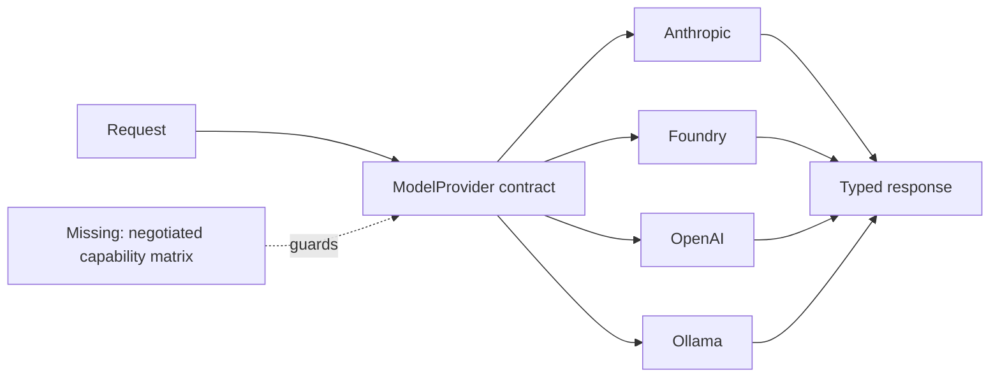
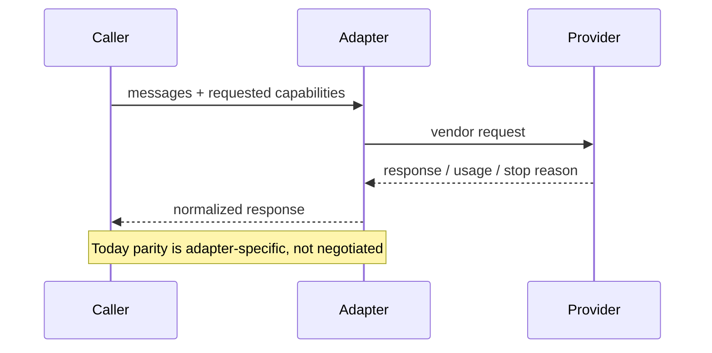

# Provider adapters and capability parity

> **Implementation status:** `partial`
> **Status boundary:** Archon has several live adapters behind model interfaces, but it does not negotiate or preserve tools, images, structured output, usage, caching, and stop semantics uniformly across every provider and fallback.
> **Reviewed revision:** `6e3e13f`
> **Used by module:** [Module 02-typed-runtime](../modules/02-typed-runtime/README.md)
> **Catalog ID:** `provider-adapters-capability-parity`

## Beginner explanation

A provider adapter translates Archon’s model request into one vendor’s API and translates the reply back. Capability parity means changing providers does not silently remove a feature. A shared method name alone is not parity: a text-only fallback cannot safely replace a request that requires typed tools.

## Problem and mental model

Treat the boundary as a contract with explicit inputs, outputs, state, failure behavior, and evidence. The important question is not whether a similarly named class or file exists, but whether the behavior is wired into a real path and whether a test or observation proves it.

## Architecture and components

## Startup and request sequence

## Archon implementation and source walkthrough

At revision `6e3e13f`, the mapped symbols implement the bounded behavior below. No explicit capability matrix or fail-fast negotiation; legacy fallback can degrade semantics.

### Source symbols

| Source symbol | Role and boundary |
|---|---|
| [`backend/app/runtime/ports.py:ModelProvider`](../../../backend/app/runtime/ports.py) | Typed runtime-facing contract. |
| [`backend/app/agents/llm_factory.py:create_llm_client`](../../../backend/app/agents/llm_factory.py) | Selects configured adapters and legacy fallback. |

### Tests

| Test | Contract proved and limit |
|---|---|
| [`backend/tests/unit/test_adapters.py::TestAdapterProtocolCompliance`](../../../backend/tests/unit/test_adapters.py) | Adapters satisfy the declared protocol and deterministic transports parse representative replies. |
| [`backend/tests/unit/test_fallback_wire.py::test_factory_returns_fallback_chain_with_fallbacks`](../../../backend/tests/unit/test_fallback_wire.py) | Factory fallback wiring exists. |

### Evidence boundary

Current implementation dimensions are centralized in [Implementation Evidence](../../IMPLEMENTATION-EVIDENCE.md). Source/tests below are repository evidence; they are not public-deployment or production-certification evidence.

## Try it: bounded study exercise

From the repository root, inspect the mapped source and test, then run the named focused test with the project test environment if available. Confirm both the passing contract and this gap: No explicit capability matrix or fail-fast negotiation; legacy fallback can degrade semantics.

**Done criteria:** identify the trust boundary, one proved behavior, and one unproved behavior without changing repository state.

## Risks, failures, and trade-offs

| Topic | Assessment |
|---|---|
| Principal risk | Silent capability loss can turn a safe typed-tool workflow into unstructured text. |
| Current gap/failure | No explicit capability matrix or fail-fast negotiation; legacy fallback can degrade semantics. |
| Trade-off | One lowest-common-denominator contract is simple but wastes provider features; capability negotiation is safer but adds branching and tests. |
| Evidence hygiene | Do not log secrets or hidden chain-of-thought; record revision, environment, command, and only redacted outcomes. |

## Lab vs production

The status remains **partial** at `6e3e13f`. Archon has several live adapters behind model interfaces, but it does not negotiate or preserve tools, images, structured output, usage, caching, and stop semantics uniformly across every provider and fallback. Unit tests, manifests, or local observations do not prove external-provider parity, sustained load, public deployment, legal compliance, or a production SLO.

## Interview answer

> A provider adapter translates Archon’s model request into one vendor’s API and translates the reply back. Capability parity means changing providers does not silently remove a feature. A shared method name alone is not parity: a text-only fallback cannot safely replace a request that requires typed tools. In Archon the honest status is **partial**: Archon has several live adapters behind model interfaces, but it does not negotiate or preserve tools, images, structured output, usage, caching, and stop semantics uniformly across every provider and fallback.

## Self-check

1. What problem does this concept solve, and what nearby concept is it not?
2. Trace the diagram’s trust boundary and failure path.
3. Which mapped symbol/test proves current behavior, or why are the lists empty?
4. What exact gap prevents a stronger status?
5. Which risk would you test first before production use?

Answer guide

A good answer names the contract in the beginner explanation, follows the sequence, cites the exact table entry (or the explicit absence), repeats the status boundary, and chooses a risk from the table rather than claiming unrecorded behavior.

## Related concepts and modules

- **Module:** [Module 02-typed-runtime](../modules/02-typed-runtime/README.md)
- **Course-day map:** [AIAMastery Days 1–30 coverage](../course-concept-coverage.md)
- **Evidence:** [Implementation Evidence](../../IMPLEMENTATION-EVIDENCE.md)
- **Historical context only:** [Feature and Course Audit v2](../../FEATURE-AND-COURSE-AUDIT-V2.md)
