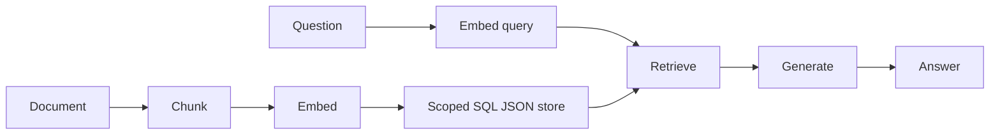
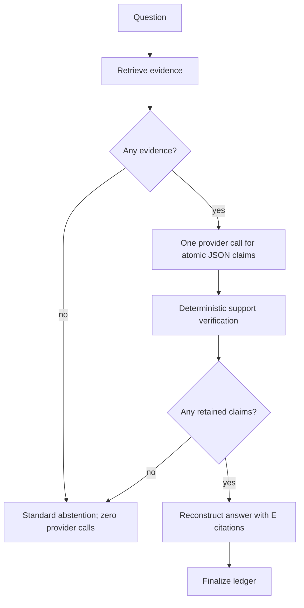

# Retrieval-augmented generation (RAG)

**Status:** implemented local workflow; external quality partial

## Beginner definition

Retrieval-augmented generation first finds evidence and then asks a model to answer with that evidence available.
It separates knowledge selection from language generation.
Basic RAG can still hallucinate because placing text in a prompt does not force the model to use it correctly.
Grounded RAG adds claim-level checks, evidence identities, and an abstention path.

## Vocabulary

- **Ingestion:** chunking, embedding, and storing documents before queries.
- **Retrieval:** selecting candidate chunks for a question.
- **Context:** evidence supplied to the generator for this run.
- **Generation:** producing answer text from question and context.
- **Atomic claim:** one independently checkable factual statement.
- **Abstention:** declining to answer when support is unavailable.
- **Evidence ID:** a run-local label such as `E1` tied to a retrieved chunk.
- **Run ledger:** durable events describing workflow progress without raw evidence text.
- **Grounded workflow:** retrieval, structured synthesis, verification, filtering, and reconstruction.

## Mental model

RAG is an open-book exam.
Retrieval chooses the pages placed on the desk.
Generation writes the response.
Verification checks whether each factual line can be traced to those pages.
The exam can still be wrong if the book is wrong, and it can still be unhelpful if it answers a different question.

## Two Archon paths

`backend/app/services/rag_pipeline.py::RAGPipeline` is the simpler teaching path.
`RAGPipeline.ingest_document` chunks with 500 characters and 50 characters of overlap.
It embeds every chunk and stores them through `VectorStoreProtocol.add_chunks`.
`RAGPipeline.query` embeds the question and calls the scoped vector search.
It renders retrieved text into `RAG_SYSTEM_PROMPT` and calls `LLMClient.chat`.
It returns answer, source metadata, retrieved count, and average similarity as `confidence`.
That confidence is an average retrieval score, not a calibrated answer probability.
The simple path instructs the model to cite sources but does not verify claim support.

`backend/app/services/grounded_rag.py::GroundedDocumentWorkflow` is the evidence-first path.
It creates a durable run identity before retrieval.
`DocumentEvidenceRetriever.retrieve` embeds, searches, deduplicates, and assigns `E#` IDs.
The workflow records an `evidence_retrieved` event containing IDs, hashes, scores, and counts.
No evidence returns the standardized abstention with zero provider calls.
With evidence, `_prompt` requests bounded atomic claims and known evidence IDs in JSON.
`_parse_claims` constrains output size, claim count, claim length, and citations per claim.
`_verify_document_claims` rechecks evidence hashes and applies deterministic support rules.
`GroundedDocumentWorkflow._finish` reconstructs output only from retained claims.
It records `claim_verified`, `grounded_answer`, and `run_stopped` events.
Provider or retrieval exceptions finalize the run and raise sanitized `GroundedProviderError`.
Cancellation finalizes the run as cancelled and is re-raised.
An optional `EvidenceVerifierSpecialist` can further filter claims and records child lineage.

## Five separate quality questions

**Retrieval relevance:** did the retriever supply chunks useful for the question?
**Groundedness:** are factual claims supported by evidence supplied in this run?
**Faithfulness:** did the generated answer stay within that context without unsupported additions or contradiction?
**Citation correctness:** does each citation identify existing evidence that supports its attached claim?
**Answer relevance:** does the final answer actually address what the user asked?
RAG is not one scalar quality property.
An answer can be relevant but ungrounded.
It can be grounded and faithfully reproduce an irrelevant passage.
It can have complete-looking citations that do not support their claims.

## Deterministic verification boundary

`_supports_claim` checks known citations, substantive-token overlap, numeric containment, and polarity.
This is a conservative regression mechanism, not semantic entailment or global truth.
It can reject a valid paraphrase and accept text with overlapping words but wrong meaning.
The optional child verifier adds another model-mediated gate, not an oracle.
The prompt's “use only evidence” instruction is a control, not proof.
Deterministic verification is not semantic truth.

## Security and failure modes

Scope retrieval by owner, project, and requested documents before ranking.
Treat documents as untrusted data that may contain prompt injection.
Keep system instructions separate and never grant tools based on retrieved text.
Redact before chunking and embedding so overlap does not multiply sensitive values.
Bound document size, chunk count, candidates, prompt text, model output, claims, and citations.
Verify persisted content hashes immediately before claim support checks.
Fail closed on malformed model output, unknown evidence IDs, verifier failure, and tampered rows.
Avoid raw evidence and claims in the ledger; hashes and bounded identifiers reduce exposure.
Provider success does not compensate for missing evidence.

## Observability

Track ingestion count, retrieval latency, provider latency, token use, evidence count, and abstention rate.
Track supported and unsupported claim counts separately.
Track provider calls so no-evidence behavior can be proven to avoid generation cost.
Record provider and model identity with each run.
Monitor retrieval score distributions without interpreting them as truth probabilities.
Measure the five quality axes on representative labeled cases rather than combining them blindly.
Use ledger event order to investigate partial and cancelled runs.
Do not log raw document text to make debugging easier.

## Alternatives and trade-offs

Long-context prompting avoids retrieval infrastructure but increases cost and can dilute attention.
Fine-tuning can shape behavior but is not a current-fact store or citation mechanism.
Tool-based database queries are better for structured, authoritative data.
Knowledge graphs support explicit relations but require extraction and maintenance.
Hybrid sparse/dense retrieval improves coverage for both exact terms and semantics.
Agentic or multi-hop retrieval can decompose questions but increases latency and attack surface.
A strict extractive answerer may be more faithful but less fluent than generation.

## Lab versus production

The local pipeline demonstrates control flow, durable scoping, bounded parsing, and fail-closed checks.
Its SQL JSON vectors are ranked with Python cosine; this is not pgvector.
The final acceptance benchmark at `docs/evidence/local-portfolio-benchmark.json` uses mock embeddings/provider.
That evidence validates deterministic plumbing and expected controls, not live semantic answer quality.
Production requires real-provider tests, corpus-specific retrieval labels, adversarial documents, and human review.
It also needs scalable indexing, versioned re-ingestion, SLOs, cost controls, deletion guarantees, and calibrated thresholds.
A production release should state which quality axis each gate measures.

## Evidence in this repository

- `backend/app/services/rag_pipeline.py::RAGPipeline.ingest_document`
- `backend/app/services/rag_pipeline.py::RAGPipeline.query`
- `backend/app/services/rag_pipeline.py::RAG_SYSTEM_PROMPT`
- `backend/app/services/grounded_rag.py::GroundedDocumentWorkflow.run`
- `backend/app/services/grounded_rag.py::GroundedDocumentWorkflow._finish`
- `backend/app/services/grounded_rag.py::_prompt`
- `backend/app/services/grounded_rag.py::_parse_claims`
- `backend/app/services/grounded_rag.py::_verify_document_claims`
- `backend/tests/unit/test_rag.py::TestRAGPipeline.test_ingest_document`
- `backend/tests/unit/test_rag.py::TestRAGPipeline.test_query_with_results`
- `backend/tests/unit/test_rag.py::TestRAGPipeline.test_query_no_documents`
- `backend/tests/unit/test_grounded_rag.py::test_no_evidence_has_standard_response_and_no_provider_call`
- `backend/tests/unit/test_grounded_rag.py::test_provider_failure_finalizes_failed_run`
- `backend/tests/unit/test_grounded_rag.py::test_cancellation_finalizes_cancelled_run_and_reraises`

## Exercise

Ingest two short documents containing conflicting claims under separate projects.
Ask the same question through the simple and grounded paths.
Record retrieved chunks, answer text, citations, unsupported claims, provider calls, and ledger events.
Try no evidence, an unknown `E99`, a changed number, and a negated claim.
Score retrieval relevance, groundedness, faithfulness, citation correctness, and answer relevance independently.
Explain what the deterministic checks establish and what requires semantic or human evaluation.

## 30-second interview answer

“RAG retrieves scoped evidence before generation. Archon has a simple prompt-based pipeline and a grounded workflow that assigns evidence IDs, requests atomic claims, rechecks hashes, applies conservative support rules, filters unsupported claims, reconstructs citations, and abstains when nothing survives. Its deterministic mock evidence proves plumbing rather than semantic truth; production quality needs real embeddings, labeled retrieval and answer evaluations, and scalable serving.”

## Self-checks

1. **Does adding context guarantee grounding?** No; generation can ignore or misuse it.
2. **What happens when the grounded path retrieves no evidence?** It abstains and makes zero provider calls.
3. **What does simple-path confidence represent?** Average retrieval similarity, not answer correctness probability.
4. **Is deterministic support checking semantic NLI?** No; it is a conservative lexical, numeric, and polarity proxy.
5. **Can a grounded answer be globally false?** Yes; supplied sources can be false.
6. **Why use atomic claims?** They make support and citations independently checkable.
7. **What does the final mock benchmark establish?** Deterministic workflow behavior, not live model quality.
8. **Which path verifies citations?** `GroundedDocumentWorkflow`, not the basic `RAGPipeline` prompt alone.
