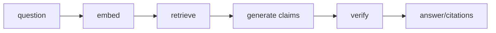

# Retrieval-augmented generation (RAG)

**Status:** implemented local workflow; external quality partial

## Definition
RAG embeds a query, retrieves scoped evidence, places that evidence in a model prompt, generates an answer, and returns source metadata. Grounded RAG additionally verifies claim/evidence relationships and abstains when support is absent.

## Archon implementation
`backend/app/services/rag_pipeline.py::RAGPipeline` is the simpler ingest/query path. The evidence-first path is `backend/app/services/grounded_rag.py::GroundedDocumentWorkflow`: retrieve, ledger `evidence_retrieved`, one provider call for atomic JSON claims, deterministic verification, answer reconstruction with `E#` citations, then terminal ledger events.

## Invariants and limits
No evidence means standardized abstention and zero provider calls. Provider/retrieval errors finalize a sanitized failed run; cancellation finalizes cancelled. The prompt says “use only evidence,” but prompt instruction alone is not verification. Current verifier is conservative lexical/numeric/polarity support, not semantic NLI.

## Evidence
`backend/tests/unit/test_rag.py`, `backend/tests/unit/test_grounded_rag.py`, `docs/evidence/local-portfolio-benchmark.json`. Benchmark provider/embeddings are mock; do not claim live answer quality.

## Interview prompt
“RAG supplies context; the grounded workflow adds claim filtering and durable evidence, while preserving an explicit abstention path.”
