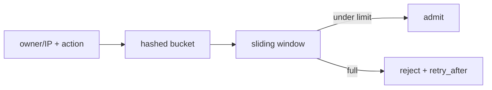

# Rate limiting

**Status:** implemented; backend-dependent scope

## Definition
Rate limiting controls admission over time to protect capacity and fairness. It differs from concurrency limits, quotas, and model token budgets.

## Archon implementation
`backend/app/security/rate_limiter.py::RateLimiter` implements a sliding window. Identifiers are SHA-256 hashed in keys. Redis mode uses one Lua operation; Redis-compatible servers without `EVAL` use a WATCH/MULTI retry transaction. Local mode uses a lock and monotonic timestamps. `RateLimitResult` includes allowed/current/limit/remaining/retry-after, and routes call `enforce_rate_limit` with action names.

## Failure modes and limits
Local state is per-process and unsuitable for multi-replica global limits. Redis mode is the shared target and non-compatibility Redis errors fail closed rather than silently weakening to local mode. Key hashing reduces identifier exposure but is not anonymity against low-entropy guessing. Define trusted client-IP extraction and action-specific limits.

## Evidence
`backend/tests/unit/test_rate_limiter.py` checks isolation, retry-after, unique members, concurrent atomicity, hashing, and Redis failure. `backend/tests/integration/test_route_rate_limits.py` checks route wiring.

## Interview prompt
“Archon’s atomic Redis sliding window is shared; the lock-based local mode is explicitly process-local development behavior.”
