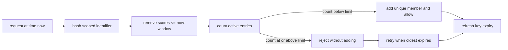
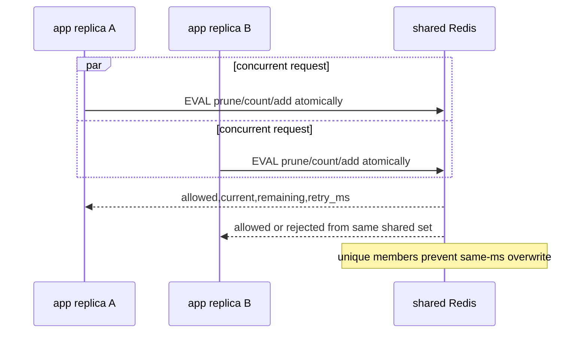
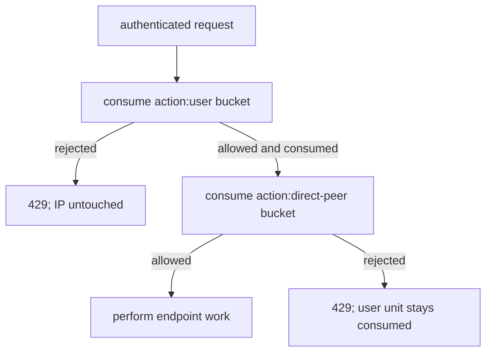

# Rate limiting

**Status:** implemented with backend-dependent scope

## Definition

Rate limiting controls how many arrivals a named subject may consume over a time window.
It protects capacity, fairness, cost, and abuse boundaries.
It is different from a concurrency limit, which bounds simultaneous work.
It is different from a quota, which commonly spans a longer billing or policy period.
It is different from a model token budget, which constrains consumption rather than request count.
Archon uses a sliding-window request limiter.

## Sliding-window intuition

A fixed window resets everyone at a clock boundary and can permit bursts on both sides of that boundary.
A sliding window counts only events newer than the current time minus the window length.
Every admission therefore reflects the immediately preceding interval.
When full, retry time is determined by the oldest active event.
Rejected requests are not inserted as new events.

## Exact result contract

`backend/app/security/rate_limiter.py::RateLimitResult` is immutable and slotted.
It reports `allowed`, `current`, `limit`, `remaining`, and `retry_after`.
Allowed results have `retry_after=None`.
Rejected results have `remaining=0` and retry-after of at least one second.
`current` includes the newly admitted request when allowed.
`current` does not include a rejected attempt.
The object also supports string-key access through `__getitem__` for compatibility.
A per-call `max_requests` value overrides the configured default.
Both configured and override limits must be positive.

## Identifier and bucket semantics

`RateLimiter._key` computes SHA-256 over the complete logical identifier.
The Redis or local key is `<prefix>:<hex digest>`.
This avoids putting raw user IDs, IPs, request bodies, tokens, or secrets into keys.
The caller must include the action and subject namespace in the logical identifier.
For example, route dependencies build values containing scope plus `user` or `ip`.
Different identifiers get independent buckets.
Changing action scope creates a different bucket.
Hashing reduces accidental exposure but is not anonymity for guessable low-entropy values.
An attacker with key access can hash candidate IP addresses or user IDs offline.

## Redis fast path

The Redis implementation uses the Lua script `_LUA` in one atomic `EVAL` operation.
It represents a bucket as a sorted set.
The score is current Unix wall-clock time in milliseconds.
The member is `<now_ms>:<uuid4 hex>`, so concurrent requests in the same millisecond remain distinct.
The script removes all entries with score less than or equal to `now - window`.
It then obtains the active count with `ZCARD`.
If count is below limit, it adds the unique member and returns allowed.
If count is at limit, it does not add the rejected request.
Both paths set `PEXPIRE` to the full window in milliseconds.
The rejection retry delay is the oldest active score plus window minus now, rounded up and at least one millisecond.
Python converts that millisecond delay to whole seconds with ceiling and a minimum of one.

## Redis compatibility transaction

Some Redis-compatible development servers do not implement `EVAL`.
Fallback occurs only when the exception text contains both `unknown command` and `eval`.
Other Redis failures are re-raised; there is no silent degradation to local mode.
`_check_redis_transaction` uses `WATCH` and `MULTI` around the same sorted-set bucket.
It reads active values with an exclusive lower bound at the cutoff.
That matches the Lua rule that removes values less than or equal to the cutoff.
It computes admission and retry delay from the watched state.
The transaction removes expired entries, conditionally adds the member, and refreshes expiry.
A `WatchError` means a concurrent writer changed the key, so the loop recomputes from new state.
This preserves Redis-backed atomicity at the cost of retries and extra round trips.

## Local mode

Without a Redis client, `_check_local` uses an in-memory dictionary and `asyncio.Lock`.
It uses `time.monotonic` rather than wall-clock time.
Entries survive only within that Python process.
Expired entries satisfy `stamp <= now - window` and are removed by retaining only newer stamps.
An allowed request appends the current monotonic stamp.
A rejected request does not append a stamp.
Retry-after is based on the oldest retained stamp and rounded up to at least one second.
The lock makes decisions atomic among coroutines sharing that limiter instance.
It does not coordinate workers, replicas, hosts, or process restarts.
Restarting the process clears every local bucket.

## Route-level enforcement

`backend/app/security/dependencies.py::_action_limit` derives a category from text before the first underscore.
It uses `rate_limit_<category>_requests` when configured, otherwise the global request limit.
`enforce_ip_rate_limit` consumes one direct-peer bucket before unauthenticated work.
`enforce_rate_limit` first consumes a user bucket, then a direct-peer IP bucket.
If the user bucket is exhausted, the IP bucket is not consumed.
If the user check succeeds but the IP bucket is exhausted, the user unit remains consumed.
There is no rollback across those two bucket operations.
A rejection becomes HTTP 429 with a `Retry-After` header and matching safe detail value.
The direct peer comes from `request.client.host`.
Forwarding headers are deliberately not trusted in this helper.
Valid IPs are canonicalized; short valid transport names are normalized; malformed names become `unknown`.
A trusted proxy deployment must normalize the peer boundary before this code rather than blindly trusting user-controlled headers.

## Security and failure modes

Shared Redis gives a cross-replica bucket only when every replica uses the same backend and key namespace.
A partition or Redis error is propagated instead of weakening into process-local enforcement.
The eventual HTTP behavior depends on upstream exception handling, but protected work is not admitted by this limiter call.
Local mode can multiply the effective limit by the number of workers.
Clock skew between app hosts affects Redis scores because clients supply wall-clock milliseconds.
A compromised client can distribute traffic across identities or source addresses.
NAT can make many legitimate users share one peer bucket.
Hashing keys does not prevent enumeration of small identifier spaces.
Unlimited bucket cardinality can itself consume memory; expiry and identity design matter.
A limit of requests says nothing about request cost, so expensive operations may need weighted or token-based controls.
Do not use rate limiting as the only authentication, authorization, or billing control.

## Observability

The limiter logs `rate_limit_exceeded` with the limit but not the raw identifier.
Measure allowed and rejected counts by bounded action category and backend mode.
Track retry-after distribution, Redis latency, transaction retries, and Redis errors.
Track local-mode activation as a deployment property, not as a per-user metric.
Alert if production unexpectedly runs process-local mode.
Observe bucket cardinality and Redis memory without exporting hashed user keys as high-cardinality labels.
Compare user and IP rejection rates to find shared-network harm or account abuse.
Monitor 429 response rates and downstream saturation together to tune limits.
Health checks can call `RateLimiter.check_health`, which pings Redis without consuming quota.

## Lab versus production

Local mode is suitable for one-process development and deterministic unit tests.
It is not a global limiter for a multi-worker server.
`fakeredis` exercises the WATCH/MULTI compatibility path and concurrency behavior.
It does not prove networked Redis availability, clock alignment, or operational sizing.
Production should use shared Redis, isolated key prefixes, TLS/authentication, and capacity monitoring.
Choose fail-closed behavior consciously and provide an incident plan for Redis outage.
Tune per action from load tests and business risk rather than copying one universal number.
Document proxy topology so direct-peer identity has a trusted meaning.

## Alternatives and complements

A token bucket permits controlled bursts and is cheap to implement.
A leaky bucket smooths output rate.
A fixed window is simpler but has boundary bursts.
A concurrency semaphore protects in-flight capacity.
A queue absorbs bursts but increases latency and needs bounded depth.
Provider quotas protect external spend but may not ensure tenant fairness.
Weighted limits account for request cost.
Admission priorities preserve critical traffic during overload.
These controls can be layered; they solve different dimensions.

## Exercise

1. Create a local limiter with a limit of two and a 60-second window.
2. Confirm two requests are allowed and the third is rejected without increasing `current`.
3. Use two identifiers and show that their buckets are independent.
4. Inspect local keys and verify that the raw identifier is absent.
5. Run 30 concurrent calls against the fakeredis limiter with limit seven and count exactly seven admissions.
6. Explain why unique sorted-set members matter when calls share one millisecond.
7. Trace an authenticated request whose user check passes but IP check fails.
8. State why switching to local mode on Redis failure would silently weaken a production policy.

## Exact source and test evidence

- `backend/app/security/rate_limiter.py::_LUA` defines atomic Redis prune, count, add, expiry, and retry semantics.
- `backend/app/security/rate_limiter.py::RateLimiter._check_redis_transaction` defines the WATCH/MULTI compatibility path.
- `backend/app/security/rate_limiter.py::RateLimiter._check_local` defines process-local monotonic behavior.
- `backend/app/security/dependencies.py::enforce_rate_limit` defines user-then-IP consumption order.
- `backend/tests/unit/test_rate_limiter.py::TestRateLimiterLocal::test_per_action_override_and_hashed_identifier` proves override and key hiding.
- `backend/tests/unit/test_rate_limiter.py::TestRateLimiterRedis::test_fakeredis_transaction_fallback_is_atomic_under_concurrency` proves seven of 30 concurrent admissions.
- `backend/tests/unit/test_rate_limiter.py::TestRateLimiterRedis::test_non_eval_redis_errors_fail_closed_without_local_fallback` proves Redis errors propagate.
- `backend/tests/unit/test_rate_limiter.py::TestRateLimiterRedis::test_lua_fast_path_uses_unique_members` proves unique members.
- `backend/tests/integration/test_route_rate_limits.py::test_chat_enforces_ip_cap_across_different_users_and_ignores_xff` proves direct-peer enforcement and ignored forwarding header.

## 30-second interview answer

“Archon implements a sliding-window limiter. Redis uses one atomic Lua prune/count/conditional-add operation with unique sorted-set members; Redis-compatible servers lacking `EVAL` use a WATCH/MULTI retry transaction with equivalent cutoff semantics. Other Redis errors propagate rather than silently weakening to local mode. The local locked monotonic implementation is explicitly process-local. Routes consume action-scoped user quota and then direct-peer quota, so an IP rejection does not refund the already consumed user unit.”

## Self-checks

1. **Does a rejected request enter the window?** No. It reports the current active count and waits for the oldest entry to expire.
2. **Why is the Redis member not just the timestamp?** Concurrent requests in one millisecond would overwrite the same sorted-set member and undercount.
3. **Which entries expire at the cutoff?** Scores less than or equal to `now - window` are removed.
4. **When does Redis fall back to WATCH/MULTI?** Only for an unknown-command error specifically identifying `EVAL`.
5. **Does Redis failure switch to local mode?** No. Non-compatibility errors are re-raised.
6. **What happens when user admission succeeds and IP admission fails?** The request is rejected, and the user bucket unit remains consumed.
7. **Does hashing a user ID anonymize it?** No. Low-entropy identifiers can be guessed and hashed offline.
8. **Why is local mode unsuitable across replicas?** Each process has independent state, so the effective aggregate limit can multiply.
