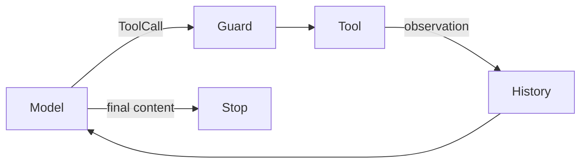

# ReAct

## Definition

ReAct is an iterative pattern: a model selects an **action**, the system executes it under controls, and the returned **observation** informs the next model response. Archon uses provider-native tool calls and does not expose private chain-of-thought.

## Archon implementation

`AgentRuntime.run` sends typed history and tool definitions, handles `ModelResponse.tool_calls`, appends a `Role.TOOL` message, and iterates under time/token/tool/iteration budgets. Duplicate semantic calls are blocked. Tool exceptions become bounded error observations so the model may choose another call.

Inspect [`AgentRuntime.run`](../../../backend/app/runtime/engine.py), [`RuntimeBudget`](../../../backend/app/runtime/engine.py), and [`Role`](../../../backend/app/runtime/models.py). Tests: [`test_runtime_v2.py`](../../../backend/tests/unit/test_runtime_v2.py), [`test_runtime_budget_regressions.py`](../../../backend/tests/unit/test_runtime_budget_regressions.py), and [`test_reflexion.py`](../../../backend/tests/unit/test_reflexion.py).

## Terminology boundary

The historical `test_reflexion.py` proves error feedback and a bounded retry. It does **not** prove a generic self-reflection system. Deterministic grounded-claim checks, the evidence-only verifier child, and post-run evaluations have different inputs, timing, and guarantees. Generic critique/revision reflection is **not implemented**.
