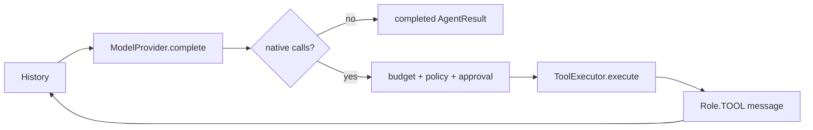
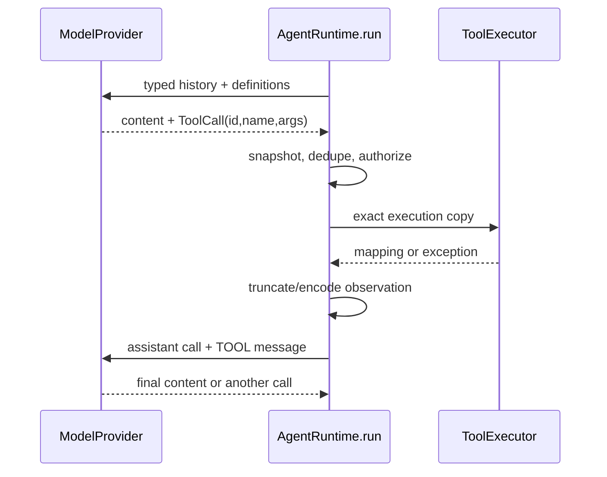

# ReAct

## Beginner explanation

ReAct is an iterative action/observation pattern: the model proposes a tool action, controlled code executes it, and the resulting observation informs the model's next response.
Archon uses provider-native `ToolCall` values rather than parsing actions from model prose.
It does not expose or require private chain-of-thought; observable progress, calls, results, and final answers are enough to run the loop.
One configured tool-call allowance is shown to the model and enforced by the runtime; when the boundary is reached, unexecuted native calls are closed with synthetic observations before bounded final synthesis.

## Prerequisites and vocabulary

- **Action:** native tool call with ID, name, and argument object.
- **Observation:** bounded `Role.TOOL` message associated with the call ID.
- **History:** typed messages sent on the next model iteration.
- **Iteration:** one provider completion plus processing of its result.
- **Progress text:** model content accompanying tool calls; not yet a final answer.
- **Synthesis:** final tool-free response after evidence or a budget boundary.
- **Reflection:** generic critique/revision phase; Archon implements this as an **optional bounded final-answer reflection** through `BoundedReflectionService`, disabled by default (see [generic self-reflection](generic-self-reflection.md)).

## Problem and mental model

Models cannot directly know fresh external state. The loop turns tools into controlled sensors/actuators and lets observations update the next proposal.
The runtime is a referee: it limits rounds, blocks repeated plays, authorizes actions, and decides when the game ends.





## Code-grounded Archon loop

[`AgentRuntime.run`](../../../backend/app/runtime/engine.py) snapshots input history, starts counters, and emits `RUN_STARTED`.
Each iteration calls [`ModelProvider.complete`](../../../backend/app/runtime/ports.py) with a detached history and [`ToolExecutor.definitions`](../../../backend/app/runtime/ports.py).
[`ModelResponse`](../../../backend/app/runtime/models.py) must contain content or calls; [`ToolCall`](../../../backend/app/runtime/models.py) preserves native call identity.
Text with calls emits `MODEL_PROGRESS`; text without calls terminates with `StopReason.COMPLETED`.
Policy mode snapshots all provider calls and preauthorizes a batch before any handler dispatch.
`seen_calls` blocks repeated semantic name/argument combinations in one run.
Tool exceptions become JSON error observations with a `reflexion_hint`, allowing the model to choose corrected parameters or another tool.
Large serialized outputs emit progress chunks and are truncated before insertion into model history according to [`RuntimeBudget.max_tool_result_chars`](../../../backend/app/runtime/engine.py).
[`AgentRuntime._finalize`](../../../backend/app/runtime/engine.py) requests bounded tool-free synthesis for selected budget stops.

## Tool-budget alignment and synthesis

`Settings.agent_max_tool_calls` (default 20) is passed to three aligned consumers:

1. **System prompt** — the `{tool_budget}` placeholder in the assembled context tells the model its call allowance.
2. **`RuntimeBudget.max_tool_calls`** — wired through `factory.py`, governs the deterministic tool-count enforcement in `AgentRuntime.run`.
3. **`RequestContextBuilder.prepare`** — both sync (`chat.py`) and SSE (`stream.py`) pass `tool_budget=settings.agent_max_tool_calls`.

When a model response would exceed the tool budget, `_append_unexecuted_tool_results` inserts synthetic `Role.TOOL` messages for every unexecuted call, each containing `{"error":"Tool call was not executed.","reason_code":"tool_budget_exhausted"}`. These close the provider tool-use block so the subsequent `_finalize` call can request bounded tool-free synthesis with the evidence already in history. If synthesis itself fails (deadline, provider error, structured-output rejection), the original budget stop reason is preserved in the `AgentResult`; the runtime does not pretend the run succeeded.

## Reflection terminology boundary

The historical [`test_tool_error_feedback.py`](../../../backend/tests/unit/test_tool_error_feedback.py) uses “reflexion” for error feedback followed by a corrected retry. That proves only a narrow recovery path.

Archon now also has optional **generic final-answer reflection** through [`BoundedReflectionService`](../../../backend/app/reflection/service.py): a tool-free structured critique and at most one bounded revision. It is invoked only after a normal unstructured final-answer draft, is disabled by default, and has no recursive loop or learned reflection memory. Deterministic grounded-claim verification, verifier delegation, and post-run evaluation remain separate mechanisms.

## Behavior-focused tests—and their limits

- [`test_typed_tool_round_trip_and_events`](../../../backend/tests/unit/test_runtime_v2.py) proves one action/observation/final round trip and event sequence. It does not prove open-ended planning quality.
- [`test_duplicate_tool_calls_execute_only_once`](../../../backend/tests/unit/test_runtime_budget_regressions.py) proves a repeated semantic call is blocked in one run. It does not provide durable idempotency.
- [`test_tool_results_are_bounded_before_returning_to_model`](../../../backend/tests/unit/test_runtime_budget_regressions.py) proves model-history truncation. It does not prove the original output is safe or complete.
- [`test_reflexion_self_correction`](../../../backend/tests/unit/test_tool_error_feedback.py) proves a scripted error is observed and a later scripted call succeeds. It does not prove generic reflection or autonomous diagnosis.
- [`test_policy_batch_authorizes_all_before_executing_in_order`](../../../backend/tests/unit/test_runtime_policy.py) proves guarded multi-call ordering against fakes. It does not make external effects transactional.

## Bounded executable exercise

Timebox: 12 minutes. Run the round-trip and error-recovery examples:

```bash
cd backend
pytest -q \
  tests/unit/test_runtime_v2.py::test_typed_tool_round_trip_and_events \
  tests/unit/test_tool_error_feedback.py::test_reflexion_self_correction
```

Sketch the exact history roles after the first tool result. Label which behavior is ReAct and which is merely scripted recovery.

## Security and failure modes

- Tool observations are untrusted data and may contain prompt injection; policy authority must remain outside model history.
- Repeated or branching calls can consume budget rapidly; call and iteration limits cap this loop.
- An exception string may leak secrets; production adapters should sanitize errors before observation/persistence.
- Truncation can hide crucial tail data; tools should return structured bounded summaries rather than giant blobs.
- Multi-call batches can create partial effects; Archon preauthorizes the batch but does not offer distributed transactions.
- Correct control flow does not make the final answer factually grounded.

## Observability and evidence

Follow `ITERATION_STARTED`, `MODEL_RESPONSE`, `MODEL_PROGRESS`/`TEXT_DELTA`, `TOOL_CALL_REQUESTED`, policy/approval events, `TOOL_CALL_COMPLETED`, and `RUN_STOPPED`.
Track iteration count, tool count, duplicate blocks, error observations, result size/truncation, tokens, and terminal reason.
Do not log hidden reasoning; evidence should be typed decisions and externally visible outcomes.
A successful final answer after an error demonstrates recovery on that fixture, not a generally reliable reasoning strategy.

## Alternatives and tradeoffs

A fixed pipeline is predictable when the tool sequence is known and easier to test exhaustively.
Plan-then-execute can expose a reviewable plan, but plans become stale and still require per-action checks.
Text action parsing works with more providers but is ambiguous and injection-prone compared with native calls.
Parallel tool execution lowers latency for independent reads but complicates ordering, budgets, cancellation, and side-effect safety; Archon processes prepared calls in order.

## Lab versus production

A lab uses `MockLLM` scripted responses and pure tools to visualize the loop.
Production needs policy-aware registration, exact approvals, bounded outputs, durable evidence, cancellation, idempotent effects, and evaluations based on real failure distributions.
Do not label one corrected fixture as “self-healing” or “self-reflective.”

## 30-second interview answer

“ReAct is the action-observation loop, not hidden chain-of-thought. Archon's custom `AgentRuntime` sends typed history and tool definitions, receives native `ToolCall`s, snapshots and authorizes them, executes through the registry, appends bounded `Role.TOOL` observations, and repeats under token, time, iteration, and call budgets. Tool errors can become retry hints, which is narrow feedback. Separately, optional final-answer reflection performs one tool-free structured critique and at most one bounded revision; it is disabled by default and is not a recursive agent or learned memory.”

## Self-check questions

1. **What closes a normal loop?** A `ModelResponse` with no tool calls, yielding completed final content.
2. **Why use native calls?** Typed names, arguments, and call IDs avoid ambiguous prose parsing.
3. **Is progress text final?** No, not when tool calls accompany it.
4. **Where is duplicate detection scoped?** One `AgentRuntime.run` invocation.
5. **Does error feedback equal reflection?** No; it is a bounded observation/retry mechanism.
6. **Are tool observations trusted instructions?** No; they are untrusted data returned to the model.

## Related modules and concepts

- Module: [ReAct loop](../modules/03-react-loop/README.md).
- Concepts: [agent anatomy](agent-anatomy.md), [state machines](state-machines.md), [tool contracts](tool-contracts.md), and [evaluation harness](evaluation-harness.md).
