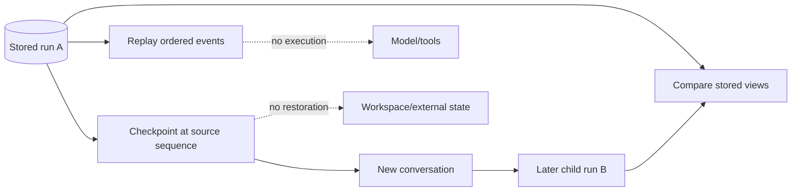
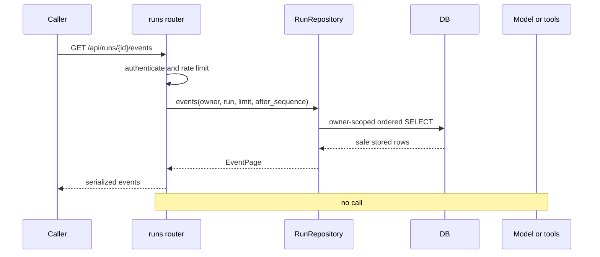
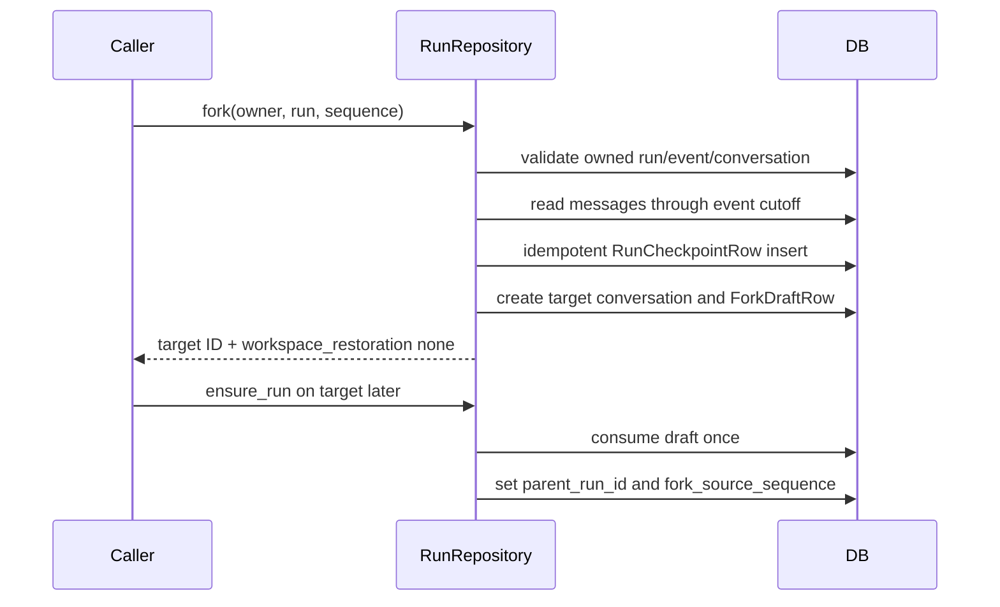

# Replay, fork, and compare

> **Implementation status:** `implemented for stored data; executable resume partial`
> **Boundary:** Replay and compare read safe persisted fields only; fork copies selected conversation state and lineage metadata but does not restore arbitrary workspace or re-execute a run.

## Beginner explanation

These three operations answer different questions:

- **Replay:** “What safe events were recorded for this run, in order?”
- **Fork:** “Create a new conversation branch from the stored state at this event boundary.”
- **Compare:** “How do two stored run summaries and trajectories differ?”

Replay is not rerun.
It makes no model or tool call and therefore cannot reproduce nondeterministic output or side effects.
Fork is not rewind.
It does not undo the source or reconstruct process memory, open files, credentials, network sessions, provider state, or external effects.
Compare is not causal inference.
It places stored fields side by side; a difference does not prove why an outcome changed.

## Concept map



All three paths start from persisted data and an authenticated owner boundary.
They inherit the Run Ledger's allowlist: raw prompts, chain-of-thought, tool arguments/results, and evidence quotes are not available for replay or comparison.

## Replay path



`RunRepository.events` first checks that the run is owner-visible.
It returns rows where `sequence > after_sequence`, ordered by sequence, with a maximum page size of 200.
`_event_record` rejects unsupported schema versions, unknown kinds, malformed JSON, non-object payloads, and fields outside the current allowlist.
That fail-closed read behavior matters: old or corrupted data is not silently reinterpreted.

## Fork path



The fork response includes `checkpoint_id`, source run and sequence, target conversation, policy profile, selected memory IDs, creation time, and `workspace_restoration: "none"`.
The message snapshot is redacted and bounded per item.
Selected memory IDs are stored metadata; current views do not prove memory content was restored or selected into effective context.

## Compare path

`backend/app/routes/runs.py::compare_runs` owner-loads both runs.
For each side it fetches up to 200 events and calls `_trajectory`.
`_trajectory` groups policy decisions, approval events, tool events, and evidence events, then includes tokens, cost, latency, iterations, and stop reason.
The compare response also includes answer summary, provider/model, lineage, and empty current `memory_ids`/`context_ids` views.
It performs no model or tool call, so the same stored rows produce a deterministic structural view.
Because event retrieval is capped at 200, “full trajectory” should not be claimed for longer runs without pagination support in comparison.

## What stored-only means

The API can show that an allowlisted event row was committed at a sequence.
It cannot recover omitted arguments, outputs, prompts, hidden reasoning, or evidence quotes.
It cannot establish that a tool's reported success matches the external world.
It cannot recreate provider sampling, time, web content, mutable dependencies, or race scheduling.
Hashes help correlate known values, but they are not reversible content and do not certify truth.

## Invariants

- Every route authenticates, applies `run_read` rate limiting, and derives owner from trusted identity.
- A foreign run is indistinguishable from a missing run.
- Replay orders committed events by run-local sequence.
- Replay and compare never invoke providers or tools.
- Fork validates the exact selected sequence.
- Fork reuses a deterministic checkpoint but creates a distinct conversation/draft per request.
- Only one first run consumes a given fork draft for lineage.
- Compare is a read-only projection of safe stored fields.
- No operation claims arbitrary workspace restoration.
- No operation turns ledger events into semantic truth or chain-of-thought.

## Source symbols and endpoints

| Symbol/endpoint | Role |
|---|---|
| `backend/app/routes/runs.py::get_run_events` | Paginated stored replay endpoint |
| `backend/app/routes/runs.py::get_run` | Run plus safe trajectory |
| `backend/app/routes/runs.py::fork_run` | Validated fork endpoint |
| `backend/app/routes/runs.py::compare_runs` | Read-only two-run projection |
| `backend/app/routes/runs.py::_trajectory` | Event grouping and aggregate view |
| `backend/app/services/run_ledger.py::RunRepository.events` | Owner-scoped ordered read |
| `RunRepository.fork` | Checkpoint and branch transaction |
| `RunRepository.ensure_run` | One-time draft consumption |
| `RunRepository._event_record` | Schema and allowlist validation |

The concrete routes are `GET /api/runs`, `GET /api/runs/{run_id}`, `GET /api/runs/{run_id}/events`, `GET /api/runs/{run_id}/children`, `POST /api/runs/{run_id}/fork`, and `GET /api/runs/compare?a=...&b=...`.

## Tests and evidence

`backend/tests/integration/test_run_replay_api.py::test_replay_is_owner_scoped_and_never_calls_model_or_tools` installs `ForbiddenSpy` objects and proves replay/list/children do not touch them.
`backend/tests/integration/test_run_fork_compare.py::test_compare_and_filters_are_read_only_and_owner_scoped` does the same for compare.
`test_fork_is_durable_owner_scoped_validates_sequence_and_propagates_lineage` covers restart and lineage.
`test_fork_snapshot_uses_selected_event_cutoff_and_terminal_completion` defines cutoff semantics.
`test_repeated_and_concurrent_forks_reuse_checkpoint_but_create_distinct_drafts` proves checkpoint idempotency.
`test_fork_draft_is_consumed_once_by_concurrent_distinct_child_runs` proves one lineage winner.
`backend/tests/unit/test_run_ledger.py::test_malformed_payload_and_unknown_version_fail_closed` covers replay corruption handling.

## Security and failure modes

| Threat/failure | Control or response | Residual risk |
|---|---|---|
| Cross-owner probing | Owner predicates and 404-like miss | Every new filter/join must preserve scope |
| Replay causes side effect | Stored-data repository only; spy tests | Future enrichment must not inject runtime clients |
| Sensitive event leakage | `_SAFE_FIELDS` projection plus redaction | Allowed identifiers/hashes remain metadata |
| Fork claims false restoration | Explicit `workspace_restoration: none` | UI wording can still mislead |
| Invalid/corrupt schema | `LedgerDataError`, route returns safe 500 | Requires migration/repair, not silent coercion |
| Compare truncation | 200-event read cap | Long-run differences may be omitted |
| Causal overclaim | Side-by-side deterministic data only | Human interpretation can still confuse correlation |
| Stale fork draft | Durable until consumed | Retention/cleanup policy is needed |

Do not add “helpful” replay that silently reruns tools.
A re-execution feature would need new approvals, idempotency keys, isolated workspace provisioning, explicit external-side-effect policy, and a different name.

## Observability

Track operation (`replay`, `fork`, `compare`), owner-safe run IDs, source sequence, pagination, event count, checkpoint reuse, target conversation ID, duration, response status, and stable failure reason.
Never log message snapshots, raw arguments/results, decrypted memories, or reconstructed prompts.
Monitor replay page truncation, compare views that hit 200 events, invalid sequence attempts, checkpoint conflicts, and draft age.
The act of reading may warrant an access audit, but that audit should not duplicate sensitive payloads.

## Trade-offs

Stored-only replay is safe, fast, cheap, and deterministic, but cannot reproduce behavior.
Executable replay could test reproducibility but risks duplicate side effects and changing dependencies.
Forking dialogue makes alternatives easy to explore but can omit workspace and memory needed for equivalent behavior.
Deterministic comparison avoids evaluator nondeterminism, while offering less semantic judgment.
An allowlisted ledger protects privacy but limits debugging detail.
A fixed event cap protects resources but can hide tail events unless pagination is designed through the compare view.

## Lab versus production

The test suite uses SQLite, mock records, and spies to prove no runtime dependency is accessed.
Production requires database migrations, retention policy, authorization review, rate-limit sizing, monitoring, and UI language that preserves the stored-only boundary.
If production needs reproducible execution, package immutable model/settings/tool versions, workspace artifacts, and side-effect controls as a separate capability.
No local test proves provider determinism, external-world rollback, cross-region consistency, or legal-grade audit retention.

## Exercise

Run the stored-data contract suites:

```bash
cd backend
uv run pytest -q \
  tests/integration/test_run_replay_api.py \
  tests/integration/test_run_fork_compare.py \
  tests/unit/test_run_ledger.py::test_malformed_payload_and_unknown_version_fail_closed
```

Afterward, inspect the `ForbiddenSpy` assertions and explain why they are stronger evidence for stored-only replay than a comment saying “read only.”
Create two forks at the same sequence and predict which IDs match and which differ before reading the concurrency test.

## 30-second interview answer

“Archon replay reads an owner-scoped sequence of already stored safe events; it never calls a model or tool. Fork creates or reuses a checkpoint at one event, copies redacted conversation rows into a new conversation, and lets one later run consume lineage, while explicitly restoring no arbitrary workspace. Compare deterministically groups the two runs' stored policy, approval, tool, evidence, and metric fields. These features explain recorded differences; they do not re-execute, undo side effects, recover chain-of-thought, or prove causality or semantic truth.”

## Self-check

1. **Does replay call the provider again?** No; spy-backed tests require zero provider/tool access.
2. **Can replay reproduce nondeterministic output?** No; it only returns stored records.
3. **What does fork restore?** Redacted conversation state through a cutoff plus metadata/lineage handoff.
4. **Does fork restore files or network state?** No; `workspace_restoration` is `none`.
5. **What does compare prove?** Deterministic differences in stored fields, not their cause or truth.
6. **Why can compare omit data on a long run?** Its current event fetch is limited to 200.
7. **What happens on unknown schema data?** Reads fail closed with `LedgerDataError`.
8. **Are selected memory IDs proof of memory replay?** No; they are metadata in the current fork path.

## Related concepts

- [Run Ledger](run-ledger.md)
- [Checkpoints](checkpoints.md)
- [Conversation lifecycle](conversation-lifecycle.md)
- [Context windows](context-windows.md)
- [Encrypted memory](encrypted-memory.md)
- [Parent-child lineage](parent-child-lineage.md)
- [Idempotency](idempotency.md)
- [Evaluation harness](evaluation-harness.md)
