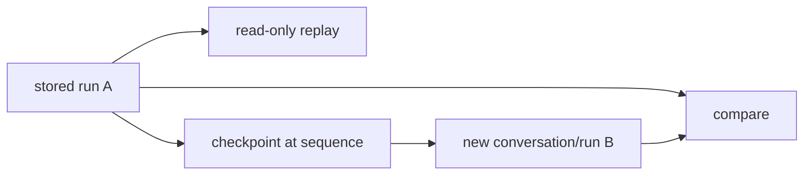

# Replay, fork, and compare

**Status:** implemented for stored data; executable resume partial

## Definitions
- **Replay:** read a stored run and ordered safe events without invoking models/tools.
- **Fork:** create a new conversation from a checkpoint at a source event and attach later child lineage.
- **Compare:** deterministically place safe summaries/trajectories/metrics side by side.

## Archon implementation
`backend/app/routes/runs.py` exposes list/get/events/children, `fork_run`, and `compare_runs`. `_trajectory` groups policy, approval, tool, and evidence events. `RunRepository.fork` snapshots redacted messages through a cutoff. `ensure_run` consumes the fork draft and records `parent_run_id`/`fork_source_sequence`.

## Invariants and limits
All operations are owner-scoped and rate-limited. Compare has no model/tool access and cannot establish causality. Replay does not reproduce nondeterminism. Fork reports `workspace_restoration: none`, with empty context/memory IDs in current views and no arbitrary external state restoration.

## Evidence
`backend/tests/integration/test_run_replay_api.py`, `backend/tests/integration/test_run_fork_compare.py`, `backend/tests/unit/test_run_lineage.py`.

## Interview prompt
“Replay explains; fork branches safe state; compare measures stored differences. None silently re-executes side effects.”
