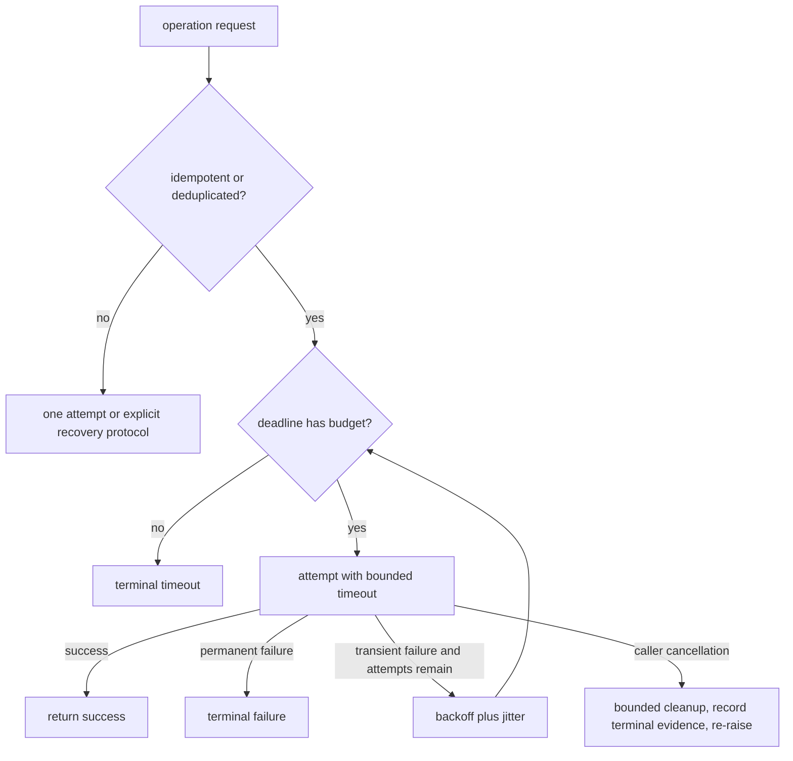

# Retries, timeouts, deadlines, and cancellation

**Status:** implemented at the managed runtime boundaries; arbitrary in-process work still cannot be forcibly rolled back

## Definitions

A **retry** starts another attempt after a classified failure.
A **timeout** bounds how long one wait or operation is allowed to take.
A **deadline** is an absolute end-to-end time budget shared across nested operations.
**Cancellation** communicates that the caller no longer wants the work and should propagate through async code.
These controls interact, but none is a substitute for another.
A timeout can trigger a retry.
A retry without a deadline can multiply total latency.
Cancellation can arrive after an external side effect has already committed.

## The core safety model



Retry only errors believed to be transient.
Retry only operations that are idempotent or protected by a stable idempotency key and durable deduplication.
Bound both attempt count and total elapsed time.
Use exponential backoff with jitter in production to avoid synchronized retry storms.
Respect server retry guidance where trustworthy.
Stop immediately on caller cancellation unless a bounded critical cleanup must complete.
Never report success merely because waiting stopped without an error object.

## Idempotency is required for safe retries

An idempotent operation has the same externally visible result when repeated with the same identity.
Reads are often idempotent, but metered reads can still incur duplicate cost.
Creating a payment, sending a message, or invoking a mutating tool is usually not naturally idempotent.
A timeout means the caller does not know whether the remote operation committed.
Retrying such an ambiguous operation can duplicate effects.
A production design uses a stable operation ID, a durable deduplication record, and replayable result.
The idempotency key must be reused across attempts, not regenerated per attempt.
Deduplication state must outlive process crashes and client retries.
Do not infer “safe to retry” solely from an exception class.

## Timeout versus deadline

A 10-second timeout on each of three attempts can consume about 30 seconds before backoff.
An absolute deadline prevents every layer from spending a fresh full timeout.
Before an attempt, compute remaining deadline budget.
Set the attempt timeout to the smaller of remaining budget and operation-specific cap.
Do not start an attempt when the remaining budget cannot support useful work and cleanup.
Propagate deadline metadata to downstream services when the protocol supports it.
Reserve bounded time for terminal recording and resource cleanup.
Use a monotonic clock for elapsed local budgets.

```mermaid
sequenceDiagram
  participant C as caller
  participant A as agent layer
  participant T as tool/provider
  C->>A: request with absolute deadline
  A->>A: calculate remaining budget
  A->>T: attempt 1 with bounded timeout
  T-->>A: transient error
  A->>A: jittered backoff within deadline
  A->>T: attempt 2 with remaining timeout
  C--xA: cancellation
  A->>A: bounded terminal cleanup
  A--xC: re-raise CancelledError
  Note over C,T: cancellation stops waiting; it does not roll back a committed effect
```

## Archon: shared managed-runtime deadline

`backend/app/runtime/deadline.py` creates a monotonic absolute deadline and awaits nested work only for the remaining budget. `AgentRuntime`, grounded RAG, and the child verifier wrap their complete managed operation—including run creation, event persistence, approval preparation, provider/tool waits, and normal finalization—inside that absolute deadline. If a collaborator absorbs cancellation, an immediate post-await fence prevents later provider/tool dispatch.
Terminal recording uses a separate bounded cleanup budget (50 ms for runtime/RAG and 250 ms for the verifier). If it cannot finish, Archon logs an explicit `*_terminal_persistence_indeterminate` state rather than waiting indefinitely or claiming persistence. Detached operations may still consume resources or complete their own already-started side effect; their result cannot re-enter the request.

## Archon: legacy resilient coordinator

`backend/app/agents/resilient_coordinator.py::ResilientCoordinator._execute_with_fallback` uses `asyncio.wait_for`.
Each specialist attempt receives the same `timeout_seconds` value.
The loop is `range(1, max_retries + 1)`.
Therefore `max_retries` currently means total attempts, despite its name.
The default value two produces two total attempts.
Timeouts and other ordinary exceptions are logged and lead to another attempt if one remains.
There is no backoff or jitter.
There is no shared end-to-end deadline.
There is no idempotency check before retry.
After exhaustion, a fallback dictionary is returned.
This is a teaching/prototype path and is unsafe for arbitrary side-effecting agents.
The coordinator estimates and records response tokens only after a successful call.
Its token accounting is not a pre-call admission budget.

## Archon: secure tool timeout

`backend/app/tools/registry.py::SecureToolRegistry.execute` enforces each registered tool's timeout.
Asynchronous handlers run under `asyncio.wait_for` directly.
Synchronous handlers run in an executor and the await is wrapped in `asyncio.wait_for`.
Timing out an executor wait does not reliably stop the underlying thread or undo its effects.
The registry audits successful, denied, failed, and timed-out calls through its boundary.
A timeout bounds caller waiting; it is not a transactional rollback.
Tool authors must provide their own idempotency and cancellation-safe resource handling.

## Archon: grounded workflow cancellation

`backend/app/services/grounded_rag.py::GroundedDocumentWorkflow.run` catches `asyncio.CancelledError` explicitly.
It shields `_stop(..., reason="cancelled", error=False)` so terminal Run Ledger evidence can be written.
It then re-raises the original cancellation.
This preserves caller intent instead of turning cancellation into a normal response.
Shielding is narrow: it protects terminal recording, not the entire workflow.
If cancellation occurs after a provider or tool committed an effect, the terminal record does not reverse that effect.
Consumers must interpret `cancelled` as “the caller stopped waiting/work was asked to stop,” not “nothing happened.”

## Archon: breaker probe cancellation

`backend/app/security/circuit_breaker.py::CircuitBreaker.call` treats cancellation separately from ordinary failure.
A cancelled half-open probe calls `_abandon_probe`.
The breaker returns to open, refreshes its failure time, clears the probe token, and re-raises cancellation.
A cancelled ordinary closed-state call is propagated without incrementing the normal failure count.
This avoids wedging the breaker in half-open state.
It does not guarantee that the provider stopped processing the cancelled request.

## Archon: bounded evidence verifier

The bounded verifier has explicit attempt, absolute deadline, input, output, and accumulated usage budgets. Malformed JSON receives at most one corrective retry; the retry text does not include rejected model output and its enlarged request is re-estimated before dispatch.
The managed RAG acceptance exercises the verifier through the same durable monetary gateway as the parent call and records a completed child verdict. This is evidence for the managed verifier boundary, not for arbitrary third-party code.
A local component budget must fit inside the request's end-to-end deadline and monetary budget. Terminal evidence distinguishes timeout, cancellation, provider failure, malformed response, and budget exhaustion.

## Cancellation correctness

Catch `CancelledError` only to perform necessary cleanup or terminal recording.
Keep cleanup bounded so shutdown cannot hang forever.
Use `asyncio.shield` narrowly when cancellation must not interrupt a critical record or resource release.
After cleanup, re-raise cancellation.
Do not catch cancellation as a generic provider error and retry it.
Child tasks need explicit ownership: await, cancel and drain, or transfer them to a supervised lifecycle.
A detached child may continue spending money or mutating state after the request disappears.
Cancellation is cooperative; synchronous code and remote servers may ignore it.

## Committed effects and ambiguous outcomes

A deadline or cancellation changes what the caller waits for.
It does not rewind a database commit, payment, email, tool action, or remote provider request.
The operation may finish just before, during, or after timeout handling.
Marking a local run `cancelled` does not prove the remote side did nothing.
For side effects, persist an operation ID before dispatch.
On ambiguous outcome, query status by that ID instead of issuing a fresh operation.
Use transactional outbox or saga compensation where atomic cross-system commit is impossible.
Compensation is a new effect and can itself fail; it is not time travel.
Expose uncertain outcomes to operators and clients rather than claiming rollback.

## Security and failure modes

Retry storms can turn a small outage into a large one.
Jitter, retry budgets, and circuit breakers reduce correlated amplification.
Attackers can deliberately trigger expensive retryable paths.
Never retry authentication, authorization, schema, or policy denial as if transient.
Repeated tool calls can duplicate destructive actions.
Long cleanup can defeat shutdown and resource bounds.
Swallowed cancellation creates zombie work and misleading success records.
Raw exception logging can leak prompts, credentials, or provider internals.
Fallback after timeout may produce an answer while the timed-out operation still commits.
Apply least privilege and approval checks independently on every new side-effecting attempt.

## Observability

Record total attempts and stable terminal reason per operation.
Measure attempt latency separately from end-to-end latency.
Track timeout count, cancellation count, retry success, exhausted retries, and fallback use.
Measure backoff time and remaining deadline at each attempt.
Correlate repeated attempts with one operation or idempotency ID.
Trace whether cancellation propagated to child tasks and downstream protocols.
Alert on retry amplification ratio and work continuing after client disconnect.
Audit ambiguous side-effect outcomes and reconciliation results.
Never label metrics with raw prompts, exception messages, or high-cardinality operation IDs.

## Lab versus production

In a lab, short `asyncio.wait_for` calls and deterministic failures demonstrate mechanics.
In production, choose per-operation classification, backoff, deadlines, and idempotency contracts.
The coordinator's immediate repeated attempts are acceptable as a prototype demonstration, not a default policy.
Executor-backed synchronous tools require process isolation or cooperative cancellation when hard termination matters.
Production systems need durable deduplication across restarts and replicas.
Use fault injection to test timeout just before and just after a side effect commits.
Test shutdown, client disconnect, and cancellation during cleanup.
Document which terminal statuses mean unknown remote outcome.

## Alternatives and complements

A circuit breaker suppresses calls during dependency failure rather than repeating them.
Fallback selects another capability after failure but must preserve required semantics.
Hedged requests race duplicate idempotent reads to reduce tail latency at increased load.
Queues decouple caller latency from eventual work and need durable status.
Bulkheads isolate resource pools so retries in one path cannot consume all capacity.
Leases and heartbeats are useful for long-running distributed work.
Transactional outbox patterns reliably publish side effects after local commit.
Sagas model compensating actions for multi-step distributed workflows.
Sometimes the safest policy is one attempt followed by an explicit unknown-outcome response.

## Exercise

1. Wrap a fake idempotent read in two bounded attempts and one absolute deadline.
2. Make the first attempt fail transiently and the second succeed.
3. Cancel during the backoff and verify no second call starts.
4. Build a fake side-effecting handler that commits just before its caller times out.
5. Show that timeout does not remove the committed record.
6. Add a stable idempotency key and make the second attempt return the first operation's result.
7. Run the grounded workflow cancellation test and inspect the terminal `run_stopped` reason.
8. Explain why executor timeout cannot guarantee that synchronous tool code stopped.

## Exact source and test evidence

- `backend/app/agents/resilient_coordinator.py::ResilientCoordinator._execute_with_fallback` defines bounded attempts and per-attempt timeout.
- `backend/app/tools/registry.py::SecureToolRegistry.execute` defines async and executor-backed tool timeout handling.
- `backend/app/services/grounded_rag.py::GroundedDocumentWorkflow.run` shields cancelled terminal recording and re-raises.
- `backend/app/security/circuit_breaker.py::CircuitBreaker._abandon_probe` prevents a cancelled probe from wedging half-open state.
- `backend/tests/unit/test_grounded_rag.py::test_cancellation_finalizes_cancelled_run_and_reraises` proves the workflow cancellation contract.
- `backend/tests/unit/test_tools.py::TestToolTimeout::test_timeout_enforcement` is the exact timeout test node.
- `backend/tests/unit/test_tools.py::TestToolTimeout::test_fast_tool_within_timeout` proves the successful counterpart.
- `backend/tests/unit/test_evidence_verifier.py::test_budget_prevents_call_and_retry_is_bounded` proves verifier attempt bounds.
- `backend/tests/unit/test_evidence_verifier.py::test_timeout_and_cancellation_are_terminal` proves verifier terminal behavior.

## 30-second interview answer

“Retries repeat classified transient work, timeouts bound one wait, deadlines bound the whole request, and cancellation propagates caller intent. Safe retries require idempotency or durable deduplication, plus attempt and time budgets with jitter. Archon applies these controls at selected boundaries: the coordinator has simple per-attempt `wait_for`, tools have timeout enforcement, the verifier has explicit budgets, and the grounded workflow shields a cancelled terminal record then re-raises. Crucially, timeout or cancellation does not undo a database commit or remote side effect, so ambiguous outcomes need operation IDs and reconciliation.”

## Self-checks

1. **Why is a timeout not proof of failure?** The remote operation or synchronous worker may have committed even though the caller stopped waiting.
2. **What makes a retry safe?** A transient failure classification plus an idempotent operation or stable key with durable deduplication.
3. **How does a deadline differ from per-attempt timeout?** A deadline bounds total elapsed work across attempts and layers; repeated per-attempt timeouts can multiply latency.
4. **What is the exact tool timeout test node?** `backend/tests/unit/test_tools.py::TestToolTimeout::test_timeout_enforcement`.
5. **What should code do after cancellation cleanup?** Re-raise `CancelledError` so caller intent remains visible.
6. **Does shielding terminal recording undo earlier effects?** No. It only helps persist truthful terminal evidence.
7. **How many total attempts does coordinator default `max_retries=2` produce?** Two, because the loop ranges from 1 through `max_retries`.
8. **Why add jitter to backoff?** It reduces synchronized retry waves that can prolong an outage.
