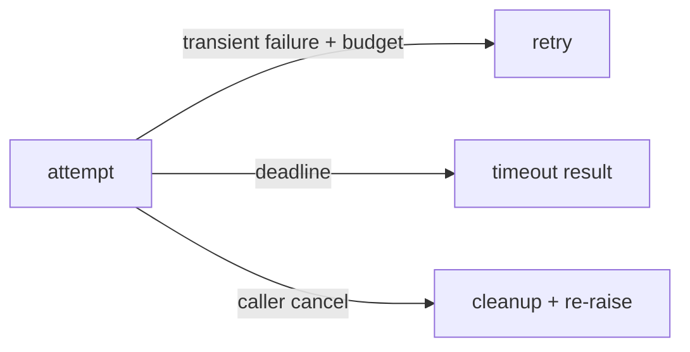

# Retries, timeouts, and cancellation

**Status:** partial

## Definitions
A **retry** repeats a classified transient operation within an attempt/time budget. A **timeout/deadline** stops waiting after bounded time. **Cancellation** communicates that the caller no longer wants work and must propagate through async code. They are related, not interchangeable.

## Archon implementation
`ResilientCoordinator._execute_with_fallback` uses bounded attempts and `asyncio.wait_for`, but is a prototype. `SecureToolRegistry.execute` enforces per-tool timeout. `EmbeddingService` bounds DNS/HTTP. `GroundedDocumentWorkflow.run` catches `CancelledError`, shields a terminal `run_stopped(reason="cancelled")`, then re-raises. `CircuitBreaker.call` abandons a cancelled half-open probe without wedging it. The bounded verifier has explicit retries/time/token budgets.

## Rules and failure modes
Retry only classified transient and idempotent operations; add backoff/jitter in production; use one end-to-end deadline; do not swallow cancellation; bound cleanup. Archon has no universal retry policy. Coordinator fallback can silently degrade validation and token budgets are recorded after calls, not pre-enforced.

## Evidence
`backend/tests/unit/test_grounded_rag.py::test_cancellation_finalizes_cancelled_run_and_reraises`, `backend/tests/unit/test_tools.py::TestSecureToolRegistry::test_timeout_enforcement`, `backend/tests/unit/test_evidence_verifier.py`.

## Interview prompt
“Retries address transient failure, deadlines bound latency, and cancellation preserves caller intent; all require truthful terminal evidence.”
