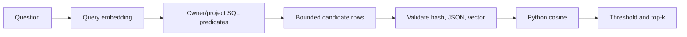
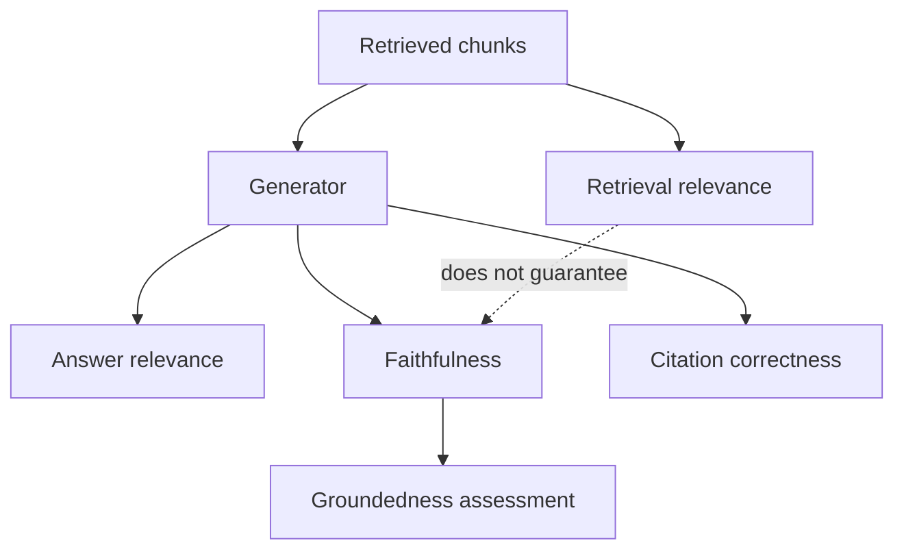

# Retrieval

**Status:** implemented locally; production scale partial

## Beginner definition

Retrieval selects and ranks stored chunks that may help answer a question.
It reduces a large corpus to a small evidence candidate set for the generator.
A high similarity score means the configured ranking function considered two vectors close.
It does not mean the chunk is true, sufficient, authorized, or correctly cited.

## Vocabulary

- **Candidate:** a chunk considered before final ranking and truncation.
- **Top-k:** the maximum number of highest-ranked results returned.
- **Minimum score:** the similarity threshold a result must meet.
- **Recall:** how often relevant evidence appears in the retrieved set.
- **Precision:** how much of the retrieved set is actually relevant.
- **Filter:** a database predicate narrowing the legal search scope.
- **Reranking:** a second, usually more expensive ordering step.
- **Deduplication:** removal of repeated evidence.
- **Cosine similarity:** normalized vector dot product used by this implementation.

## Mental model

Retrieval is a librarian selecting a short stack before a researcher writes an answer.
A well-chosen stack improves the opportunity to answer.
The researcher can still misread it, invent details, or answer the wrong question.
Authorization determines which shelves the librarian may inspect before ranking begins.

## Archon implementation

The durable backend is `backend/app/services/sql_json_vector_store.py::SqlJsonVectorStore`.
Its public backend identity is `sql-json-cosine`.
Embeddings are serialized as JSON arrays in SQL rows.
This is SQLite/PostgreSQL-compatible SQL JSON storage with cosine computed in Python.
It is **not pgvector** and it has no vector index.
`PostgresJsonVectorStore` and `PgVectorStore` are compatibility aliases only.
`SqlJsonVectorStore.search` validates the query embedding first.
It applies mandatory `owner_id` and `project_id` SQL predicates.
It optionally filters by one `document_id` or a set of `document_ids`.
An explicitly empty `document_ids` set returns no results.
Rows are ordered by ID and bounded by `candidate_limit`, which defaults to 10,000.
Each row's content, 16-character content hash, embedding JSON, and metadata JSON is validated.
The persisted hash is compared with recomputed content using `hmac.compare_digest`.
Corrupt rows are skipped and logged as `corrupt_vector_row_skipped` without raw content.
`backend/app/services/vector_store.py::cosine_similarity` performs the ranking calculation.
Accepted rows are sorted descending and sliced to `top_k` after `min_score` filtering.
Scores are rounded to four decimal places in returned records.

## Evidence adaptation

`backend/app/services/grounded_rag.py::DocumentEvidenceRetriever.retrieve` embeds the question.
It requests owner/project/document-scoped results with `min_score=-1.0`.
It ignores rows whose `chunk` is not a `DocumentChunk`.
It deduplicates on `(document_id, content_hash)`.
It assigns run-local evidence IDs `E1`, `E2`, and so on after deduplication.
It preserves full text privately for verification and returns a bounded quote publicly.

## Quality boundaries

**Retrieval relevance** asks whether returned chunks help answer the question.
**Groundedness** asks whether factual answer claims are supported by supplied evidence.
**Faithfulness** asks whether generation stays within the retrieved context.
**Citation correctness** asks whether each cited item exists and supports its attached claim.
**Answer relevance** asks whether the final answer addresses the user's intent.
These axes can disagree.
A relevant chunk can lead to an unfaithful answer.
A faithful summary of an irrelevant chunk can fail answer relevance.
A grounded claim can cite a source that is factually wrong in the real world.
A structurally valid `E1` can still be citation-incorrect for a particular claim.

## Security and failure modes

Apply tenant and project filters in SQL before loading candidates or computing scores.
Never retrieve broadly and filter unauthorized rows after ranking.
Validate persisted hashes so changed content cannot silently masquerade as indexed evidence.
Treat retrieved text as untrusted prompt data, not model instructions.
Candidate truncation can hide the best result and reduce recall.
Near-duplicate chunks can monopolize top-k slots despite evidence-level deduplication.
A low `min_score` can admit noise; a high threshold can force false abstentions.
Embedding dimension or model mismatch invalidates comparisons.
Python scans create latency and memory growth as a scoped corpus expands.

## Observability

Track candidate count before validation, skipped-corruption count, returned count, and latency.
Track retrieval scores as diagnostics, not calibrated probabilities.
Track filters used, embedding version, backend identity, and top-k configuration.
Measure recall@k, precision@k, mean reciprocal rank, and no-result rate on labeled queries.
Monitor source diversity and duplicate-content-hash rates.
Break metrics down by tenant safely, document type, language, and query class.
The grounded workflow records evidence IDs, document IDs, chunk IDs, hashes, scores, and counts in `evidence_retrieved`.
Do not put raw evidence text in operational ledger events.

## Alternatives and trade-offs

BM25 or another sparse index handles exact identifiers and rare terms well.
Hybrid retrieval combines lexical and dense rankings.
A cross-encoder reranker can improve precision at additional latency and cost.
A native approximate-nearest-neighbor index scales better but introduces index tuning and recall trade-offs.
Metadata-first routing can narrow domains before vector search.
Parent-child retrieval can return broader context after matching smaller units.
Query rewriting or multi-query retrieval can improve recall but expands cost and attack surface.

## Lab versus production

The SQL JSON Python-cosine path is portable, deterministic, and inspectable for a lab.
It is appropriate for bounded datasets and validates scope and integrity behavior.
It must never be described as pgvector merely because a compatibility alias exists.
Production scale usually needs an indexed vector or hybrid backend with measured ANN recall.
Migrations must preserve ownership predicates, hash checks, score semantics, and deletion behavior.
Capacity tests should include worst-case scoped candidate counts and corrupt rows.
Quality tests need representative real embeddings; mock vectors only verify control flow.

## Evidence in this repository

- `backend/app/services/sql_json_vector_store.py::SqlJsonVectorStore.search`
- `backend/app/services/sql_json_vector_store.py::SqlJsonVectorStore.add_chunks`
- `backend/app/services/vector_store.py::VectorStoreProtocol`
- `backend/app/services/vector_store.py::cosine_similarity`
- `backend/app/services/grounded_rag.py::DocumentEvidenceRetriever.retrieve`
- `backend/tests/unit/test_embedding_hardening.py::test_sql_store_bounds_candidates_and_skips_corrupt_rows`
- `backend/tests/unit/test_embedding_hardening.py::test_sql_store_rejects_tampered_hashes_without_logging_raw_values`
- `backend/tests/unit/test_pgvector_store.py::test_add_and_search` uses a historical filename and compatibility alias.
- `backend/tests/unit/test_pgvector_store.py::test_search_with_document_filter`
- `backend/tests/unit/test_grounded_rag.py::test_duplicate_results_are_deduplicated`
- `backend/tests/unit/test_grounded_rag.py::test_owner_scope_restart_ledger_and_no_raw_database_content`
- `backend/tests/integration/test_durable_documents.py::test_restart_ownership_projects_delete_and_raw_pii`

## Exercise

Create six chunks for two owners and two projects, including one duplicate content hash and one corrupt vector row.
Search as one owner/project with `top_k=3` and document filters.
Confirm SQL scope excludes foreign rows before scoring and corruption is skipped.
Label relevant chunks for five questions and calculate recall@1 and recall@3.
Then inspect a generated answer separately for faithfulness, citation correctness, and answer relevance.
Explain why the retrieval score alone cannot decide those answer-level properties.

## 30-second interview answer

“Retrieval selects candidate evidence; it does not certify the answer. Archon stores vectors as SQL JSON, applies owner/project and optional document predicates in SQL, validates hashes and vectors, then computes cosine in Python and returns thresholded top-k results. It is explicitly not pgvector. This is inspectable for a bounded lab, while production needs measured recall, scalable indexing, and the same fail-closed scope guarantees.”

## Self-checks

1. **Where is cosine computed?** In Python through `cosine_similarity`, not in pgvector.
2. **What is the backend identity?** `sql-json-cosine`.
3. **When are owner/project filters applied?** In SQL before candidate rows are loaded and ranked.
4. **What can candidate limits damage?** Recall, because a relevant row may never be scored.
5. **Does top cosine imply a true source?** No; similarity does not establish source truth.
6. **Can faithful generation coexist with poor retrieval?** Yes; an answer can faithfully summarize irrelevant context.
7. **How are duplicate grounded results identified?** By `(document_id, content_hash)`.
8. **Why is the `PgVectorStore` name not evidence of pgvector?** It is only a source-compatibility alias to `SqlJsonVectorStore`.
