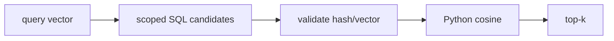

# Retrieval

**Status:** implemented locally; production scale partial

## Definition
Retrieval selects and ranks candidate chunks for a query. **Retrieval relevance** asks whether selected chunks help answer the question; it does not ask whether the generated answer is faithful.

## Archon implementation
`backend/app/services/sql_json_vector_store.py::SqlJsonVectorStore.search` applies owner/project and optional document predicates in SQL, loads at most `candidate_limit`, validates JSON vectors/content hashes/metadata, computes cosine similarity in Python, sorts, and returns top-k above `min_score`. Backend identity is `sql-json-cosine`.

## Precision warning
This is JSON vector storage in SQLite/PostgreSQL with a Python scan. It is **not pgvector** and has no vector index. `PgVectorStore = SqlJsonVectorStore` is a compatibility alias only.

## Failure/security modes
Scope before ranking; empty document sets return empty; corrupt rows are skipped with sanitized warning. Candidate truncation can reduce recall. Duplicate evidence is deduplicated by document/content hash in `DocumentEvidenceRetriever`.

## Evidence
`backend/tests/unit/test_pgvector_store.py` (historical filename), `backend/tests/unit/test_grounded_rag.py`, `backend/tests/integration/test_durable_documents.py`.

## Interview prompt
“Archon favors portable, inspectable SQL JSON cosine for the lab; indexed vector serving and measured recall remain production gaps.”
