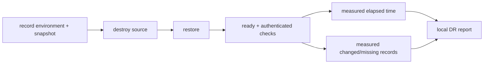

# Recovery time and recovery point

> **Documentation status:** Draft
> **Concept status:** `partial`
> **Status boundary:** The repository records measured recovery observations from one local drill. They are not adopted RTO/RPO objectives, SLOs, or guarantees.
> **Used by:** [Module 14](../modules/14-local-operations/README.md)

## Definitions

- **Recovery Time Objective (RTO):** an agreed maximum acceptable time to restore service after disruption.
- **Recovery Point Objective (RPO):** an agreed maximum acceptable data loss measured backward from disruption.
- **Observed recovery time/loss:** what one bounded drill actually measured.

Archon has the third item, not organization-approved objectives. Learn [Backup and restore](backup-restore.md) first.

## Measurement boundary

The drill times restore-to-ready and compares selected IDs, counts, and hashes at the snapshot boundary. Zero changed records there is a measured record-level observation; it is not a claim of zero loss for writes after the snapshot, continuous operation, or point-in-time recovery.

## Source and evidence

- [`scripts/local-dr-smoke.sh`](../../../scripts/local-dr-smoke.sh) defines timing and comparison points.
- [`docs/evidence/local-dr-report.json`](../../evidence/local-dr-report.json) records one environment-specific result.
- [`test_dr_smoke_covers_required_persisted_categories_without_fixed_secrets`](../../../backend/tests/unit/test_local_dr.py) checks drill structure, not elapsed-time performance.
- Canonical interpretation: [implementation evidence](../../IMPLEMENTATION-EVIDENCE.md).

## Why status is partial

Measurement machinery and one observation exist, but objectives require business approval, workload assumptions, repeated representative drills, monitoring, escalation, and remediation when targets are missed.

## Interview answer

“I report the local drill’s measured recovery time and observed record difference from the canonical evidence page. I do not rename those numbers RTO/RPO objectives. Objectives remain partial operational work until agreed and repeatedly validated under representative conditions.”
