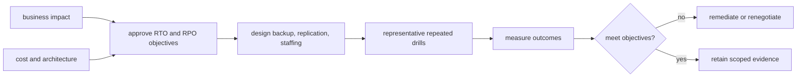
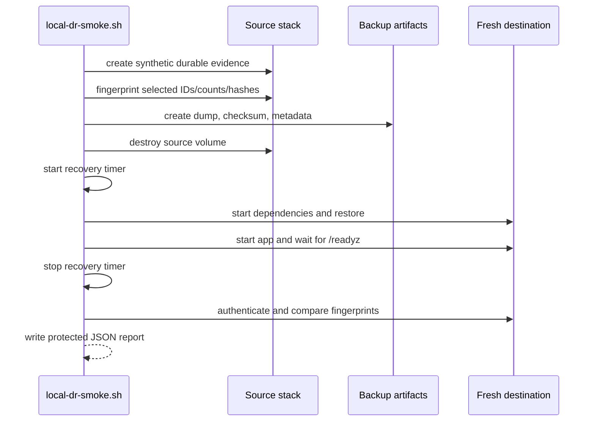
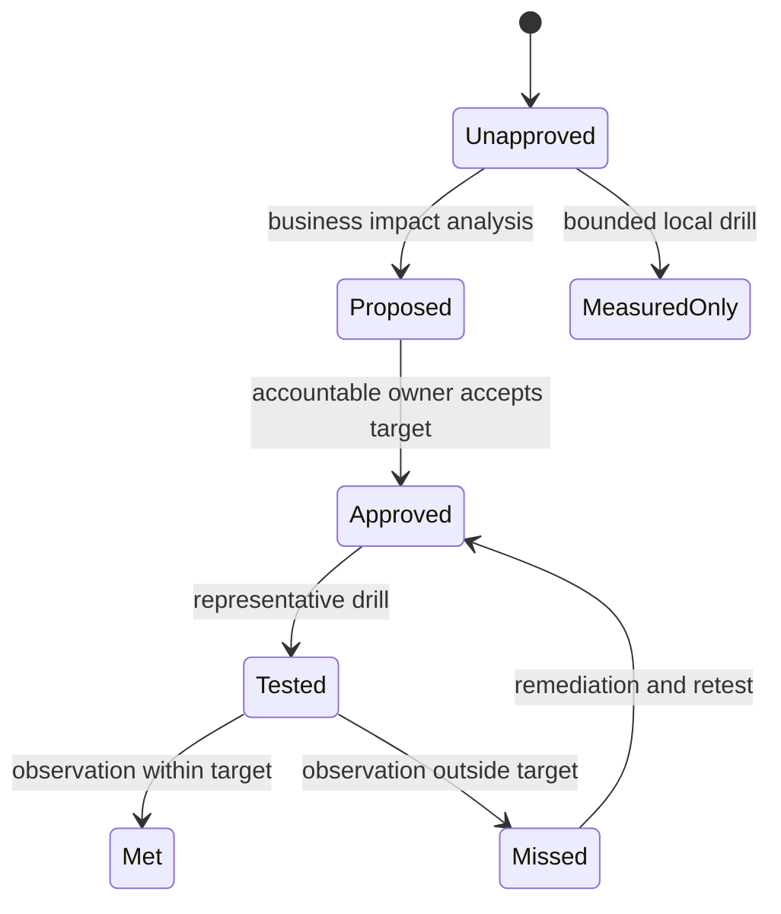

# Recovery time and recovery point

> **Documentation status:** Draft
> **Concept status:** `partial`
> **Status boundary:** The repository records measured observations from one bounded local recovery drill; no organization-approved RTO/RPO objective, SLO, or guarantee exists.
> **Used by:** [Module 14](../modules/14-local-operations/README.md)

## Beginner explanation

A service owner must decide how long an outage may last and how much recent data may be lost.
Recovery Time Objective, or RTO, is an agreed maximum acceptable restoration time.
Recovery Point Objective, or RPO, is an agreed maximum acceptable data-loss window measured backward from the disruption.
An objective is a business decision informed by risk, cost, and system capability.
A stopwatch result from one drill is only an observation.
Archon currently has one local measured recovery-time observation and one selected-record difference observation at the backup boundary.
It does not have approved RTO or RPO objectives.
It also does not have evidence of continuous writes, point-in-time recovery, failover, or representative production scale.

## Vocabulary and distinctions

| Term | Plain-English meaning |
|---|---|
| RTO | approved maximum acceptable outage duration |
| RPO | approved maximum acceptable data-loss window |
| observed recovery time | elapsed time measured by a specific drill |
| observed record difference | selected missing/changed record count in a specific comparison |
| snapshot boundary | instant represented by the backup |
| drill | controlled recovery exercise with recorded scope |
| guarantee | commitment supported by architecture and operations; absent here |

Never rename report fields into promises.
The report currently uses `rto_seconds` and `rpo_records`, but their honest interpretation is measured local recovery time and selected record difference for that drill.
Field names do not create policy.
“Zero changed selected records at the snapshot boundary” does not mean zero seconds of possible data loss after the snapshot.
Learn [Backup and restore](backup-restore.md) first.

## Objective-setting model



Archon is at the measurement stage for one local path, without the preceding business approval or production architecture.
The page status is therefore `partial` even though scripts and a report exist.
An objective should identify service scope, outage start, recovery endpoint, data class, exclusions, workload, region, and authority that accepted it.
Repeated tests are needed because one fast result can be luck and one slow result can be environment noise.

## Current measurement boundary



[`scripts/local-dr-smoke.sh`](../../../scripts/local-dr-smoke.sh) starts the recovery timer after the source Compose project and its volumes are removed.
The stop point follows destination stack startup, restore, application start, and successful `/readyz`.
Authentication and exact record comparisons happen after that timer stop.
This is a specific measurement definition, not the only valid definition of service recovery.
A business objective might require the authenticated verification inside the time boundary.
The selected record comparison covers user, conversation, run/events, document/chunk hash, approval status/argument hash, and schema revision.
It does not sample writes after backup creation because the source is destroyed after the snapshot.

## State and decision model



Archon remains in `MeasuredOnly` for this concept.
The report is useful engineering evidence but cannot move the system to `Approved`.
Only accountable business and operations owners can select objectives and fund the design needed to meet them.

## Exact source, tests, and evidence

| Source or evidence | Exact contract or observation | Important limit |
|---|---|---|
| [`local-dr-smoke.sh`](../../../scripts/local-dr-smoke.sh) | timer boundaries, source destruction, restore, readiness, authentication, selected comparisons | local synthetic workload |
| [`local-backup.sh`](../../../scripts/local-backup.sh) | snapshot metadata and protected custom dump | no schedule or PITR |
| [`local-dr-report.json`](../../evidence/local-dr-report.json) | one measured result, snapshot, digest, selected counts and schema revision | not an objective or guarantee |
| [`test_dr_smoke_covers_required_persisted_categories_without_fixed_secrets`](../../../backend/tests/unit/test_local_dr.py) | script contains required categories and avoids fixed secrets | static structure, not elapsed performance |
| [Implementation Evidence](../../IMPLEMENTATION-EVIDENCE.md) | canonical interpretation and environment scope | mutable evidence, inspect revision |

Do not duplicate current numeric observations into planning documents without their date, revision, machine, workload, start/stop definition, and source link.
A later drill may differ.
A result can be compared with an objective only after that objective exists independently.

## How to choose objectives

Start with business impact rather than the fastest observed script.
List critical user journeys and durable data classes.
Estimate impact as outage and data-loss windows grow.
Identify legal, contractual, and safety limits.
Choose separate targets where services or data classes have different importance.
Design backup frequency and recovery architecture from the RPO.
Design detection, escalation, restore automation, capacity, and staffing from the RTO.
Budget time for incident declaration and diagnosis if the objective includes them.
Define how evidence will be reviewed and who can accept exceptions.
None of those governance steps is implemented by the current local report.

## Try it: bounded evidence-reading exercise

### Goal

Interpret the existing report without converting measurements into objectives.

### Setup and steps

Run from the repository root.
This exercise validates and reads an existing artifact; it does not start Docker or destroy data.
Do not execute the full DR smoke against shared resources.

```bash
python3 -m json.tool docs/evidence/local-dr-report.json >/dev/null
python3 - <<'PY'
import json
from pathlib import Path
report = json.loads(Path("docs/evidence/local-dr-report.json").read_text())
print("result:", report["result"])
print("measured recovery field present:", "rto_seconds" in report)
print("selected record-difference field present:", "rpo_records" in report)
print("snapshot recorded:", bool(report["backup"]["snapshot_utc"]))
PY
```

Write two sentences beginning with “This drill observed …” and “This drill did not establish …”.

### Done criteria

- [ ] JSON parses and the expected fields are present.
- [ ] Your wording says measured or observed, not objective, guarantee, or SLA.
- [ ] You state the timer start and stop boundaries.
- [ ] You state that post-snapshot writes were not tested.
- [ ] No container, volume, backup, or secret was created.

## Security and failure modes

| Threat or failure | Control or interpretation | Residual risk |
|---|---|---|
| optimistic timer | exact script boundaries are documented | business may need earlier start/later stop |
| tiny synthetic dataset | report identifies bounded local scope | scale may dominate real recovery |
| post-snapshot writes | explicitly excluded from zero-difference wording | actual data-loss window unmeasured |
| corrupted backup | checksum gate before restore | checksum is not authenticity |
| missing encryption key | continuity is called out | key recovery is not drilled here |
| report tampering | restricted file mode from drill | no signature or immutable evidence store |
| secret leakage | ephemeral env and cleanup | `KEEP=1` intentionally retains sensitive artifacts |
| one successful run | status remains partial | variability and failure rate unknown |
| unavailable staff/provider | local automation avoids some dependencies | incident response and cloud dependencies untested |
| objective drift | canonical evidence separates observation from target | copied numbers can still be misrepresented |

## Observability and evidence path

```text
snapshot metadata → destructive recovery stages → readiness timestamp → authenticated comparisons → protected report → canonical interpretation
```

The script’s `stage` variable identifies where a failed drill stopped.
Elapsed time is computed from nanosecond wall-clock samples and rendered in seconds.
The report includes the snapshot timestamp and checksum so the restored source can be identified.
Selected counts and IDs help reviewers understand what “recovered” meant.
This operational evidence does not enter agent metrics or fabricate an authenticated Core API recovery object.
Production evidence would need durable drill history, alerts for backup freshness, restore success rates, objective compliance calculations, and incident review.

## Alternatives and trade-offs

| Recovery design | Potential benefit | Cost or limitation |
|---|---|---|
| periodic logical dump | simple and portable | recovery point tied to snapshot schedule |
| WAL archive/PITR | finer-grained point selection | operational complexity and storage |
| warm standby | shorter restoration time | replication lag and ongoing cost |
| multi-region active/passive | regional resilience | failover testing, data consistency, expense |
| active/active | low failover time | conflict, consistency, and major complexity |

Architecture should follow approved objectives and threat scenarios.
The current local dump/restore path cannot justify selecting an aggressive target.

## Lab vs production

| Dimension | Demonstrated | Missing or unverified |
|---|---|---|
| measurement | one bounded local elapsed-time observation | distribution across repeated drills |
| recovery point | selected records match snapshot | post-snapshot loss window and PITR |
| workload | small synthetic dataset | representative volume and write rate |
| environment | local Compose on recorded platform | managed/cloud/regional incident |
| governance | honest canonical evidence | approved objectives, owners, exceptions |
| operations | scripted cleanup and stage failure | on-call, escalation, alerting, audit |

Status remains `partial`: measurement machinery exists, but objectives and production validation do not.

## Interview answer

### 30-second answer

> RTO and RPO are approved business objectives: maximum acceptable restoration time and data-loss window. Archon has neither. It has one local DR report measuring a script-defined restore-to-readiness interval and selected record differences at the backup snapshot. The drill destroys a source, restores PostgreSQL, becomes ready, authenticates, and compares IDs, counts, and hashes. That is useful evidence, but not a guarantee, PITR proof, or production objective.

## Self-check

1. What is the difference between an objective and an observation?
2. When does the current recovery timer start and stop?
3. Why does a zero selected-record difference not mean zero data-loss time?
4. Which test inspects the drill’s structure?
5. Why is the concept status `partial`?
6. Who should approve RTO/RPO?
7. What additional evidence would production need?

<details>
<summary>Answer guide</summary>

1. An objective is an approved acceptable limit; an observation is what happened in one scoped execution.
2. It starts after source volume destruction and stops after destination restore, startup, and successful readiness.
3. The comparison is at the snapshot boundary and does not include later writes.
4. `test_dr_smoke_covers_required_persisted_categories_without_fixed_secrets`.
5. Only one local bounded measurement exists; approved targets and representative repeated validation are absent.
6. Accountable business, risk, and operations owners, informed by engineering capability and cost.
7. Repeated scale-representative drills, backup freshness, PITR/failover tests, monitoring, escalation, and objective compliance history.

</details>

## Related concepts

- [Backup and restore](backup-restore.md)
- [Docker and Compose](docker-compose.md)
- [Liveness and readiness](liveness-readiness.md)
- [Module 14](../modules/14-local-operations/README.md)
