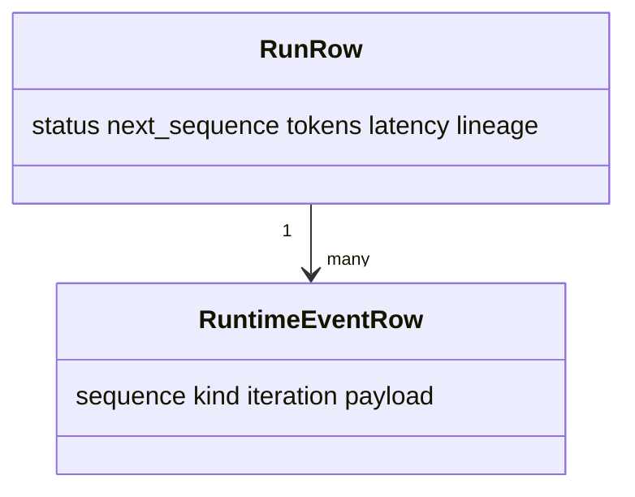

# Run Ledger

**Status:** implemented

## Definition
The Run Ledger is an owner-scoped durable flight recorder containing a run summary and an append-only, ordered sequence of safe execution events.

## Archon implementation
`backend/app/services/run_ledger.py::RunRepository` creates `RunRow`, projects payloads through event-specific `_SAFE_FIELDS` and `PersistenceRedactor`, atomically increments `next_sequence`, inserts `RuntimeEventRow`, and performs a guarded terminal update for `run_stopped`. Reads validate `SCHEMA_VERSION`; retention deletes whole terminal runs.

## Invariants
Sequences are unique/contiguous for committed events. Owner predicates apply to reads and mutations. Terminal state cannot be overwritten or appended to. Raw prompts, chain-of-thought, tool arguments/results, and evidence quotes are excluded; hashes/IDs/counts remain.

## Evidence and limits
`backend/tests/unit/test_run_ledger.py`, `backend/tests/integration/test_run_replay_api.py`, and `docs/evidence/local-portfolio-benchmark.json`. The ledger proves recorded control events, not semantic truth, tamper-proof/WORM storage, or globally distributed ordering.

## Interview prompt
“An allowlisted append-only trajectory makes behavior inspectable without persisting sensitive reasoning or tool payloads.”
