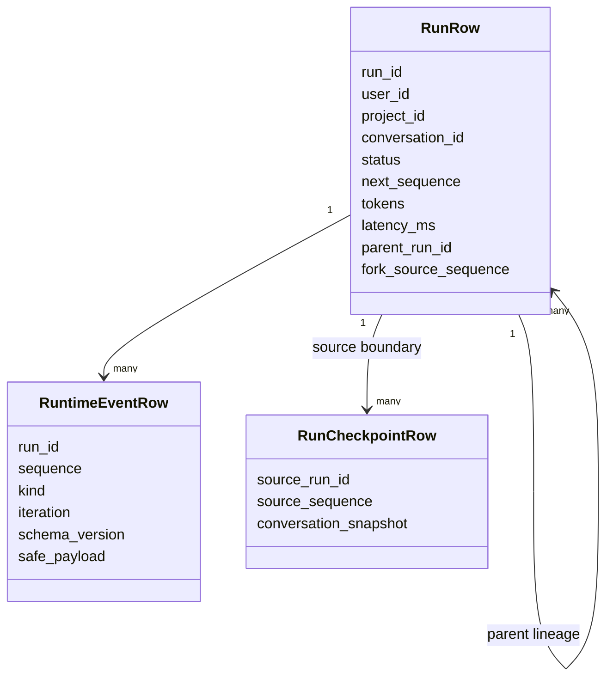
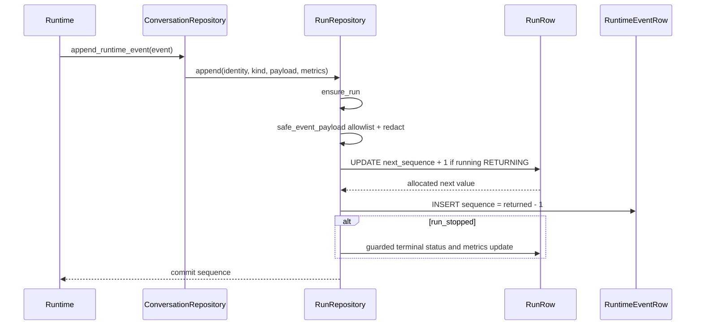
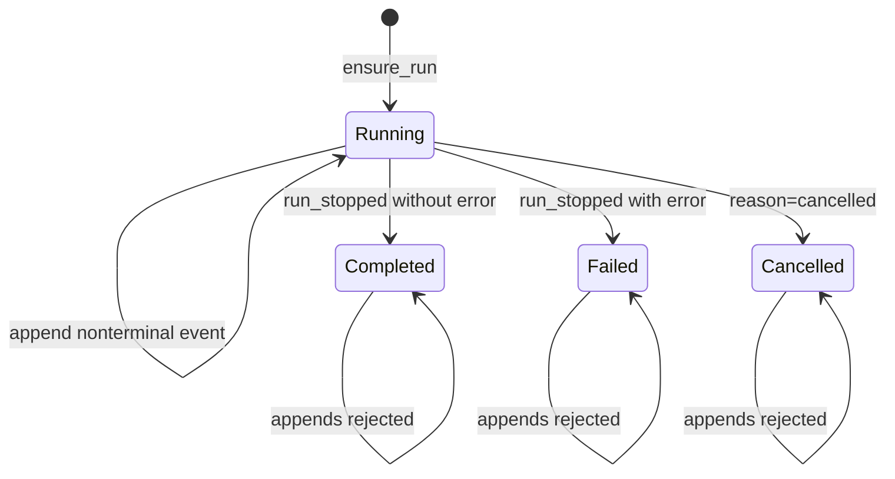

# Run Ledger

> **Implementation status:** `implemented`
> **Boundary:** The ledger is an owner-scoped durable flight recorder of allowlisted control events and run aggregates; it is neither chain-of-thought, a full transcript, tamper-proof storage, nor semantic truth.

## Beginner explanation

A Run Ledger answers operational questions about one agent execution: when it began, which safe control events committed, whether policy or approval intervened, how it ended, and what bounded metrics were recorded.
Each run has one summary row and an ordered sequence of event rows.
The sequence is append-only while the run is active and frozen after terminal completion.

“Flight recorder” does not mean “record everything.”
Archon deliberately excludes raw prompts, hidden reasoning, tool arguments/results, evidence quotes, and provider exception text.
It keeps safe metadata such as event kind, sequence, iteration, IDs, hashes, counts, statuses, reason codes, token totals, and latency.

## Data model



`RunRow.next_sequence` is the atomic allocator.
The database enforces unique `(run_id, sequence)` for runtime events.
A run-local sequence establishes committed order for that run; it is not a global clock across runs or regions.

## Append sequence



`RunRepository.ensure_run` creates a running row conflict-safely for SQLite and PostgreSQL.
If the conversation has a pending fork draft, only the transaction that creates its first run consumes it and records lineage.
`RunRepository.append` projects and serializes safe payload **before** opening the event transaction.
The guarded update requires the owned run to be `running` with no completion timestamp.
If allocation fails, an owner mismatch and a terminal run produce distinct internal `ValueError` paths without appending an event.

## Safe payload projection

`backend/app/services/run_ledger.py::_SAFE_FIELDS` maps every accepted `AgentEventKind` to permitted keys.
Examples include tool call ID/name plus argument/output hashes and output size, policy risk classes and reason code, approval status, evidence IDs/content hashes/scores/counts, and verification counts.
Text deltas, model progress, and iteration-start events persist no payload fields.
For `run_stopped`, exception detail becomes only a boolean `error` indicator.
`safe_event_payload` rejects unknown event kinds, drops non-allowlisted keys, then recursively applies `PersistenceRedactor`.

This design is data minimization, not reconstruction.
A hash can correlate a known argument or output but cannot show what it meant or whether it was correct.
An event says the application recorded an outcome; it does not certify the external world or the model's internal reasoning.

## Terminal state machine



The `run_stopped` event insert and guarded terminal summary update occur in one transaction.
Status becomes `cancelled` for cancellation, `failed` when safe error presence is true, otherwise `completed`.
Completion freezes timestamp, stop reason, token totals, iteration count, and computed latency.
A racing ordinary append either commits before the terminal event or fails; the terminal event remains last.

## Read, replay, and retention

`RunRepository.list`, `get`, `events`, and `list_children` all apply owner predicates and bounded pagination.
`_run_record` rejects unsupported run schema versions.
`_event_record` rejects unsupported kinds/versions, malformed JSON, and payload keys outside the current allowlist.
The runs API uses these methods for stored-only replay and comparison without model/tool access.

`prune_completed` deletes whole owner-scoped terminal trajectories older than a cutoff.
`prune_terminal_to_event_budget` removes oldest whole terminal runs until a global event budget is met.
Active runs and inconsistent terminal-looking rows without `completed_at` are not treated as safe prune candidates.
Retention never truncates half a trajectory: event rows are removed before their parent run.

## Invariants

- Every run read and mutation is bound to authenticated `user_id`.
- Committed event sequences are unique and contiguous per run.
- Sequence allocation and event insert share one transaction.
- A terminal event is last and terminal state cannot be overwritten.
- Unknown event kinds cannot be persisted through `append`.
- Read-side schema/payload validation fails closed.
- Payload persistence is allowlist-based, not denylist-based.
- Raw reasoning, prompts, arguments, outputs, quotes, and exception messages are excluded.
- Retention deletes complete terminal runs, not arbitrary old events.
- Run-local order is not global distributed order.

## Source symbols

| Symbol | Role |
|---|---|
| `backend/app/services/run_ledger.py::SCHEMA_VERSION` | Reader/writer compatibility boundary |
| `backend/app/services/run_ledger.py::_SAFE_FIELDS` | Per-kind payload allowlist |
| `backend/app/services/run_ledger.py::safe_event_payload` | Projection, error booleanization, redaction |
| `backend/app/services/run_ledger.py::RunRepository.ensure_run` | Idempotent creation and fork lineage |
| `RunRepository.append` | Atomic allocation, event insert, terminal update |
| `RunRepository.events` | Owner-scoped ordered replay page |
| `RunRepository.prune_completed` | Owner/time retention |
| `RunRepository.prune_terminal_to_event_budget` | Whole-run event-budget retention |
| `RunRepository._run_record` / `_event_record` | Fail-closed deserialization |
| `backend/app/services/db_store.py::RunRow` | Summary and allocator schema |
| `backend/app/services/db_store.py::RuntimeEventRow` | Event schema and uniqueness |
| `backend/alembic/versions/20260826_03_run_ledger.py` | Durable ledger migration |

## Tests and runtime evidence

`backend/tests/unit/test_run_ledger.py::test_concurrent_append_is_unique_contiguous_and_restart_safe` commits 30 concurrent appends and verifies sequences 1 through 30 after repository restart.
`test_redaction_and_allowlist_leave_no_raw_sensitive_payload` inspects the raw database payload.
`test_concurrent_append_racing_finalize_is_linearizable` proves the terminal event is last under a race.
`test_finalize_is_idempotent_and_cannot_overwrite_terminal_run` proves terminal immutability.
`test_malformed_payload_and_unknown_version_fail_closed` proves defensive reads.
`backend/tests/unit/test_runtime_observability.py` covers event-to-metric/span mapping and whole-run budget retention.
`backend/tests/integration/test_run_replay_api.py` proves owner-scoped stored-only reads.
`backend/tests/integration/test_run_ledger_migration.py` covers legacy migration and round-trip.
`docs/evidence/local-portfolio-benchmark.json` is local benchmark evidence; read its revision/environment before making performance claims.

## Security and failure modes

| Threat/failure | Control or behavior | Residual risk |
|---|---|---|
| Secret in tool payload | Allowlist drops arguments/results; redactor is second layer | IDs/hashes can still be sensitive metadata |
| Exception leaks prompt | Store boolean error presence only | Operational logs need independent redaction |
| Cross-owner run lookup | Owner predicate, missing-like response | New joins and admin paths need review |
| Concurrent append collision | Atomic allocator plus unique constraint | Database outage still loses availability |
| Append after finalization | Guard requires running/no completion | Out-of-band DB writes can violate assumptions |
| Corrupted or future schema | `LedgerDataError` fails closed | Requires migration or repair tooling |
| Retention cuts trajectory | Delete whole terminal runs only | Policy may delete evidence too early |
| Ledger tampering | Ordinary database controls | No signature, hash chain, WORM, or attestation |
| Semantic overclaim | Documentation and bounded fields | Consumers may still mistake records for truth |

The ledger is not chain-of-thought and must not be expanded into hidden reasoning storage.
Capturing more raw data would increase breach impact and may violate provider/user expectations without making the record semantically authoritative.

## Observability

The ledger itself is one evidence sink, while metrics, traces, and structured logs are complementary projections.
Correlate by `run_id`, `conversation_id`, and `correlation_id`; use sequence for run-local ordering.
Monitor append latency/error count, sequence conflicts, terminal status distribution, active-run age, event count per run, retention deletions, unsupported schema reads, and ledger database health.
Never export payload fields to high-cardinality metric labels.
Never put raw prompt/tool values into traces to compensate for ledger minimization.
A missing event can mean the event was never emitted, was rejected, or the transaction failed; use surrounding health signals before concluding what happened.

## Trade-offs

Allowlisting sharply limits sensitive persistence but requires explicit updates for every new event kind or field.
Atomic database ordering is durable and concurrency-safe but adds a write per runtime event.
Per-run order scales better than one global sequence but cannot answer total ordering across runs.
Fail-closed versioning avoids silently misreading data but can make old records temporarily unavailable during migration mistakes.
Whole-run retention preserves explainability but may overshoot a strict event budget while active runs remain.
Summary metrics are convenient but can diverge from external billing unless reconciled with provider reports.

## Lab versus production

SQLite concurrency and migration tests provide deterministic contract evidence for local development.
Production should exercise PostgreSQL locking under load, migration rollback/forward plans, backups, retention jobs, owner-access audits, and alerting.
If compliance requires tamper evidence, add signatures/hash chains or WORM storage as a separately tested architecture; do not relabel the current database as immutable.
If analytics require global order, use an explicit clock/stream design rather than interpreting per-run sequence globally.
No local benchmark proves production capacity, durability class, or audit certification.

## Exercise

Run the focused ledger contracts:

```bash
cd backend
uv run pytest -q \
  tests/unit/test_run_ledger.py \
  tests/unit/test_runtime_observability.py::test_runtime_event_budget_prunes_oldest_terminal_run_whole \
  tests/integration/test_run_replay_api.py
```

Then choose `tool_call_completed` in `_SAFE_FIELDS` and list every accepted key and every intentionally omitted value.
Explain how the `UPDATE ... RETURNING` allocator and same-transaction insert prevent duplicate committed sequence numbers.

## 30-second interview answer

“Archon's Run Ledger is an owner-scoped durable run summary plus append-only, run-local ordered safe events. `RunRepository.append` allowlists and redacts payload metadata, atomically increments `RunRow.next_sequence`, inserts the event, and guardedly freezes terminal status and metrics. Reads validate schema and payload shape, and retention deletes whole terminal trajectories. It records inspectable control evidence without raw prompts, chain-of-thought, tool arguments/results, or evidence quotes. It is not WORM storage, a global clock, re-execution, or proof that an event's semantic claim is true.”

## Self-check

1. **Are sequences globally ordered?** No; they are contiguous only within one committed run.
2. **Why an allowlist instead of a denylist?** Unknown fields are excluded by default, reducing accidental leakage.
3. **What is stored for an error?** Presence as a boolean, not raw exception text.
4. **Can events be appended after `run_stopped`?** No; the guarded allocator rejects terminal runs.
5. **Does a ledger event prove a tool changed the external world?** No; it proves a safe event was recorded.
6. **Is chain-of-thought stored?** No, deliberately.
7. **How does retention preserve trajectory integrity?** It deletes event rows and their terminal parent run as a whole.
8. **What happens with malformed stored payloads?** Read conversion raises `LedgerDataError`.

## Related concepts

- [Replay, fork, and compare](replay-fork-compare.md)
- [Checkpoints](checkpoints.md)
- [Conversation lifecycle](conversation-lifecycle.md)
- [Context windows](context-windows.md)
- [Parent-child lineage](parent-child-lineage.md)
- [Structured logging](structured-logging.md)
- [Metrics](metrics.md)
- [Tracing and OpenTelemetry](tracing-opentelemetry.md)
- [Migrations](migrations.md)
