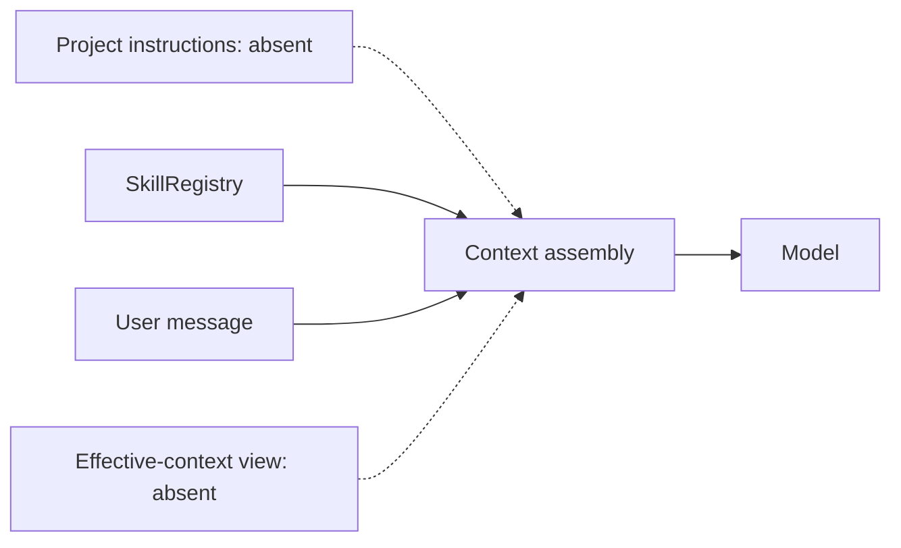
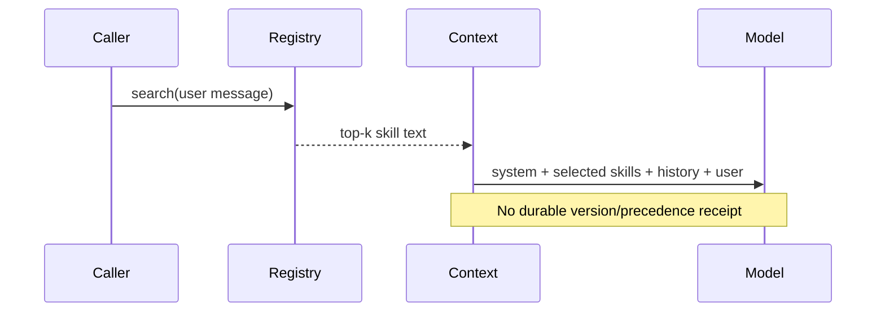

# Skills and project instructions

> **Implementation status:** `partial`
> **Status boundary:** Keyword-selected skills are injected into sync and streaming chat, but there is no project-file instruction convention, precedence model, immutable version/provenance record, or effective-context inspector.
> **Reviewed revision:** `c115d62`
> **Used by module:** [Module 06-context-and-memory](../modules/06-context-and-memory/README.md)
> **Catalog ID:** `skills-project-instructions`

## Beginner explanation

Instructions tell an agent how to behave; a skill is a reusable packet of task guidance selected when relevant. A production system must state which instruction wins when system, organization, project, skill, and user directions conflict. Merely concatenating matching text is not an instruction governance model.

## Problem and mental model

Treat the boundary as a contract with explicit inputs, outputs, state, failure behavior, and evidence. The important question is not whether a similarly named class or file exists, but whether the behavior is wired into a real path and whether a test or observation proves it.

## Architecture and components

## Startup and request sequence

## Archon implementation and source walkthrough

At revision `c115d62`, the mapped symbols implement the bounded behavior below. Remote loading and mutable global registry lack a complete trust, ownership, version, and precedence contract.

### Source symbols

| Source symbol | Role and boundary |
|---|---|
| [`backend/app/skills/registry.py:SkillRegistry.search`](../../../backend/app/skills/registry.py) | Ranks registered skills by keyword matches. |
| [`backend/app/routes/chat.py:chat`](../../../backend/app/routes/chat.py) | Adds relevant skill content to the synchronous request path. |
| [`backend/app/routes/stream.py:chat_stream_real`](../../../backend/app/routes/stream.py) | Searches skills and adds their content to streaming context. |

### Tests

| Test | Contract proved and limit |
|---|---|
| [`backend/tests/unit/test_skills_security.py::TestSkillRegistry`](../../../backend/tests/unit/test_skills_security.py) | Proves registry/search behavior, not project precedence or provenance. |

### Evidence boundary

Current implementation dimensions are centralized in [Implementation Evidence](../../IMPLEMENTATION-EVIDENCE.md). Source/tests below are repository evidence; they are not public-deployment or production-certification evidence.

## Try it: bounded study exercise

From the repository root, inspect the mapped source and test, then run the named focused test with the project test environment if available. Confirm both the passing contract and this gap: Remote loading and mutable global registry lack a complete trust, ownership, version, and precedence contract.

**Done criteria:** identify the trust boundary, one proved behavior, and one unproved behavior without changing repository state.

## Risks, failures, and trade-offs

| Topic | Assessment |
|---|---|
| Principal risk | Untrusted or stale instructions can override intended behavior or leak across scopes. |
| Current gap/failure | Remote loading and mutable global registry lack a complete trust, ownership, version, and precedence contract. |
| Trade-off | Automatic selection is convenient; explicit pinned project instructions are more reproducible. |
| Evidence hygiene | Do not log secrets or hidden chain-of-thought; record revision, environment, command, and only redacted outcomes. |

## Lab vs production

The status remains **partial** at `c115d62`. Keyword-selected skills are injected into sync and streaming chat, but there is no project-file instruction convention, precedence model, immutable version/provenance record, or effective-context inspector. Unit tests, manifests, or local observations do not prove external-provider parity, sustained load, public deployment, legal compliance, or a production SLO.

## Interview answer

> Instructions tell an agent how to behave; a skill is a reusable packet of task guidance selected when relevant. A production system must state which instruction wins when system, organization, project, skill, and user directions conflict. Merely concatenating matching text is not an instruction governance model. In Archon the honest status is **partial**: Keyword-selected skills are injected into sync and streaming chat, but there is no project-file instruction convention, precedence model, immutable version/provenance record, or effective-context inspector.

## Self-check

1. What problem does this concept solve, and what nearby concept is it not?
2. Trace the diagram’s trust boundary and failure path.
3. Which mapped symbol/test proves current behavior, or why are the lists empty?
4. What exact gap prevents a stronger status?
5. Which risk would you test first before production use?

Answer guide

A good answer names the contract in the beginner explanation, follows the sequence, cites the exact table entry (or the explicit absence), repeats the status boundary, and chooses a risk from the table rather than claiming unrecorded behavior.

## Related concepts and modules

- **Module:** [Module 06-context-and-memory](../modules/06-context-and-memory/README.md)
- **Course-day map:** [AIAMastery Days 1–30 coverage](../course-concept-coverage.md)
- **Evidence:** [Implementation Evidence](../../IMPLEMENTATION-EVIDENCE.md)
- **Historical context only:** [Feature and Course Audit v2](../../FEATURE-AND-COURSE-AUDIT-V2.md)
