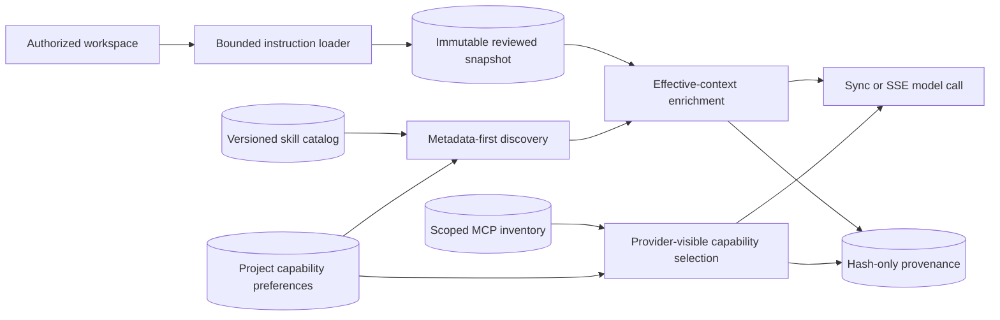
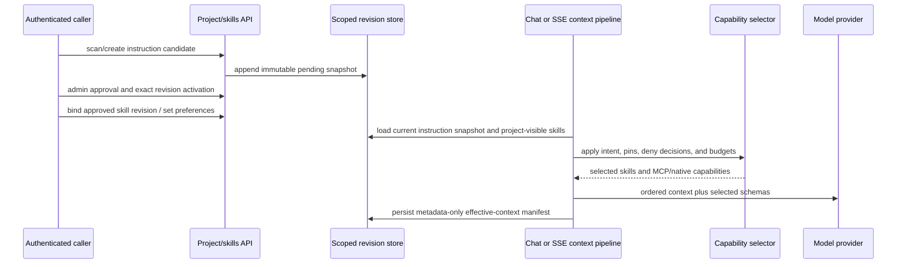

# Skills and project instructions

> **Implementation status:** `implemented`
> **Status boundary:** The candidate at `a642952` implements owner/project-scoped immutable skill revisions, reviewed project-instruction snapshots, deterministic precedence, bounded discovery, exact provenance, and sync/SSE wiring. MCP capabilities share project preferences and provider-visible provenance. This is repository-tested local candidate behavior; it is **not deployed** and does not prove a public multi-tenant service.
> **Reviewed revision:** `a642952` (local candidate)
> **Used by module:** [Module 06-context-and-memory](../modules/06-context-and-memory/README.md)
> **Catalog ID:** `skills-project-instructions`

## Beginner explanation

A project instruction is reviewed guidance that applies to one project. A skill is a versioned reusable package selected for a task. MCP tools are external capabilities, not instructions, but the same project preference layer can enable, disable, or pin them before provider schemas are built. Archon now keeps these concerns separate and records hashes and revision identifiers instead of treating an unversioned text concatenation as governance.

## Problem and mental model

Use a **compile, approve, select, snapshot** model:

1. load only one configured instruction family from an already-authorized workspace;
2. persist an immutable, owner/project-scoped snapshot and require approval before activation;
3. discover only approved and trusted skill revisions bound to that project;
4. apply capability preferences, permission decisions, negative triggers, and byte/schema budgets before model exposure;
5. record content hashes, exact revisions, order, reasons, and provider-visible capability schema hashes without storing raw instruction bodies in provenance.

This controls which candidate context and capability descriptions reach a run. It does not make instruction text trustworthy, make MCP side effects reversible, or establish deployment.

## Architecture and components

The filesystem loader supports one explicitly selected family per scan: `.archon/instructions.md`, `AGENTS.md`/`AGENTS.override.md`, or `CLAUDE.md`. Relative `@include` files are bounded and cycle checked. Secure descriptor-relative traversal rejects symlinks, hardlinks, non-regular files, path escapes, excess depth, count, or bytes. The caller must first authorize the workspace root.

## Startup and request sequence

## Deterministic precedence and selection

`resolve_effective_context` orders structural layers as system, root-to-leaf project instructions, pinned skills, selected skills, then the current user task. It rejects duplicate identifiers instead of attempting semantic conflict resolution. A byte budget always preserves mandatory system/user blocks, omits lower-priority optional blocks deterministically, and fails if mandatory content cannot fit.

The live request preparation uses durable project instruction snapshots and project-visible exact skill revisions. Skill discovery starts from metadata, honors explicit invocation, negative triggers, required permissions, disabled/pinned preferences, and a context budget; full skill instructions and declared references are loaded only after selection and scope revalidation. Sync and SSE use the same preparation boundary.

MCP remains a tool boundary. Enabled, healthy, owner/project-scoped MCP metadata participates in capability selection; only selected schemas are materialized, and provider-visible capabilities carry permission, selection reason, and schema hash in provenance. Calls still pass through schema validation, policy, approval, timeout, audit, and stale-binding checks. Deployment-owned Streamable HTTP profiles are supported in addition to stdio, but profile URLs and credential references are not persisted in inventory or exposed by the profile API.

## Archon implementation and source walkthrough

### Source symbols

| Source symbol | Role and boundary |
|---|---|
| [`backend/app/instructions/loaders.py::load_project_instructions`](../../../backend/app/instructions/loaders.py) | Loads one configured filesystem family beneath an authorized root with no-follow traversal and resource limits. |
| [`backend/app/instructions/resolver.py::resolve_effective_context`](../../../backend/app/instructions/resolver.py) | Applies explicit structural precedence, duplicate rejection, and deterministic byte budgeting. |
| [`backend/app/skills/persistence.py::SkillRepository`](../../../backend/app/skills/persistence.py) | Stores append-only owner-scoped skill revisions and exact project bindings/pins. |
| [`backend/app/skills/persistence.py::ProjectInstructionRepository`](../../../backend/app/skills/persistence.py) | Stores ordered immutable instruction snapshots and an owner/project-scoped current revision. |
| [`backend/app/skills/discovery.py::SkillDiscoveryService`](../../../backend/app/skills/discovery.py) | Performs metadata-first project-scoped discovery and revalidates exact revisions/references before loading content. |
| [`backend/app/skills/context.py::EffectiveContextEnrichmentService.enrich`](../../../backend/app/skills/context.py) | Adds approved instruction sources and selected skill bodies under one byte budget and creates metadata-only provenance. |
| [`backend/app/routes/project_instructions.py`](../../../backend/app/routes/project_instructions.py) | Exposes authenticated create, scan, list, approve, revoke, and resolve operations. Scan is disabled unless a workspace root is configured. |
| [`backend/app/routes/chat.py::chat`](../../../backend/app/routes/chat.py) and [`backend/app/routes/stream.py::chat_stream_real`](../../../backend/app/routes/stream.py) | Wire the same scoped context/capability preparation into sync and SSE requests. |
| [`backend/app/capabilities/selector.py::select_capabilities`](../../../backend/app/capabilities/selector.py) | Applies deterministic preferences, permissions, negative triggers, pins, and budgets across capability metadata. |
| [`backend/app/mcp/runtime.py::MCPRuntimeToolProvider.for_scope`](../../../backend/app/mcp/runtime.py) | Selects scoped MCP metadata first and materializes only enabled schemas under count/byte limits. |
| [`backend/app/runtime/context_provenance.py::EffectiveContextManifest`](../../../backend/app/runtime/context_provenance.py) | Records exact instruction/skill revisions and provider-visible capability schema hashes without raw bodies. |

### Migration chain 15–22

The linear Alembic chain `20260901_15` through `20260902_22` introduces skill packages/revisions and project instruction state, skill references and project pins, capability preferences, ordered instruction snapshot sources, MCP transport-profile evolution, owner/integrity hardening, exact capability provenance, and forward-head core-table reconciliation. Migration tests check round trips, scope fences, immutability, Streamable HTTP compatibility, the serialized PostgreSQL migration runner, and legacy schema adoption. Schema migration evidence is still local test evidence, not proof that any public deployment was upgraded.

### Tests

| Test | Contract proved and limit |
|---|---|
| [`backend/tests/unit/test_instruction_loaders.py`](../../../backend/tests/unit/test_instruction_loaders.py) | Root-to-leaf families, override semantics, includes, path containment, no-follow traversal, and resource limits. |
| [`backend/tests/unit/test_instruction_precedence.py`](../../../backend/tests/unit/test_instruction_precedence.py) | Structural ordering, duplicate rejection, and deterministic budget behavior; it does not understand semantic contradictions. |
| [`backend/tests/unit/test_instruction_snapshots.py`](../../../backend/tests/unit/test_instruction_snapshots.py) | Exact ordered restart-safe snapshots, owner scope, provenance, and tamper failure. |
| [`backend/tests/unit/test_skill_discovery_enrichment.py`](../../../backend/tests/unit/test_skill_discovery_enrichment.py) | Bundled bootstrap, metadata-first selection, exact revision pinning, lazy references, budgets, and metadata-only provenance. |
| [`backend/tests/integration/test_scoped_configuration_apis.py`](../../../backend/tests/integration/test_scoped_configuration_apis.py) | Authenticated instruction/capability APIs, owner isolation, chat provenance, restart persistence, and hidden MCP profile configuration. |
| [`backend/tests/integration/test_instruction_snapshot_api.py`](../../../backend/tests/integration/test_instruction_snapshot_api.py) | Filesystem scan persists exact sources and requires admin approval. |
| [`backend/tests/integration/test_skill_migration.py`](../../../backend/tests/integration/test_skill_migration.py), [`test_instruction_snapshot_migration.py`](../../../backend/tests/integration/test_instruction_snapshot_migration.py) | Migration round trips plus scope and immutability guards. |
| [`backend/tests/unit/test_mcp_remote_client.py`](../../../backend/tests/unit/test_mcp_remote_client.py), [`backend/tests/integration/test_mcp_transport_governance.py`](../../../backend/tests/integration/test_mcp_transport_governance.py) | Governed Streamable HTTP configuration, deferred credential lookup, bounded reconnect, hidden secrets, and metadata-first schema loading using deterministic mocks. |
| [`backend/tests/unit/test_context_provenance.py`](../../../backend/tests/unit/test_context_provenance.py) | Canonical, validated instruction/skill/capability provenance and schema hashes. |

### Evidence boundary

The implementation is present and covered by repository tests on merged `main`. `implemented` means the bounded code path exists and is tested; **deployed remains no**. No public endpoint, hosted database migration, external secret broker, remote production MCP observation, production SLO, or adversarial multi-tenant certification is claimed. The existing [Implementation Evidence](../../IMPLEMENTATION-EVIDENCE.md) remains the central evidence index and is not rewritten by this course update.

## Try it: bounded study exercise

From `backend`, run the loader, precedence, snapshot, discovery/enrichment, scoped API, migration, remote MCP, and provenance tests listed above. Then inspect a run's authenticated `/api/runs/{run_id}/effective-context` response. Verify that it contains revision IDs, source paths, ordering, reasons, permissions, and hashes—but not raw instruction, skill, credential, or MCP argument content.

**Done criteria:** explain one owner/project fence, one immutable revision guarantee, the exact precedence order, one pre-provider selection gate, and one deployment claim that remains intentionally absent.

## Risks, failures, and trade-offs

| Topic | Assessment |
|---|---|
| Workspace trust | Scanning starts only below a configured owner/project root; configuration and workspace provisioning remain operator responsibilities. |
| Instruction conflict | Ordering is deterministic, not semantic; contradictory approved text can still degrade behavior. |
| Review and revocation | Approval selects exact immutable revisions, but organizational review quality and emergency response are operational concerns. |
| External skills | Installation requires pinned sources and bounded parsing; external catalog metadata is untrusted and does not install or execute content by itself. |
| MCP | Remote transport expands the network and credential boundary; it does not make discovered tools safe or side effects reversible. |
| Provenance privacy | Metadata and hashes support reproducibility while excluding bodies; hashes may still be correlation identifiers and need access control. |
| Deployment | Local candidate tests do not prove hosted migration state, scale, availability, or public security. |

## Lab vs production

The bounded capability is **implemented in the candidate**: exact revisions, scope, approval, precedence, budgets, provenance, APIs, and sync/SSE wiring exist. Deployment is **no**. Production adoption still needs an authorized workspace provisioning model, operator review and revocation procedures, a managed credential provider for remote MCP, hosted migration/rollback evidence, monitoring, SLOs, and adversarial tenant-isolation validation.

## Interview answer

> Archon treats instructions, skills, and MCP as distinct governed inputs. Project files are loaded under an authorized root, snapshotted immutably, reviewed, and activated per owner/project. Skills are immutable approved revisions selected metadata-first under permissions, preferences, negative triggers, and budgets. MCP schemas are selected lazily and remain behind normal policy and approval. Sync and SSE persist exact hash-only provenance. That bounded path is implemented and repository-tested at `a642952`; it is a local candidate, not a deployed production claim.

## Self-check

1. Why is a configured workspace root required before filesystem instruction scanning?
2. What is the precedence order, and what kind of conflict does the resolver deliberately not solve?
3. How do exact skill revisions and metadata-first discovery reduce TOCTOU and prompt exposure?
4. Which MCP facts enter provider-visible provenance, and which secret/raw values must not?
5. What do migrations 15–21 and their tests prove, and why does that still not prove deployment?

Answer guide

A strong answer identifies the caller-owned workspace trust boundary; lists system, project instructions, pinned skills, selected skills, and user task; distinguishes deterministic ordering from semantic resolution; cites exact revision/hash/scope revalidation; names capability ID, permission, reason, and schema hash as provenance; and says local migration tests do not establish a deployed database or production service.

## Related concepts and modules

- **Module:** [Module 06-context-and-memory](../modules/06-context-and-memory/README.md)
- **MCP:** [MCP](mcp.md) and [MCP transports and inventory](mcp-transports-inventory.md)
- **Context:** [Context windows](context-windows.md) and [Authorization and ownership](authorization-ownership.md)
- **Course-day map:** [AIAMastery Days 1–30 coverage](../course-concept-coverage.md)
- **Evidence:** [Implementation Evidence](../../IMPLEMENTATION-EVIDENCE.md)
