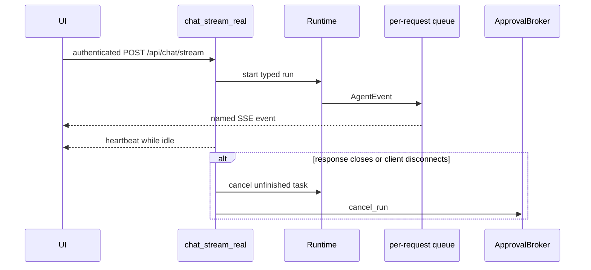
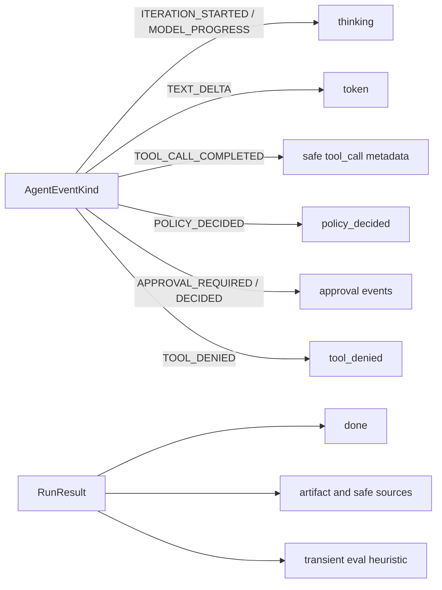
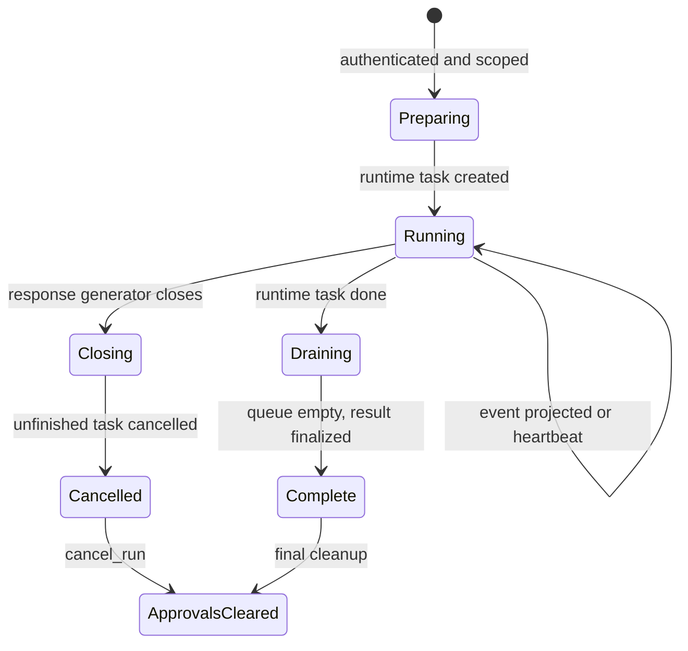

# Server-Sent Events (SSE)

> **Documentation status:** Draft
> **Concept status:** `implemented`
> **Status boundary:** The authenticated chat route projects typed runtime events onto one transient HTTP stream. There is no client acknowledgement or reconnect replay guarantee.
> **Used by:** [Module 13](../modules/13-auth-ui-observability/README.md)

## Why SSE here

SSE is a one-way sequence of named UTF-8 events carried in one HTTP response.
It fits token and progress delivery from server to browser.
The browser sends a normal authenticated POST to start the chat; SSE is the response representation.
It does not grant the browser a bidirectional socket protocol.
Read [Typed runtime](typed-runtime.md) and [Authentication](authentication.md) first.

The stream is a transient view of work happening now.
It is not the [run ledger](run-ledger.md), a message queue, an acknowledgement protocol, or a replay log.
If a client misses an SSE event, this implementation does not promise to replay it after reconnect.
Durable run events and recorded evaluations have separate storage and APIs.

## Request and isolation boundary

`chat_stream_real` authenticates through `get_current_user` and applies the chat rate limit.
It checks an existing conversation under the authenticated owner or creates a new owner-bound conversation.
It creates `RunContext` with user, conversation, correlation, and requested project scope.
MCP and memory tools are selected under that scope before the runtime starts.

Inside `event_stream`, the route creates a fresh `asyncio.Queue[AgentEvent]`.
`QueueEventSink` writes runtime events only to that queue.
The queue is not application-global and is not shared between requests.
This is the central cross-talk boundary for concurrent streams.
The route creates one runtime task and drains its queue until the task is done and the queue is empty.

## Typed event projection

This is a projection map, not a generic transport diagram.
`TOOL_CALL_COMPLETED` exposes tool name, call ID, argument hash, output hash, output size, and status.
It does not stream the raw tool output through that event.
`_routed_event` selects safe policy/approval fields and adds run and conversation routing IDs.
Web-search sources pass through `_project_web_search_sources` and URL validation before display.

`_sse` emits an `event:` line and one `data:` line per payload line, followed by a blank line.
Dictionaries and lists are JSON serialized.
A comment line `: heartbeat` is emitted every 0.25 seconds while waiting for runtime events.
The response declares `text/event-stream`, `Cache-Control: no-cache`, and `X-Accel-Buffering: no`.
Those headers discourage caching and proxy buffering but cannot control every intermediary.

## Stream lifecycle and cleanup

The `finally` block cancels and awaits an unfinished runtime task.
It always calls `approval_broker.cancel_run(run_context)`.
This prevents a disconnected request from leaving a pending in-memory approval active.
Cancellation and approval cleanup are runtime controls; they do not provide reconnect continuation.
After normal task completion, result metadata is finalized in the run repository before `done` and inline `eval` events complete the stream.

## Transient versus durable evidence

The `done` event contains UI-facing summary fields such as iteration count, tool count, elapsed time, conversation ID, stop reason, token count, cost, and error.
Receiving it is useful UX evidence but not a client acknowledgement stored by the server.
The inline `eval` event runs simple `evaluate_faithfulness`, `evaluate_relevance`, `evaluate_safety`, and `evaluate_cost` functions in `stream.py`.
That event is transient UI telemetry.
It does not create an `EvaluationService` record.
It does not bind a versioned dataset or prove regression quality.
Durable recorded-run evaluation is a different workflow; never substitute a captured SSE `eval` packet for it.

The run ledger persists safe ordered runtime evidence independently of browser delivery.
A browser disconnect can lose future SSE frames while durable runtime cleanup or ledger writes still occur.
Conversely, seeing a token frame does not prove every corresponding durable transaction committed.
The two channels have related IDs but different guarantees.

## Exact implementation landmarks

- [`chat_stream_real`](../../../backend/app/routes/stream.py) owns authentication, scoping, runtime setup, projection, and cleanup.
- [`QueueEventSink`](../../../backend/app/routes/stream.py) adapts typed events to a request-local queue.
- [`_sse`](../../../backend/app/routes/stream.py) serializes named SSE records.
- [`_routed_event`](../../../backend/app/routes/stream.py) selects safe approval/policy routing fields.
- [`_project_web_search_sources`](../../../backend/app/routes/stream.py) selects display-safe source metadata.
- [`SSEParser`](../../../frontend/src/lib/sse.ts) handles arbitrary browser chunk boundaries.
- [`EvaluationService`](../../../backend/app/eval/service.py) is the separate durable evaluation boundary.

## Tests and evidence

- [`test_concurrent_sse_streams_do_not_cross_talk`](../../../backend/tests/unit/test_runtime_sse.py) checks request queue isolation.
- [`test_sse_receives_native_runtime_events_and_stop_reason`](../../../backend/tests/unit/test_runtime_sse.py) checks typed projection and completion metadata.
- [`test_policy_sse_routing_preserves_ids_and_drops_raw_secrets`](../../../backend/tests/integration/test_live_policy_wiring.py) checks policy event routing.
- [`test_approval_endpoint_enforces_owner_and_consumes_decision_once`](../../../backend/tests/integration/test_live_policy_wiring.py) checks the adjacent approval ownership boundary.
- [`sse.test.ts`](../../../frontend/src/lib/sse.test.ts) checks frontend parsing across chunks.
- Revision-scoped implementation evidence is in [implementation evidence](../../IMPLEMENTATION-EVIDENCE.md).

Tests exercise application behavior under fixtures.
They do not prove every reverse proxy disables buffering or that a mobile reconnect receives missed events.

## Security and failure analysis

Authenticate and authorize before returning the streaming response.
Never let a request-local queue become global or keyed only by a caller-controlled conversation ID.
Do not project raw tool outputs, secrets, unbounded exceptions, or full internal event payloads.
Treat event data as untrusted at the browser and render it safely.
A slow or disconnected consumer can create backpressure or cancellation behavior that requires operational limits.
Heartbeats keep some intermediaries active but are not delivery acknowledgements.
Proxy buffering can make a correct stream appear delayed.
Generator cancellation must cancel unfinished work and pending approvals.
A transport close does not mean every durable subsystem rolled back; inspect the ledger for final state.

## Observability

Track stream opens, time to first event, duration, heartbeat count, event counts by safe name, normal completion, cancellation, and serialization errors.
Correlate with run and conversation IDs, not raw message text.
Track queue depth and slow-consumer duration to detect backpressure.
Separate HTTP disconnects from runtime failures and policy denials.
Track missing `done` events as a transport symptom, then inspect durable run state.
Do not count received inline `eval` events as durable evaluation coverage.
Redact logs independently of what the SSE projector omits.

## Lab versus production

The lab directly streams from one application process and verifies chunk parsing.
Production proxies must disable response buffering, preserve long-lived HTTP responses, and set suitable idle limits.
Load balancers, worker shutdown, deploys, and mobile networks can interrupt streams.
If reconnect replay is required, add durable event IDs, cursor authorization, retention, and resume semantics; they are not present now.
If client-to-server interactive messaging beyond normal HTTP endpoints is required, consider WebSockets.
If guaranteed processing is required, use a durable queue rather than SSE delivery.

## Alternatives and trade-offs

Polling is simple and reconnect-friendly but adds repeated requests and latency.
WebSockets are bidirectional but add connection state, authentication refresh, and backpressure complexity.
A durable event log with cursor replay improves recovery but requires retention and strict owner-scoped reads.
SSE is a good fit here because delivery is mainly server-to-browser and transient.
Its simplicity is valuable only when its non-durable semantics are stated honestly.

## Exercise: distinguish stream from ledger

1. Run the existing SSE unit tests: `pytest backend/tests/unit/test_runtime_sse.py -q`.
2. Trace one `TEXT_DELTA` from `QueueEventSink` to the `token` event.
3. Trace one `TOOL_CALL_COMPLETED` and list which metadata is retained and which output is omitted.
4. Close a test stream before completion and verify runtime cancellation plus approval cleanup.
5. Inspect the corresponding run through the ledger path.
6. Explain why reconnecting cannot request “events after the last SSE ID” in this implementation.

Expected conclusion: SSE optimizes live presentation; durable evidence and replay need separate stores and contracts.

## 30-second answer

“Archon uses SSE as a transient, authenticated projection of typed runtime events. Every request has its own queue; safe event mappings avoid raw tool output; heartbeats keep the response active; and disconnect cleanup cancels unfinished runtime work and approvals. There is no acknowledgement or reconnect replay guarantee. The inline eval is UI telemetry, while the run ledger and `EvaluationService` provide separate durable evidence.”

## Self-check

1. **Is SSE bidirectional?** No; this response carries server-to-client events.
2. **What prevents concurrent cross-talk?** One fresh queue and `QueueEventSink` per request.
3. **Are raw tool outputs sent in `tool_call` events?** No; safe names, IDs, hashes, size, and status are projected.
4. **What does a heartbeat prove?** Only that the server emitted an idle comment, not that the client acknowledged data.
5. **Can a reconnect replay missed events?** Not under the implemented contract.
6. **What happens on generator closure?** The unfinished runtime task is cancelled and run approvals are cancelled.
7. **Is the inline `eval` durable evaluation evidence?** No; it is transient heuristic UI telemetry.
8. **Where should final historical state be inspected?** The owner-scoped run ledger and separate recorded evaluation workflow.

## Related concepts

- [Typed runtime](typed-runtime.md)
- [Run ledger](run-ledger.md)
- [Authentication](authentication.md)
- [Authorization and ownership](authorization-ownership.md)
- [Tracing with OpenTelemetry](tracing-opentelemetry.md)
- [Evaluation harness](evaluation-harness.md)
