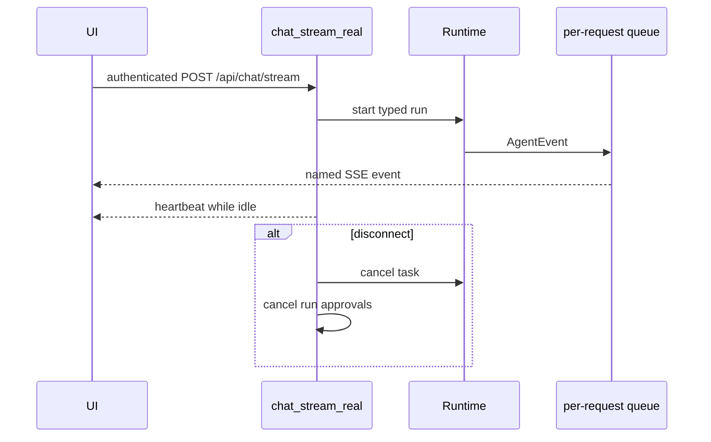

# Server-Sent Events (SSE)

> **Documentation status:** Draft
> **Concept status:** `implemented`
> **Status boundary:** The authenticated chat route projects typed runtime events onto one transient HTTP stream. There is no client acknowledgement or reconnect replay guarantee.
> **Used by:** [Module 13](../modules/13-auth-ui-observability/README.md)

## Why SSE here

SSE is a one-way sequence of named UTF-8 events over an HTTP response. It fits token/progress delivery without granting the browser a bidirectional socket protocol. Learn [Typed runtime](typed-runtime.md) and [Authentication](authentication.md) first.

`QueueEventSink` prevents concurrent streams from sharing an event queue. `_sse` serializes bounded event data; tool results are projected as safe metadata rather than raw outputs. Heartbeats keep intermediaries active. The frontend parser handles chunks split at arbitrary byte boundaries.

The stream’s post-run `eval` event is a **transient inline heuristic** assembled by `stream.py` for UI feedback. It is distinct from durable, dataset-versioned recorded-run evaluation by `EvaluationService`; receiving that SSE event neither creates an evaluation record nor proves regression quality.

## Source and tests

- [`chat_stream_real`, `QueueEventSink`, and `_sse`](../../../backend/app/routes/stream.py) implement adaptation and cleanup.
- [`SSEParser`](../../../frontend/src/lib/sse.ts) parses browser-side chunks.
- [`test_concurrent_sse_streams_do_not_cross_talk`](../../../backend/tests/unit/test_runtime_sse.py) checks isolation.
- [`test_sse_receives_native_runtime_events_and_stop_reason`](../../../backend/tests/unit/test_runtime_sse.py) checks projection.
- Frontend parser test: [`sse.test.ts`](../../../frontend/src/lib/sse.test.ts).
- Evidence: [implementation evidence](../../IMPLEMENTATION-EVIDENCE.md).

## Interview answer

“SSE is a transient projection, not the ledger. Disconnect cancels the runtime task and pending approvals. The inline eval event is UI telemetry; durable recorded-run evaluation is a separate `EvaluationService` workflow.”
