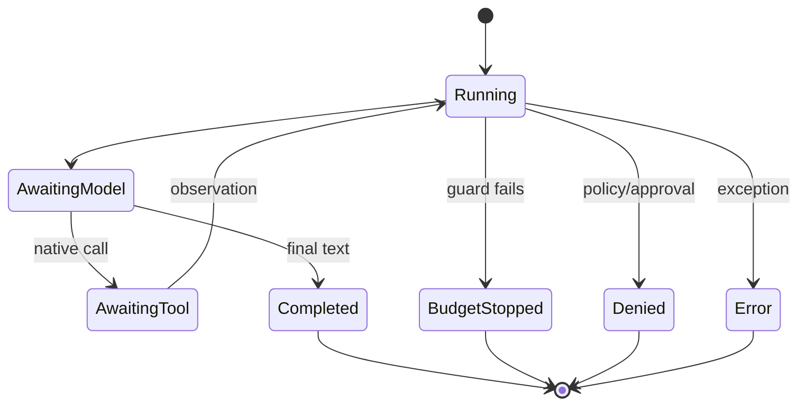

# State machines

## Definition

A state machine defines legal states, transitions, guards, and terminal outcomes. It makes “what happens next?” explicit and testable even when implemented with ordinary control flow.

## Archon mapping

State is carried by history, iteration count, call records, seen-call keys, usage, start time, and pending approval records. Guards are `RuntimeBudget`, policy decisions, exact authorization binding, and deadlines. `StopReason` closes the runtime state space; `ApprovalStatus` separately models pending/approved/denied/expired/cancelled.

Inspect [`AgentRuntime.run`](../../../backend/app/runtime/engine.py), [`StopReason`](../../../backend/app/runtime/engine.py), [`ApprovalStatus`](../../../backend/app/security/approval_repository.py), and [`AgentEventKind`](../../../backend/app/runtime/events.py). Tests: [`test_runtime_budget_regressions.py`](../../../backend/tests/unit/test_runtime_budget_regressions.py), [`test_runtime_policy.py`](../../../backend/tests/unit/test_runtime_policy.py), and [`test_approval_repository.py`](../../../backend/tests/unit/test_approval_repository.py).

## Design test

For every state, ask: what inputs are accepted, which invariant is checked, what event is emitted, and how can it terminate? A diagram without enforced guards is documentation, not a safety mechanism.
