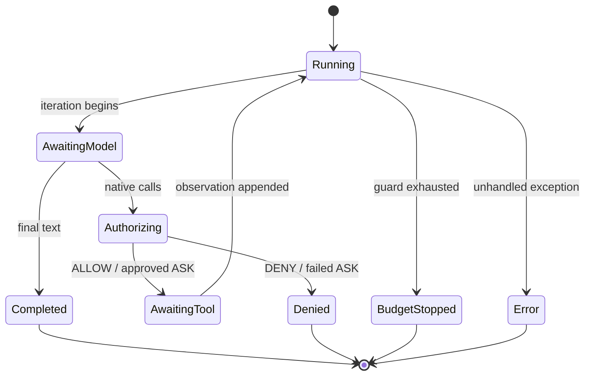
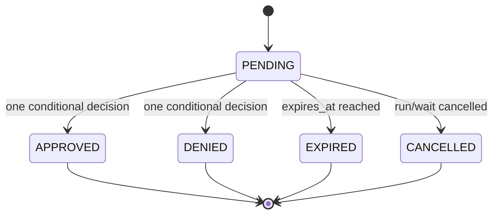

# State machines

## Beginner explanation

A state machine names possible states, the events that move between them, guards that allow transitions, and terminal outcomes.
Code need not use a state-machine library to have state-machine semantics.
Making the model explicit exposes impossible transitions, races, and missing cleanup paths.

## Prerequisites and vocabulary

- **State:** relevant facts at one point in a process.
- **Transition:** state change caused by an event or command.
- **Guard:** predicate that must hold before a transition.
- **Invariant:** property true in every valid state.
- **Terminal state:** no further normal transition is accepted.
- **Transition table:** explicit mapping of state/event to next state/action.
- **Orthogonal machines:** related lifecycles that should not be collapsed into one status.

## Problem and mental model

Ask four questions at every step: where are we, what input is legal, what invariant must hold, and how can we stop?
Archon's runtime, approval, and run-ledger lifecycles overlap, but they are distinct machines: a pending approval is not itself a runtime stop reason or ledger status.





## Archon runtime state mapping

[`AgentRuntime.run`](../../../backend/app/runtime/engine.py) carries state in history, `iterations`, `calls`, `seen_calls`, cumulative `TokenUsage`, content, and monotonic start time.
[`RuntimeBudget`](../../../backend/app/runtime/engine.py) supplies guards for iterations, calls, tokens, seconds, result length, and final synthesis.
[`StopReason`](../../../backend/app/runtime/engine.py) closes the runtime outcome space: completed, four budget outcomes, policy denied, approval timeout/unavailable, or error.
[`AgentEventKind`](../../../backend/app/runtime/events.py) exposes transition evidence without serving as the state itself.
Provider-call snapshots and policy/approval bindings are invariants between proposal and execution.
A provider batch is prepared before execution so a later denied/invalid member prevents earlier dispatch.

## Approval and ledger machines

[`ApprovalStatus`](../../../backend/app/security/approval_repository.py) defines pending, approved, denied, expired, and cancelled.
[`ApprovalRepository.decide_exact_for_owner`](../../../backend/app/security/approval_repository.py) guards approval/denial on pending status and future expiry.
[`ApprovalRepository.expire_due`](../../../backend/app/security/approval_repository.py) and `cancel_run` produce other terminal transitions while retaining receipts.
[`RunRepository.append`](../../../backend/app/services/run_ledger.py) permits event allocation only while a run is `running` with no completion timestamp.
A `RUN_STOPPED` event atomically updates run status to completed, failed, or cancelled; later appends are rejected.
These persistence transitions provide durable state evidence, unlike the runtime's in-memory history alone.

## Behavior-focused tests—and their limits

- [`test_explicit_budget_stop_reasons`](../../../backend/tests/unit/test_runtime_v2.py) exercises selected runtime terminal states. It does not enumerate every interleaving of callbacks and cancellation.
- [`test_policy_batch_allowed_then_denied_executes_none`](../../../backend/tests/unit/test_runtime_policy.py) proves preauthorization prevents a partial batch in one process. It does not provide rollback for external systems.
- [`test_owner_isolation_expiry_and_one_shot_decision`](../../../backend/tests/unit/test_approval_repository.py) proves legal approval transitions and owner scope. It does not prove UI commands cannot be duplicated upstream.
- [`test_append_after_terminal_status_is_rejected_without_allocating_sequence`](../../../backend/tests/unit/test_run_ledger.py) proves the ledger rejects a terminal-to-running append. It does not prove all external work stopped at the same instant.
- [`test_concurrent_append_racing_finalize_is_linearizable`](../../../backend/tests/unit/test_run_ledger.py) checks a database race. It does not prove behavior under network partition.

## Bounded design-and-run exercise

Timebox: 15 minutes. Run:

```bash
cd backend
pytest -q \
  tests/unit/test_approval_repository.py::test_owner_isolation_expiry_and_one_shot_decision \
  tests/unit/test_run_ledger.py::test_append_after_terminal_status_is_rejected_without_allocating_sequence
```

Then create a five-column transition row: current state, command, guard, side effect/event, next state. Stop after approval and ledger examples.

## Security and failure modes

- Missing terminal states create hanging waits; every external wait needs timeout/cancellation paths.
- Check-then-update transitions race; use one conditional atomic write.
- Conflating “approved” with “executed” hides a crash window and encourages exactly-once overclaims.
- Event emission can fail between internal transitions; durable sequencing and explicit failure policy matter.
- Mutable callback-owned objects can violate transition invariants; Archon snapshots bindings before awaits/events.
- Recovery code must reject impossible persisted combinations rather than guessing.

## Observability and evidence

Emit transition facts: prior/next semantic state, run/call identity, sanitized reason, sequence, and timestamp.
`RUN_STOPPED` plus ledger terminal metadata is stronger evidence than an HTTP connection closing.
Monitor time spent in waiting states, illegal-transition rejection, approval expiry, cancellation, budget-stop distribution, and terminal runs lacking completion metadata.
Events describe what code reported; behavior tests and durable rows establish whether guards actually prevented forbidden actions.

## Alternatives and tradeoffs

Explicit transition-table libraries improve visualization and exhaustive checks but can add indirection to a compact loop.
Enums plus guarded SQL updates are effective for durable lifecycles.
Event sourcing derives state from an append-only log and improves audit/replay, at greater schema/versioning complexity.
Workflow engines provide timers and durable resumption, but introduce infrastructure and execution semantics beyond Archon's current runtime.

## Lab versus production

A lab can force each transition with scripted providers, fake clocks, and SQLite races.
Production needs durable migrations, restart reconciliation, clock/expiry policy, cancellation ownership, illegal-state alarms, and model checking or adversarial concurrency tests for critical machines.
A diagram is documentation; only guards, constraints, and tests enforce it.

## 30-second interview answer

“State-machine thinking makes agent control explicit even when implemented as a Python loop. Archon's runtime state is history plus counters and bindings; `RuntimeBudget` supplies guards and `StopReason` supplies terminal outcomes. Approval has a separate durable `ApprovalStatus` machine with atomic pending-only transitions, while the run ledger accepts appends only in running state and finalizes on `RUN_STOPPED`. Keeping these machines separate exposes crash windows and prevents ‘approved’ from being confused with ‘executed.’”

## Self-check questions

1. **What is a guard?** A condition that must hold for a transition to occur.
2. **Are events the same as state?** No; they are evidence from which state may be observed or derived.
3. **Why separate approval and runtime states?** They have different lifetimes, invariants, and terminal meanings.
4. **How does the repository prevent two approval decisions?** Conditional update requiring pending and unexpired state.
5. **What does approved not prove?** That tool execution started, completed, or happened exactly once.
6. **What enforces a diagram?** Code guards, database constraints, and behavior-focused tests.

## Related modules and concepts

- Modules: [Typed runtime](../modules/02-typed-runtime/README.md), [Policy and approvals](../modules/05-policy-and-approvals/README.md), and [Run ledger](../modules/07-run-ledger/README.md).
- Concepts: [ReAct](react.md), [durable approvals](durable-approvals.md), [run ledger](run-ledger.md), and [checkpoints](checkpoints.md).
