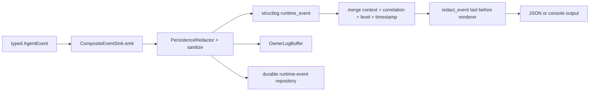
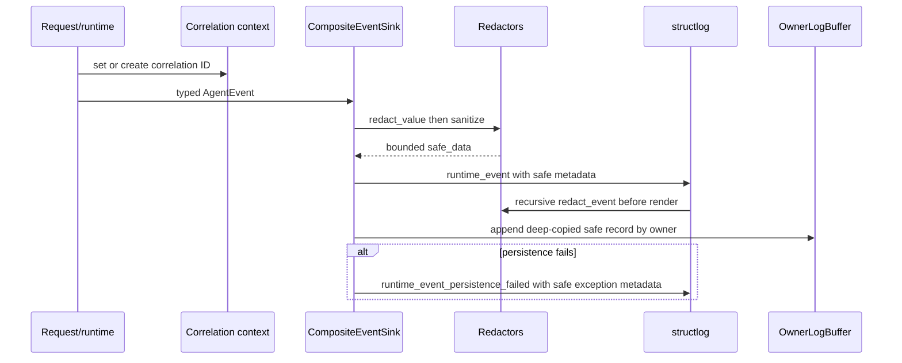
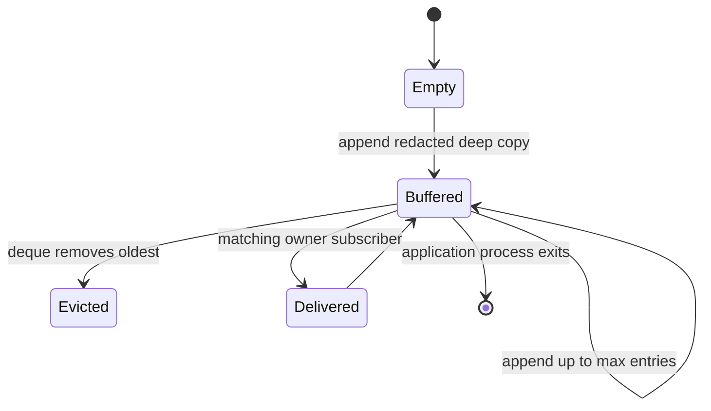

# Structured logging

> **Documentation status:** Draft
> **Concept status:** `implemented`
> **Status boundary:** Structlog emits correlation-aware records after recursive credential/PII redaction; redaction reduces exposure but cannot prove every future field or payload is safe.
> **Used by:** [Module 13](../modules/13-auth-ui-observability/README.md)

## Beginner explanation

A plain log line is free-form text written by a program.
A structured log is an event with stable fields such as event name, level, timestamp, correlation ID, and safe status.
Machines can filter and aggregate stable fields without guessing how a sentence was formatted.
Good structured logs describe what happened without copying everything the user or provider supplied.
Archon prefers IDs, status, sizes, duration, short hashes, and bounded reason codes.
It must not log credentials, prompts, tool payloads, hidden reasoning, or raw provider exceptions merely because they are useful during debugging.
Logs are operational clues, not a transcript and not the durable semantic source of truth.

## Vocabulary and invariants

| Term | Plain-English meaning |
|---|---|
| event name | stable machine-readable action label, such as `runtime_event` |
| processor | function that transforms an event before rendering |
| renderer | final conversion to JSON or developer console text |
| correlation ID | request-scoped value used to connect signals |
| redaction | replacement/removal of sensitive content |
| PII | personally identifiable information |
| bounded buffer | in-memory collection with a fixed maximum size |

Redaction must run after processors that can add fields and before the renderer.
Operational persistence receives an independently redacted copy.
Owner-facing live logs must filter records by authenticated owner unless an authorized all-owner view is requested.
User-controlled strings must be bounded.
Redaction is defense in depth, not permission to log unnecessary payloads.

## Logging architecture



[`setup_logging`](../../../backend/app/observability/logging.py) configures the processor chain.
It merges structlog context variables, injects a correlation ID, adds level and timestamp, formats stack/exception information, then invokes `redact_event` immediately before the renderer.
Production-style output uses `JSONRenderer`; debug mode uses a colored console renderer.
Because previous processors can add content, putting redaction last before rendering is a security invariant.

## Request and event sequence



[`CompositeEventSink.emit`](../../../backend/app/observability/runtime_events.py) first applies the persistence redactor and `sanitize` to event data.
`sanitize` replaces credential-like keys, recursively handles mappings and sequences, bounds strings to 1,000 characters, and leaves basic scalar values.
The sink logs `runtime_event` with event kind, iteration, run ID, conversation ID, correlation ID, and safe data.
It sends the same safe operational shape to [`OwnerLogBuffer`](../../../backend/app/observability/log_buffer.py).
Raw provider output is reserved for the requesting response sink, not copied into operational and persistence paths.

## Redaction details

[`redact_event`](../../../backend/app/observability/logging.py) recursively walks mappings, lists, and tuples.
It normalizes and tokenizes string keys, including camel-case and separator variants.
Sensitive components include authorization, cookies, credentials, passwords, secrets, and tokens.
Very long keys fail closed as sensitive because classifying attacker-controlled keys can itself consume resources.
Free-form strings pass through credential-pattern replacement and `PersistenceRedactor` with a deterministic PII detector configuration.
If redaction causes two mapping keys to collapse to the same text, ordinal suffixes preserve both entries.
Non-string scalar types remain their original type.
[`safe_value_metadata`](../../../backend/app/observability/logging.py) returns a value’s length and a 12-character SHA-256 prefix instead of the value.
[`safe_exception_metadata`](../../../backend/app/observability/logging.py) returns exception class and a caller-supplied reason without persisting the exception message.
A short hash supports correlation but may still allow guessing low-entropy inputs; avoid it where that matters.

## Buffer lifecycle and ownership



`OwnerLogBuffer` defaults to a `deque(maxlen=200)`.
`recent` caps requested results at 200 and returns a deep copy.
Subscriber queues have maximum size 100.
A full subscriber queue drops a new live item rather than blocking the runtime.
The buffer is application-scoped and process-local, so it is neither durable audit storage nor a cross-replica stream.
Ownership filtering occurs on recent retrieval and live fan-out.

## Exact source, tests, and evidence

| Source or test | Exact contract | Not proved |
|---|---|---|
| [`logging.py:setup_logging`](../../../backend/app/observability/logging.py) | processor order and renderer selection | every third-party logger uses structlog |
| [`logging.py:redact_event`](../../../backend/app/observability/logging.py) | recursive key/value credential and PII redaction | future unknown formats are safe |
| [`logging.py:safe_exception_metadata`](../../../backend/app/observability/logging.py) | type and bounded reason, no raw message | exception class itself is never sensitive |
| [`runtime_events.py:CompositeEventSink.emit`](../../../backend/app/observability/runtime_events.py) | typed safe event mapping | all application logs originate here |
| [`log_buffer.py:OwnerLogBuffer`](../../../backend/app/observability/log_buffer.py) | bounded owner-aware live buffer | durable audit retention |
| [`test_log_redaction_is_recursive_and_handles_free_form_values`](../../../backend/tests/unit/test_runtime_observability.py) | nested/free-form redaction | production data audit |
| [`test_terminal_logs_only_command_length_and_hash`](../../../backend/tests/unit/test_operational_log_privacy.py) | terminal command privacy metadata | every tool implementation |

See [Implementation Evidence](../../IMPLEMENTATION-EVIDENCE.md) for the revision-scoped implementation claim.
Tests are strong regression evidence but cannot enumerate every future sensitive payload.

## Try it: bounded exercise

### Goal

Exercise recursive redaction and terminal-command privacy without using real personal data.

### Setup and steps

Run from the repository root with backend dev dependencies.
Use only synthetic marker strings.
Test output can contain assertion context, so never place a real token or personal detail in the command.

```bash
cd backend
uv run pytest -q \
  tests/unit/test_runtime_observability.py::test_log_redaction_is_recursive_and_handles_free_form_values \
  tests/unit/test_operational_log_privacy.py::test_terminal_logs_only_command_length_and_hash
```

Inspect `setup_logging` and confirm no processor follows `redact_event` except the selected renderer.

### Done criteria

- [ ] Both focused tests pass or a real blocker is recorded.
- [ ] You can trace typed data through both redaction stages.
- [ ] You can explain why raw exception messages are avoided.
- [ ] You can state the buffer and subscriber bounds.
- [ ] No real secret, prompt, command payload, or PII was introduced.

## Security and failure modes

| Threat or failure | Control and response | Residual risk |
|---|---|---|
| nested credential | recursive mapping/sequence handling | novel encoding can bypass patterns |
| credential in prose | assignment, URI-userinfo, and auth-scheme patterns | arbitrary secret formats remain possible |
| PII in text | deterministic persistence redactor | false negatives and false positives |
| processor adds data after redaction | redaction is last before renderer | future reordering can regress safety |
| raw exception leaks input | safe exception metadata | poorly written direct logs may bypass helper |
| cross-owner live logs | owner filter and deep copies | authorization around `include_all` is external |
| memory growth | fixed deque and subscriber queues | dropped live events under slow consumers |
| hash guessing | values replaced by short metadata hash | low-entropy inputs may be enumerable |
| log injection | structured renderer and cleaned strings | downstream viewers must escape output |
| process restart | buffer disappears | no durable audit guarantee |

## Observability and evidence path

```text
typed action → correlation/run metadata → independent redaction → structured event → process output/live owner buffer/durable event → operator inspection
```

Correlation IDs connect logs to traces without becoming metric labels.
Run and conversation IDs help locate durable evidence but do not make the log authoritative.
Runtime event persistence failure logs a safe warning and allows downstream handling to continue; this behavior means operators must monitor persistence failures.
Log-level policy controls volume, while redaction controls content.
A production logging platform also needs transport encryption, access control, retention/deletion policy, tenant isolation, indexing budgets, alerting, and audit.
Never expose hidden chain-of-thought as observability evidence.

## Alternatives and trade-offs

| Alternative | Benefit | Cost or risk |
|---|---|---|
| plain text logs | easy for humans | brittle parsing and inconsistent fields |
| allowlist-only fields | strongest minimization | less diagnostic detail and more maintenance |
| redact after ingestion | centralized policy | secrets already crossed process/network boundary |
| durable audit table | transactional history | different schema, retention, and authorization needs |
| external log agent | delivery and buffering | another trusted component and failure path |

Archon combines data minimization with recursive redaction before rendering.
The process-local owner buffer improves the UI experience but must not be mistaken for an audit log.

## Lab vs production

| Dimension | Demonstrated | Missing or unverified |
|---|---|---|
| format | stable structlog events with correlation | organization-wide schema governance |
| privacy | recursive credential/PII tests and safe helpers | complete production data-flow audit |
| live view | bounded owner-aware process buffer | multi-replica fan-out and durable retention |
| failures | safe exception metadata | centralized alert on persistence/log delivery loss |
| operations | local/test inspectability | secure collector, RBAC, deletion, retention, SIEM |

The concept is `implemented` within supported code paths, with redaction explicitly treated as incomplete defense in depth.

## Interview answer

### 30-second answer

> Archon uses structlog with stable event fields and correlation IDs. Typed runtime events are independently minimized and redacted before logging, buffering, and persistence, and `redact_event` runs recursively as the last processor before rendering. `OwnerLogBuffer` is bounded and owner-filtered. Tests cover nested secrets, PII, and command privacy, but redaction is defense in depth—not proof every future field is safe or durable audit storage.

## Self-check

1. Why use structured events instead of prose?
2. Why must `redact_event` be last before rendering?
3. What does `safe_exception_metadata` deliberately omit?
4. How does `OwnerLogBuffer` bound memory?
5. Which test covers recursive free-form redaction?
6. Why can a short hash still be sensitive?
7. Are process logs the durable semantic truth?

<details>
<summary>Answer guide</summary>

1. Stable fields can be filtered, aggregated, and correlated without parsing changing sentences.
2. Otherwise a later processor could add unredacted data.
3. The raw exception message; it keeps exception type and a controlled reason.
4. A 200-entry deque and 100-item subscriber queues; full queues drop rather than block.
5. `test_log_redaction_is_recursive_and_handles_free_form_values`.
6. An attacker can enumerate low-entropy candidates and compare their hashes.
7. No; logs are operational clues, while durable scoped records carry semantic evidence.

</details>

## Related concepts

- [Metrics](metrics.md)
- [Tracing and OpenTelemetry](tracing-opentelemetry.md)
- [Module 13](../modules/13-auth-ui-observability/README.md)
