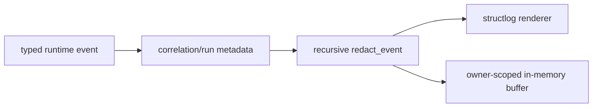

# Structured logging

> **Documentation status:** Draft
> **Concept status:** `implemented`
> **Status boundary:** Structlog emits correlation-aware records after recursive credential/PII redaction. Redaction reduces exposure; it is not proof every future payload is safe.
> **Used by:** [Module 13](../modules/13-auth-ui-observability/README.md)

## Event records, not prose dumps

A structured log has stable event names and bounded fields that machines can filter. Archon logs identifiers, status, hashes, sizes, durations, and safe reason codes. It must not log credentials, raw provider exceptions, prompts, tool payloads, or hidden reasoning merely for debugging.

`redact_event` recursively handles mappings, sequences, exception-like text, known secret keys, and detected PII. Processor order matters: redaction must occur before the final JSON/console renderer. `OwnerLogBuffer` is a bounded process-local UI aid, not durable audit storage.

## Source and tests

- [`setup_logging` and `redact_event`](../../../backend/app/observability/logging.py) define processor behavior.
- [`CompositeEventSink.emit`](../../../backend/app/observability/runtime_events.py) maps runtime events to safe signals.
- [`OwnerLogBuffer`](../../../backend/app/observability/log_buffer.py) provides scoped recent records.
- [`test_log_redaction_is_recursive_and_handles_free_form_values`](../../../backend/tests/unit/test_runtime_observability.py) checks nested/free-form redaction.
- [`test_terminal_logs_only_command_length_and_hash`](../../../backend/tests/unit/test_operational_log_privacy.py) checks tool privacy.
- Evidence: [implementation evidence](../../IMPLEMENTATION-EVIDENCE.md).

## Trade-offs and interview answer

Aggressive redaction can reduce diagnostic detail; weak redaction leaks data. Prefer stable metadata and secure access to durable run evidence over payload logging. “Logs explain operational events and correlate them; they are neither a transcript nor a semantic truth record. Redaction is defense in depth, so new fields still need privacy review.”
