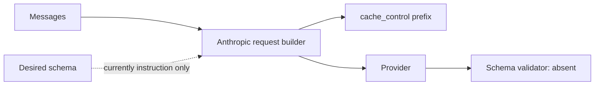
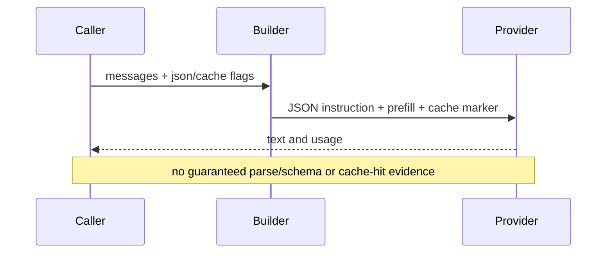

# Structured output and prompt caching

> **Implementation status:** `partial`
> **Status boundary:** Anthropic request construction supports JSON prompting/prefill and ephemeral system-prompt cache control, but JSON is not schema-validated and cache hits or savings are not measured; parity across providers is absent.
> **Reviewed revision:** `c115d62`
> **Used by module:** [Module 02-typed-runtime](../modules/02-typed-runtime/README.md)
> **Catalog ID:** `structured-output-prompt-caching`

## Beginner explanation

Structured output constrains a reply to a machine-readable shape. Prompt caching lets a provider reuse stable prompt prefixes. Asking for JSON is weaker than validating a schema, and adding a cache marker is weaker than proving a cache hit.

## Problem and mental model

Treat the boundary as a contract with explicit inputs, outputs, state, failure behavior, and evidence. The important question is not whether a similarly named class or file exists, but whether the behavior is wired into a real path and whether a test or observation proves it.

## Architecture and components

## Startup and request sequence

## Archon implementation and source walkthrough

At revision `c115d62`, the mapped symbols implement the bounded behavior below. No response schema, parser/retry contract, provider matrix, cache-read token capture, or savings evidence.

### Source symbols

| Source symbol | Role and boundary |
|---|---|
| [`backend/app/runtime/anthropic.py:anthropic_request`](../../../backend/app/runtime/anthropic.py) | Builds JSON-mode and cache-control request structures. |
| [`backend/app/runtime/support.py:JsonModeProvider`](../../../backend/app/runtime/support.py) | Forwards a JSON response-format hint. |

### Tests

| Test | Contract proved and limit |
|---|---|
| [`backend/tests/unit/test_json_mode_and_caching.py::test_json_mode_adds_system_instruction_and_prefill`](../../../backend/tests/unit/test_json_mode_and_caching.py) | Proves request shaping for JSON mode. |
| [`backend/tests/unit/test_json_mode_and_caching.py::test_caching_enabled_adds_cache_control`](../../../backend/tests/unit/test_json_mode_and_caching.py) | Proves cache-control emission. |

### Evidence boundary

Current implementation dimensions are centralized in [Implementation Evidence](../../IMPLEMENTATION-EVIDENCE.md). Source/tests below are repository evidence; they are not public-deployment or production-certification evidence.

## Try it: bounded study exercise

From the repository root, inspect the mapped source and test, then run the named focused test with the project test environment if available. Confirm both the passing contract and this gap: No response schema, parser/retry contract, provider matrix, cache-read token capture, or savings evidence.

**Done criteria:** identify the trust boundary, one proved behavior, and one unproved behavior without changing repository state.

## Risks, failures, and trade-offs

| Topic | Assessment |
|---|---|
| Principal risk | Malformed JSON can reach callers; unstable prefixes reduce cache value; sensitive prompts may be cached under provider terms. |
| Current gap/failure | No response schema, parser/retry contract, provider matrix, cache-read token capture, or savings evidence. |
| Trade-off | Prompt hints are portable and cheap; strict schemas improve reliability but require provider-specific handling and validation. |
| Evidence hygiene | Do not log secrets or hidden chain-of-thought; record revision, environment, command, and only redacted outcomes. |

## Lab vs production

The status remains **partial** at `c115d62`. Anthropic request construction supports JSON prompting/prefill and ephemeral system-prompt cache control, but JSON is not schema-validated and cache hits or savings are not measured; parity across providers is absent. Unit tests, manifests, or local observations do not prove external-provider parity, sustained load, public deployment, legal compliance, or a production SLO.

## Interview answer

> Structured output constrains a reply to a machine-readable shape. Prompt caching lets a provider reuse stable prompt prefixes. Asking for JSON is weaker than validating a schema, and adding a cache marker is weaker than proving a cache hit. In Archon the honest status is **partial**: Anthropic request construction supports JSON prompting/prefill and ephemeral system-prompt cache control, but JSON is not schema-validated and cache hits or savings are not measured; parity across providers is absent.

## Self-check

1. What problem does this concept solve, and what nearby concept is it not?
2. Trace the diagram’s trust boundary and failure path.
3. Which mapped symbol/test proves current behavior, or why are the lists empty?
4. What exact gap prevents a stronger status?
5. Which risk would you test first before production use?

Answer guide

A good answer names the contract in the beginner explanation, follows the sequence, cites the exact table entry (or the explicit absence), repeats the status boundary, and chooses a risk from the table rather than claiming unrecorded behavior.

## Related concepts and modules

- **Module:** [Module 02-typed-runtime](../modules/02-typed-runtime/README.md)
- **Course-day map:** [AIAMastery Days 1–30 coverage](../course-concept-coverage.md)
- **Evidence:** [Implementation Evidence](../../IMPLEMENTATION-EVIDENCE.md)
- **Historical context only:** [Feature and Course Audit v2](../../FEATURE-AND-COURSE-AUDIT-V2.md)
