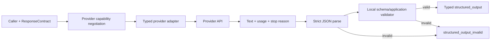
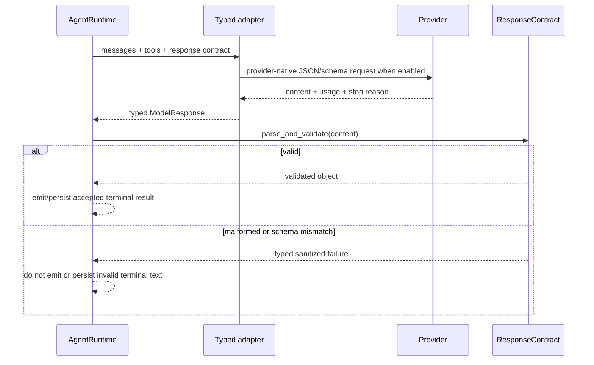

# Structured output and prompt caching

> **Implementation status:** `implemented`
> **Status boundary:** terminal structured output is bounded and validated locally against JSON Schema Draft 2020-12 before trust, with duplicate-key/fence handling and one corrective retry. Anthropic/Foundry cache controls, counters, events, and pricing are wired. Live Foundry structured output passed; the cache probe reported explicit zero read/write tokens, so no cache-savings claim is made.
> **Reviewed revision:** current S8 provider-contract branch
> **Used by module:** [Module 02-typed-runtime](../modules/02-typed-runtime/README.md)
> **Catalog ID:** `structured-output-prompt-caching`

## Beginner explanation

Structured output is a contract: the model response must parse as strict JSON and satisfy an application validator before Archon treats it as a successful answer. A provider's JSON hint or native schema improves generation but does not replace local validation.

Prompt caching is separately observable accounting. A cache marker merely requests reuse; only provider-reported cache-read or cache-write counters prove what the provider reported for that call. Local tests prove normalization and arithmetic, not a real cache hit.

## Problem and mental model

Keep these layers distinct:

1. **Requested format:** JSON mode or provider-native JSON Schema.
2. **Transport response:** provider text, tool calls, usage, and stop reason.
3. **Local trust boundary:** strict JSON parse and application validation.
4. **Cache request:** an eligible stable prompt prefix is marked.
5. **Cache evidence:** provider-reported counters are normalized and priced per response.

A response is not trusted merely because the provider says it used a schema. Cache savings are not inferred from a request marker.

## Architecture and components

## Request and validation sequence

## Archon implementation and source walkthrough

### Structured-output boundary

| Source symbol | Role and boundary |
|---|---|
| [`backend/app/runtime/structured_output.py::ResponseContract`](../../../backend/app/runtime/structured_output.py) | Immutable JSON-compatible schema, strict parse, and mandatory validator. |
| [`backend/app/runtime/engine.py::AgentRuntime.run`](../../../backend/app/runtime/engine.py) | Capability fail-before-call, terminal local validation, typed result, and sanitized rejection. |
| [`backend/app/agents/openai_adapter.py::OpenAIAdapter.complete`](../../../backend/app/agents/openai_adapter.py) | Opt-in OpenAI JSON mode/schema request plus typed tools/images/usage response. |
| [`backend/app/agents/ollama_adapter.py::OllamaAdapter.complete`](../../../backend/app/agents/ollama_adapter.py) | Opt-in Ollama JSON/schema request with strict typed response normalization. |
| [`backend/app/agents/fallback_chain.py::FallbackLLMChain.complete`](../../../backend/app/agents/fallback_chain.py) | Preserves the complete contract and selects one compatible provider candidate. |

### Cache accounting boundary

| Source symbol | Role and boundary |
|---|---|
| [`backend/app/runtime/anthropic.py::normalize_anthropic_usage`](../../../backend/app/runtime/anthropic.py) | Distinguishes absent, zero, cache-read, and cache-write counters; computes total input. |
| [`backend/app/observability/cost_tracker.py::CostTracker.record`](../../../backend/app/observability/cost_tracker.py) | Applies explicit cache-aware pricing without assuming discounts for unknown providers. |
| [`backend/app/observability/runtime_events.py::CompositeEventSink.emit`](../../../backend/app/observability/runtime_events.py) | Emits bounded cache usage into logs, traces, and durable event payloads. |
| [`backend/app/routes/stream.py::QueueEventSink`](../../../backend/app/routes/stream.py) | Prices each MODEL_RESPONSE using its actual provider/model and accumulates run totals. |

## Tests

| Test | Contract proved |
|---|---|
| [`test_structured_output.py`](../../../backend/tests/unit/test_structured_output.py) | Immutable schemas, strict finite JSON, parse and validation errors. |
| [`test_runtime_provider_contracts.py`](../../../backend/tests/unit/test_runtime_provider_contracts.py) | Fail-before-call, local terminal validation, stop semantics, and no invalid-text emission. |
| [`test_openai_typed_adapter.py`](../../../backend/tests/unit/test_openai_typed_adapter.py) | Opt-in native schema, strict tools/images, cache usage, and sanitized identity. |
| [`test_ollama_typed_adapter.py`](../../../backend/tests/unit/test_ollama_typed_adapter.py) | Opt-in JSON/schema plus strict tools, vision, IDs, and usage. |
| [`test_prompt_cache_accounting.py`](../../../backend/tests/unit/test_prompt_cache_accounting.py) | Cache normalization, pricing, actual fallback identity, accumulation, and isolation. |
| [`test_runtime_observability.py`](../../../backend/tests/unit/test_runtime_observability.py) | Cache counters in bounded event and trace evidence. |
| [`test_runtime_sse.py`](../../../backend/tests/unit/test_runtime_sse.py) | Conditional SSE cache counters and savings. |

## Evidence boundary

The executable [capability acceptance manifest](../../implementation/CAPABILITY-ACCEPTANCE.yaml) is canonical for dimensions and limitations. Deterministic tests prove local code, wiring, and arithmetic; the sanitized live-hardening report records Foundry transport evidence. The current boundary is:

- real Foundry JSON prompting passed, followed by authoritative local Draft 2020-12 validation;
- native provider-side JSON Schema is not claimed for Foundry Claude;
- a dedicated repeated-prefix cache probe ran, but reported zero cache read/write tokens, so no savings claim is made;
- provider invoices are not reconciled against local estimated prices;
- public deployment and production SLOs remain unproved.

## Failure and security analysis

| Risk | Control |
|---|---|
| Malformed/non-finite JSON | Strict parsing rejects `NaN`, infinities, malformed JSON, and schema mismatch. |
| Provider-native schema overclaim | Model/endpoint-dependent capabilities are conservative opt-ins. |
| Invalid structured text leaked as answer | Validation occurs before terminal text emission and persistence. |
| Fallback drops contract | Composite fallback routes the full conjunctive requirement set to one candidate. |
| Cache counters fabricated locally | Counters remain `None` unless reported by the provider. |
| Wrong fallback model pricing | Every MODEL_RESPONSE is priced using safe actual provider/model identity. |
| Prompt or tool secrets in evidence | Events expose counters and bounded metadata, not prompts or raw arguments. |

## Trade-offs

- Local validation is provider-independent but cannot improve model generation by itself.
- Native schemas reduce malformed responses but differ by endpoint/model and require explicit opt-in.
- Cache writes can temporarily cost more than uncached input; savings may therefore be negative.
- Per-response costing is more accurate for fallback runs than aggregate run pricing, but remains an estimate until compared with provider billing.

## Try it: bounded exercise

1. Create a `ResponseContract` backed by a Pydantic validator.
2. Run a valid response, malformed JSON, and schema-mismatched JSON.
3. Verify invalid terminal text is absent from `TEXT_DELTA` and persisted results.
4. Feed explicit cache read/write counters to the cost tracker.
5. Compare baseline input cost with cache-aware cost.

**Done criteria:** tests prove typed success, fail-closed rejection, `None` versus zero cache semantics, and per-response fallback pricing without claiming live provider evidence.

## Lab vs production

Structured validation, corrective retry, invalid-text suppression, cache accounting, and Foundry transport are implemented and observed. The live repeated-prefix probe reported explicit zero cache-read/write tokens, so this repository proves the measurement path but does not claim a cache hit or savings. Native provider-side schema enforcement, invoice parity, public deployment, and production SLOs remain outside the accepted boundary.

## 30-second interview answer

> Archon treats provider JSON features as generation aids, not trust. Foundry receives an explicit JSON instruction, and the response must pass bounded parsing, duplicate-key checks, Draft 2020-12 validation, and the application decoder before emission or persistence; one corrective retry is allowed. Prompt-cache accounting separately preserves absent versus zero counters. The live Foundry probe passed structured output but observed zero cache tokens, so the implementation is proven while savings and native provider schema are not claimed.

## Self-check

1. Why does provider-native JSON Schema not replace local validation?
2. At what point is invalid structured text prevented from reaching persistence?
3. Why must fallback select one provider satisfying the complete requirement set?
4. What is the difference between an absent cache counter and an explicit zero?
5. Why is cache cost calculated per MODEL_RESPONSE instead of from aggregate run usage?
6. Which claims still require live-provider evidence?

Answer guide

1. Provider behavior and endpoint support can differ; the application owns the final trust boundary.
2. The runtime validates terminal content before text emission and result recording.
3. A union of separate provider capabilities does not prove any one provider can execute the request.
4. Absent means unreported; zero means explicitly reported no cached tokens.
5. Different fallback iterations can use different providers/models and prices.
6. Native schema compliance, real cache hits, invoice parity, and deployment remain unproved.

## Related concepts and modules

- **Module:** [Module 02-typed-runtime](../modules/02-typed-runtime/README.md)
- **Provider parity:** [Provider adapters and capability parity](provider-adapters-capability-parity.md)
- **Course-day map:** [AIAMastery Days 1–30 coverage](../course-concept-coverage.md)
- **Evidence:** [Implementation Evidence](../../IMPLEMENTATION-EVIDENCE.md)
