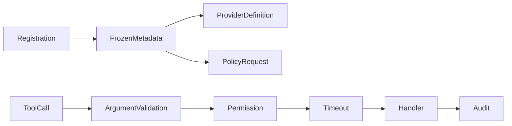

# Tool contracts

## Definition

A tool contract names a capability and declares its description, input shape, handler, timeout, permissions, risk classes, resources, and approval hint. The model sees a reduced definition; the control plane retains security metadata.

## Archon contract

[`tools.registry.ToolDefinition`](../../../backend/app/tools/registry.py) holds trusted registration metadata. [`runtime.models.ToolDefinition`](../../../backend/app/runtime/models.py) is the provider-facing view. [`SecureToolRegistry`](../../../backend/app/tools/registry.py) canonicalizes names, rejects duplicates, validates arguments before hooks, derives `PolicyRequest`, applies permissions/timeouts, and audits. Live registrations are in [`_create_tool_registry`](../../../backend/app/routes/chat.py).

Tests: [`test_tools.py`](../../../backend/tests/unit/test_tools.py) and [`test_runtime_policy.py`](../../../backend/tests/unit/test_runtime_policy.py).

## Safety and limits

Descriptions do not authorize. Schema validation is not sanitization, policy, containment, or rollback. Resource resolvers establish policy identity; effectful handlers must independently recheck mutable external state. Sync timeout cannot guarantee the underlying worker stopped.
