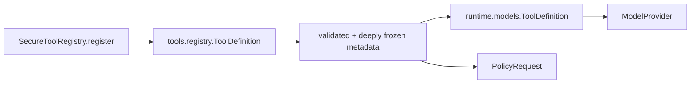
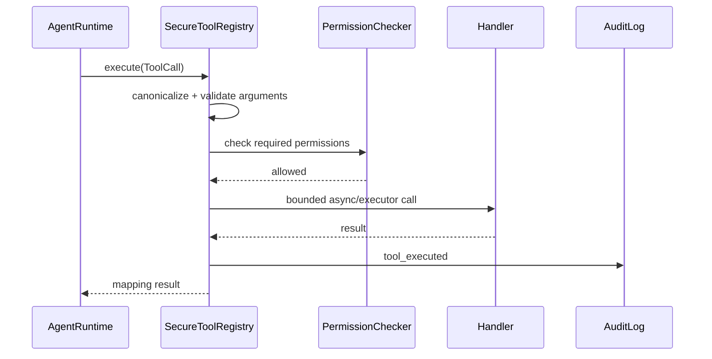

# Tool contracts

## Beginner explanation

A tool contract turns an application capability into a bounded interface a model can propose using.
It includes more than a function name: input shape, handler, timeout, permissions, risk classes, resource identity, and an approval hint.
The model sees a reduced provider definition; trusted control-plane metadata stays server-side.

## Prerequisites and vocabulary

- **Registration:** adding one canonical tool and its trusted metadata.
- **Handler:** function that performs or reads the capability.
- **Provider definition:** name, description, and input schema sent to the model.
- **Permission:** principal/action check performed before execution.
- **Risk class:** declared effect category used by policy.
- **Resource resolver:** derives concrete path/host identity from validated arguments.
- **Timeout:** upper bound on caller waiting, not rollback.
- **Audit:** security/operational evidence about attempted execution.

## Problem and mental model

A tool contract is both an API boundary and a capability boundary.
Keep the menu shown to the model separate from the kitchen's safety rules: descriptions help selection, while trusted metadata controls execution.





## Two concrete definitions

[`app.tools.registry.ToolDefinition`](../../../backend/app/tools/registry.py) is trusted registration metadata: canonical name, handler, description, permissions, schema, timeout, approval hint, risk classes, and resolver.
[`app.runtime.models.ToolDefinition`](../../../backend/app/runtime/models.py) is the provider-facing value: name, description, and input schema only.
This split prevents the model from rewriting permissions, risks, timeout, or resource resolution.

[`SecureToolRegistry.register`](../../../backend/app/tools/registry.py) canonicalizes names, rejects duplicates, validates schema metadata, and freezes nested containers.
[`SecureToolRegistry.definitions`](../../../backend/app/tools/registry.py) creates detached provider-neutral definitions.
[`SecureToolRegistry.policy_request`](../../../backend/app/tools/registry.py) validates arguments, requires non-empty risks, invokes a frozen-input resource resolver, and creates [`PolicyRequest`](../../../backend/app/security/policy.py).
[`SecureToolRegistry.execute`](../../../backend/app/tools/registry.py) checks existence, validates arguments before hooks, checks each permission, enforces handler timeout, audits, and normalizes non-dict output to `{"result": ...}`.
[`resolve_workspace_path`](../../../backend/app/tools/registry.py) derives lexical path policy identity and explicitly requires an execution-time containment recheck.
Live tool registrations are assembled by [`_create_tool_registry`](../../../backend/app/routes/chat.py).

## Behavior-focused tests—and their limits

- [`test_tools.py`](../../../backend/tests/unit/test_tools.py) covers registration, validation ordering, permissions, timeouts, snapshots, policy requests, and results. It does not prove every live handler obeys its declared effect metadata.
- [`test_allow_orders_policy_event_before_execution_and_preserves_native_id`](../../../backend/tests/unit/test_runtime_policy.py) proves event/dispatch order and ID preservation with a fake executor. It does not prove an external handler is atomic.
- [`test_policy_events_never_serialize_raw_arguments_or_output`](../../../backend/tests/unit/test_runtime_policy.py) proves selected runtime events omit sensitive payloads. It does not prove handler logs or third-party SDKs do the same.
- [`test_policy_execution_uses_detached_nested_argument_snapshot`](../../../backend/tests/unit/test_runtime_policy.py) proves nested argument mutation isolation. It does not validate nested business rules.
- [`test_terminal_tool.py`](../../../backend/tests/unit/test_terminal_tool.py) exercises terminal-specific constraints. It does not turn general registry timeouts into a process sandbox.

## Bounded read exercise

Timebox: 15 minutes. Choose one registration in `_create_tool_registry` and trace these fields: schema, risks, resolver, permissions, timeout, handler.
Then run one focused runtime contract test:

```bash
cd backend
pytest -q tests/unit/test_runtime_policy.py::test_allow_orders_policy_event_before_execution_and_preserves_native_id
```

Stop after identifying the first place each field is enforced.

## Security and failure modes

- A descriptive prompt is not authorization and can be ignored by a model.
- Wrong or empty risk metadata creates policy gaps; `policy_request` fails closed on empty risks.
- A resolver names the resource for policy but does not contain mutable external state; handlers must recheck.
- Schema validation checks a partial structural subset, not shell safety, URL safety, or domain semantics.
- A timed-out synchronous handler in an executor may continue running; effectful handlers need cooperative cancellation/idempotency.
- Returning huge or secret-rich output can poison context or logs; runtime bounds and persistence allowlists are separate safeguards.
- Registering broad multipurpose tools increases blast radius; prefer narrow capabilities.

## Observability and evidence

Registration logs establish tool name and description, but evidence should also inventory schema/risk/resolver/permission coverage without secrets.
Execution evidence includes correlation/run/call IDs, canonical tool, argument/output digests, policy action, permission denial, timeout, and status.
Order matters: validation and authorization evidence must precede handler evidence.
A successful audit entry proves the registry path reported success; external-state verification may still be needed.

## Alternatives and tradeoffs

Direct function calling is simpler but hides metadata and makes centralized controls inconsistent.
Per-tool Pydantic models improve validation depth but require provider-schema conversion and versioning.
MCP standardizes remote tool discovery/calling but still needs local trust, inventory, policy, and transport controls.
A few coarse tools reduce registration work but grant more authority per call; narrow tools increase contracts and observability.

## Lab versus production

A lab can register a pure calculator with no side effects and inspect its provider definition.
Production tools need reviewed effect classification, least-privilege credentials, exact resource identity, sandboxing where appropriate, size/time limits, idempotency, safe errors, and audit retention.
Tool registration should be treated like exposing a privileged API, not adding a prompt convenience.

## 30-second interview answer

“Archon splits each tool into trusted `tools.registry.ToolDefinition` metadata and a reduced provider-facing `runtime.models.ToolDefinition`. `SecureToolRegistry` canonicalizes and freezes registration, validates each call, derives a policy request from risks/resources, checks permissions, bounds execution, and audits. The model can propose only; descriptions and schemas never authorize. Schema support is partial, path policy identity is not containment, and a timeout cannot roll back an external effect.”

## Self-check questions

1. **What does the model see?** Name, description, and input schema—not handler or security metadata.
2. **Why require risk classes?** Policy needs explicit effect classification; empty classification fails closed.
3. **When are arguments validated?** Before permission hooks, resource use, or handler execution.
4. **Does a resource resolver sandbox a path?** No; it supplies policy identity and the handler must recheck containment.
5. **Can timeout stop an executor thread safely?** Not necessarily.
6. **Why prefer narrow tools?** Smaller authority, clearer schemas/policy, and better evidence.

## Related modules and concepts

- Module: [Tools and schemas](../modules/04-tools-and-schemas/README.md).
- Concepts: [JSON Schema](json-schema.md), [policy engine](policy-engine.md), [MCP](mcp.md), and [idempotency](idempotency.md).
