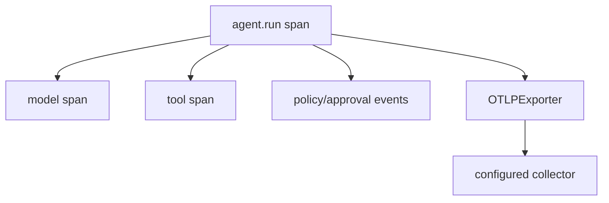

# Tracing and OpenTelemetry

> **Documentation status:** Draft
> **Concept status:** `implemented`
> **Status boundary:** The real OTLP SDK exports runtime spans when configured, and a local collector observed `agent.run`. No hosted backend, production sampling, retention, or SLO is verified.
> **Used by:** [Module 13](../modules/13-auth-ui-observability/README.md)

## Trace model

A trace connects timed spans for one request. Parent/child timing makes latency and failure location visible without storing prompt or tool payload content. Learn [Structured logging](structured-logging.md) first so correlation and privacy boundaries are clear.

`CompositeEventSink` maps typed start/complete/failure events to span lifecycle and safe attributes. `OTLPExporter` is constructed only when an endpoint is configured; readiness reports configured-but-inactive telemetry rather than silently claiming it works. Correlation IDs connect logs, but high-cardinality IDs should not become metric labels.

## Source and tests

- [`CompositeEventSink.emit`](../../../backend/app/observability/runtime_events.py) coordinates event-to-span behavior.
- [`OTLPExporter.export_span`](../../../backend/app/observability/otel_exporter.py) bridges internal spans to the SDK exporter.
- [`test_otel_exporter_receives_spans_when_wired`](../../../backend/tests/unit/test_otel_tracing_wire.py) checks configured wiring.
- [`test_otel_exporter_receives_tool_spans`](../../../backend/tests/unit/test_otel_tracing_wire.py) checks child tool spans.
- [`test_no_exporter_means_no_export`](../../../backend/tests/unit/test_otel_tracing_wire.py) checks disabled behavior.
- Current observation: [implementation evidence](../../IMPLEMENTATION-EVIDENCE.md).

## Limits and interview answer

A span proves instrumentation emitted an event, not that the operation was semantically correct or durably retained. Export can fail after work succeeds.

“Archon turns typed runtime events into redacted logs, metrics, and spans. A real local OTLP path observed `agent.run`; hosted collection, sampling policy, retention, alerts, and production scale remain unverified.”
