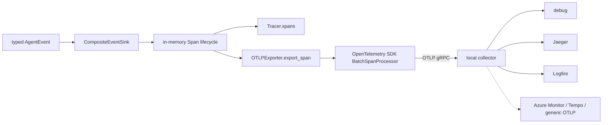
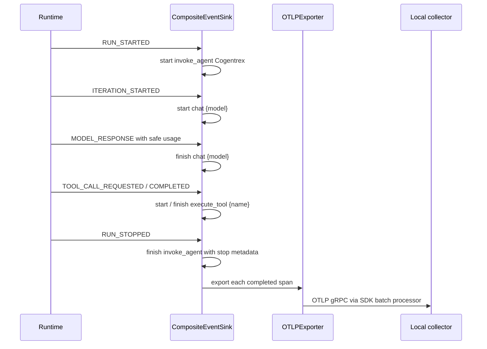
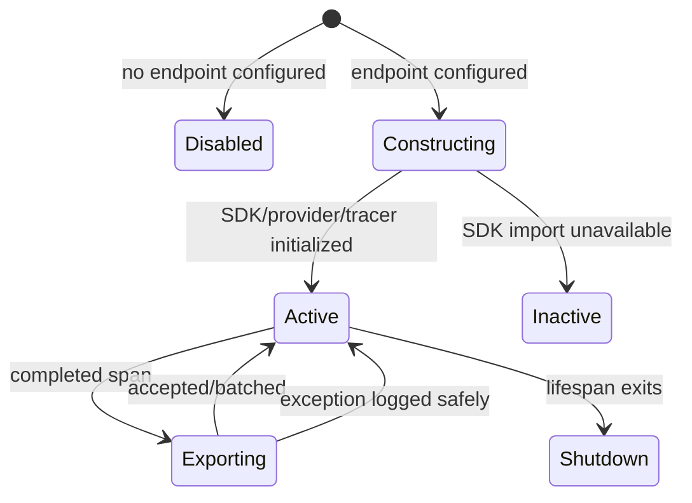

# Tracing and OpenTelemetry

> **Documentation status:** Draft
> **Concept status:** `implemented`
> **Status boundary:** Cogentrex emits one OTLP stream to the local Collector. One live agent trace was observed in Jaeger and an earlier run was accepted in Logfire Agents/Tools; the newest Logfire Summary/Messages rendering, production sampling, retention, alerts, and SLOs remain unverified.
> **Used by:** [Module 13](../modules/13-auth-ui-observability/README.md)

## Beginner explanation

A trace follows one unit of work through timed steps.
Each timed step is a span.
A parent run span can contain model and tool spans so an operator can see where time was spent and where an error occurred.
Tracing differs from metrics, which aggregate many events into numbers.
It also differs from logs, which record discrete events.
A trace should carry useful safe attributes, not credentials, tool payloads, retrieved documents, or hidden reasoning.
Cogentrex maps typed runtime events to `invoke_agent`, `chat`, and `execute_tool` spans, emits once over OTLP, and lets the Collector fan out to selected destinations.
Conversation text remains off by default. The explicit opt-in exports only redacted, bounded user and assistant text for Summary/Messages.

## Vocabulary

| Term | Plain-English meaning |
|---|---|
| trace | related spans representing one flow |
| span | named timed operation with selected attributes and status |
| parent/child | relationship showing one operation occurred inside another |
| OTLP | OpenTelemetry Protocol used to send telemetry |
| exporter | component that converts and sends completed spans |
| collector | process that receives telemetry and forwards or displays it |
| sampling | policy deciding which traces are retained or exported |
| flush | attempt to send pending batched spans before shutdown |

A span proves instrumentation emitted an observation.
It does not prove semantic correctness, durable retention, or successful alerting.
Export failure must not rewrite a successful business operation into failure.
High-cardinality correlation IDs may be trace attributes but should not become metric labels.

## Trace architecture



[`CompositeEventSink`](../../../backend/app/observability/runtime_events.py) owns runtime span lifecycle.
[`OTLPExporter`](../../../backend/app/observability/otel_exporter.py) bridges completed internal `Span` values to the real OpenTelemetry SDK.
[`lifespan`](../../../backend/app/main.py) constructs an exporter only when `settings.otel_endpoint` is present and shuts it down during application shutdown.
[`docker-compose.local.yml`](../../../docker-compose.local.yml) supplies a local collector and internal OTLP endpoint for the verified target.
This is telemetry infrastructure, not an authenticated Core API object or agent job.

## Runtime sequence



`CompositeEventSink._start` creates a span with common run, conversation, and correlation attributes and records a monotonic start time.
`_finish` computes `duration_ms`, marks an error when supplied, appends the internal span, and attempts export.
Exporter exceptions are caught and logged as `runtime_span_export_failed` using safe exception metadata.
Business execution therefore continues even when telemetry delivery fails.
`RUN_STARTED` creates `invoke_agent Cogentrex` with agent, conversation and model attributes.
`ITERATION_STARTED` creates `chat {model}` with model, tool definitions and iteration.
`MODEL_RESPONSE` adds finish reason and typed input/output/total token usage before completing the model span.
Tool request/completion events use `execute_tool {name}`, tool identity, call ID, and success status.
`RUN_STOPPED` closes unfinished tool/model spans as errors and finishes the run with stop reason, iteration count, tool-call count, and usage.

## Exporter startup and readiness



`OTLPExporter._setup_otel` creates an app-owned `TracerProvider`, service resource, OTLP gRPC exporter and `BatchSpanProcessor`.
The backend's only destination is the Collector on the trusted Compose network. Authentication, retry, batching and destination fan-out belong to the Collector.
`is_active` means a real provider and tracer were constructed.
It does not prove the endpoint accepted, stored, indexed, or retained a span.
`force_flush` returns false when no provider exists and delegates to the provider when active.
Readiness reports telemetry disabled when no exporter is configured, up when active, and down when configured but inactive.
The local acceptance observed one agent trace in Jaeger while the same Collector pipeline included Logfire. Azure Monitor, Tempo and generic OTLP remain configuration-validated rather than live-observed.

## Data and privacy boundaries

Common attributes are `cogentrex.run.id`, `cogentrex.conversation.id`, and `cogentrex.correlation.id`.
Model spans contain model name and token counts.
Tool spans contain tool name, call ID, success, and duration.
Run spans contain stop reason and bounded counts.
Before span selection, event data passes through the persistence redactor and `sanitize` in `CompositeEventSink.emit`.
Content capture defaults off. With `COGENTREX_OTEL_CAPTURE_MESSAGE_CONTENT=true`, only the current user text and final assistant text are redacted, bounded and added using OTel message attributes. System prompts, chain-of-thought, arguments, tool results, command text, retrieved document text, authorization headers and raw exceptions remain prohibited.
Trace backends often have broader access and longer retention than local memory.
Attribute allowlists and limits are therefore security controls, not merely cost optimizations.

## Exact source, tests, and evidence

| Source or test | Exact contract | Not proved |
|---|---|---|
| [`runtime_events.py:CompositeEventSink._start/_finish`](../../../backend/app/observability/runtime_events.py) | timing, status, safe export failure | hosted delivery |
| [`runtime_events.py:CompositeEventSink.emit`](../../../backend/app/observability/runtime_events.py) | typed run/model/tool mapping | every application operation traced |
| [`otel_exporter.py:OTLPExporter._setup_otel`](../../../backend/app/observability/otel_exporter.py) | app-owned provider and one OTLP stream to Collector | destination storage/retention |
| [`otel_exporter.py:OTLPExporter.export_span`](../../../backend/app/observability/otel_exporter.py) | bridge completed internal span into SDK span | original parent context propagation |
| [`test_otel_exporter_receives_spans_when_wired`](../../../backend/tests/unit/test_otel_tracing_wire.py) | configured run span reaches exporter double | real network |
| [`test_otel_exporter_receives_tool_spans`](../../../backend/tests/unit/test_otel_tracing_wire.py) | tool span export | collector storage |
| [`test_no_exporter_means_no_export`](../../../backend/tests/unit/test_otel_tracing_wire.py) | disabled mode retains in-memory behavior without export | production fallback policy |
| [`test_exact_event_to_metric_span_and_correlation_mapping`](../../../backend/tests/unit/test_runtime_observability.py) | exact names, attributes, correlation | distributed context across services |
| [`test_error_timeout_event_marks_metrics_and_spans`](../../../backend/tests/unit/test_runtime_observability.py) | error/timeout status | alerting |

[Implementation Evidence](../../IMPLEMENTATION-EVIDENCE.md) is the canonical source for the local observation.
[`test_real_otel_dependencies_and_span_assertion_are_part_of_the_target`](../../../backend/tests/unit/test_local_deployment.py) checks that dependencies and local smoke assertion exist.
A static test of the smoke is not itself a collector observation.

## Try it: bounded exercise

### Goal

Verify configured and disabled export behavior without contacting a collector.

### Setup and steps

Run from the repository root with backend dev dependencies.
The focused tests use test doubles and in-memory spans.
Do not configure a real OTLP endpoint or include user payloads.

```bash
cd backend
uv run pytest -q \
  tests/unit/test_otel_tracing_wire.py::test_otel_exporter_receives_spans_when_wired \
  tests/unit/test_otel_tracing_wire.py::test_otel_exporter_receives_tool_spans \
  tests/unit/test_otel_tracing_wire.py::test_no_exporter_means_no_export \
  tests/unit/test_runtime_observability.py::test_error_timeout_event_marks_metrics_and_spans
```

### Done criteria

- [ ] All focused tests pass or the blocker is recorded.
- [ ] You can draw run, model, and tool span lifecycles.
- [ ] You can explain why export failure does not fail business work.
- [ ] You distinguish `is_active` from collector receipt.
- [ ] No external collector, credential, or sensitive payload was used.

## Security and failure modes

| Threat or failure | Control and response | Residual risk |
|---|---|---|
| sensitive span attributes | selected safe fields after redaction/sanitize | future instrumentation may regress |
| collector unavailable | export exception logged safely; work continues | spans can be lost |
| SDK absent | exporter inactive and configured readiness fails | disabled mode intentionally has no export |
| insecure transport | confined to trusted local Compose network | unsuitable for untrusted network |
| batch not flushed | lifespan shutdown calls provider shutdown | crash can lose queued spans |
| unfinished tool/model | run stop closes remaining spans as errors | process crash bypasses terminal event |
| high-cardinality IDs | accepted for trace lookup | backend cost and retention still matter |
| misleading active state | `is_active` checks local SDK objects only | receipt and storage need independent evidence |
| duplicate/recreated spans | bridge creates SDK spans at export time | full distributed parentage semantics are limited |
| backend overload | no production sampling policy | telemetry can add resource pressure |

## Observability and evidence path

```text
typed runtime event → redacted selected attributes → app-owned OTel provider → local Collector → selected destinations
```

Logs share correlation and run identifiers with spans.
Metrics aggregate the same event lifecycle without high-cardinality identifiers.
Durable run evidence preserves semantic event history independently of trace delivery.
This separation allows telemetry loss to be visible without pretending telemetry is the business record.
For any collector observation, record revision, endpoint topology, command, service name, span name, flush/shutdown behavior, and environment.
The current evidence includes a live Jaeger trace and earlier visual Logfire Agents/Tools acceptance. Rendering of the newest opt-in Summary/Messages payload in Logfire remains pending visual acceptance.

## Alternatives and trade-offs

| Alternative | Benefit | Cost or risk |
|---|---|---|
| logs only | simple operational stack | weak timing hierarchy |
| direct vendor SDK | rich vendor features | credentials, lifecycle and fan-out become app concerns |
| auto-instrumentation | broad quick coverage | noisy attributes and unclear semantics |
| synchronous export | simple delivery timing | adds request latency and failure coupling |
| tail sampling | retain interesting traces | collector complexity and buffering |

Cogentrex uses typed explicit runtime mapping and batched OTLP export.
This makes the semantic boundary reviewable but currently limits full distributed context propagation.

## Lab vs production

| Dimension | Demonstrated | Missing or unverified |
|---|---|---|
| instrumentation | run/model/tool lifecycle and errors | every HTTP/service boundary |
| exporter | real SDK and OTLP gRPC construction | secure remote transport and auth |
| observation | one live agent trace in Jaeger; earlier Logfire Agents/Tools | latest Logfire Summary/Messages UI and production retention |
| privacy | default-off content plus redaction/bounds tests | formal telemetry data audit |
| operations | configured readiness and safe failure log | sampling, alerts, capacity, SLOs |

The concept is `implemented` for the typed runtime and local collector boundary only.

## Interview answer

### 30-second answer

> Cogentrex owns a standard OpenTelemetry provider and maps typed runtime events into `invoke_agent`, `chat`, and `execute_tool` spans. The app emits one OTLP stream to a local Collector, which owns credentials, retry and allowlisted fan-out to Jaeger, Logfire or another selected backend. Content is off by default; the opt-in exports only redacted, bounded user/assistant text. A live Jaeger trace and earlier Logfire Agents/Tools view are observed, while production retention, sampling, alerts and SLOs remain unverified.

## Self-check

1. How does a trace differ from a metric?
2. Which event starts `agent.run`?
3. What does `is_active` prove and not prove?
4. How does export failure affect business execution?
5. Which test proves disabled mode performs no export?
6. Why is `insecure=True` limited to the local boundary?
7. What is the strongest direct OTEL observation currently supported?

<details>
<summary>Answer guide</summary>

1. A trace preserves timed steps for one flow; a metric aggregates many events into numbers.
2. `AgentEventKind.RUN_STARTED` in `CompositeEventSink.emit`.
3. It proves local SDK provider/tracer construction, not endpoint receipt, storage, retention, or query.
4. The sink catches exporter exceptions, emits a safe warning, and continues business processing.
5. `test_no_exporter_means_no_export`.
6. It sends without transport security, acceptable only in the stated trusted local Compose network.
7. A locally configured collector observed an `agent.run` span during the bounded local smoke.

</details>

## Related concepts

- [Structured logging](structured-logging.md)
- [Metrics](metrics.md)
- [Liveness and readiness](liveness-readiness.md)
- [Docker and Compose](docker-compose.md)
- [Module 13](../modules/13-auth-ui-observability/README.md)
