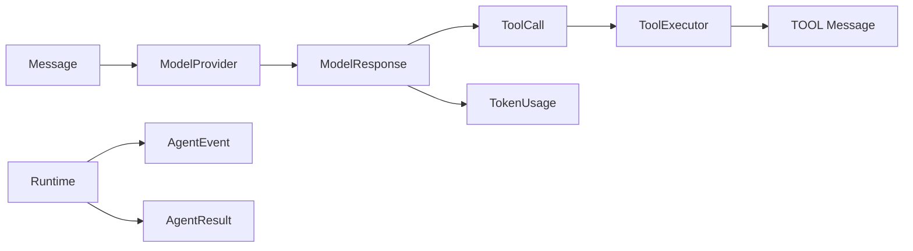

# Typed runtime

## Definition

A typed runtime represents control-plane messages, calls, usage, events, results, and terminal reasons as validated values rather than conventions hidden in strings.

## Archon contract

`Message` has a `Role`; `ToolCall` requires native ID/name and freezes its top-level arguments; `ModelResponse` must contain content or calls; `TokenUsage` rejects negatives. `AgentResult` always includes a `StopReason`. The runtime creates detached deep snapshots before callbacks can mutate provider-owned nested data.

Sources: [`runtime/models.py`](../../../backend/app/runtime/models.py), [`runtime/events.py`](../../../backend/app/runtime/events.py), and [`runtime/engine.py`](../../../backend/app/runtime/engine.py). Tests: [`test_runtime_v2.py`](../../../backend/tests/unit/test_runtime_v2.py) and adversarial snapshot cases in [`test_runtime_policy.py`](../../../backend/tests/unit/test_runtime_policy.py).

## What types do not solve

Type hints are not sandboxing. Provider token usage may be inaccurate; mappings can contain semantically unsafe values; adapters may violate Protocols at runtime. Validation, copying, policy, timeouts, and tests remain necessary.
