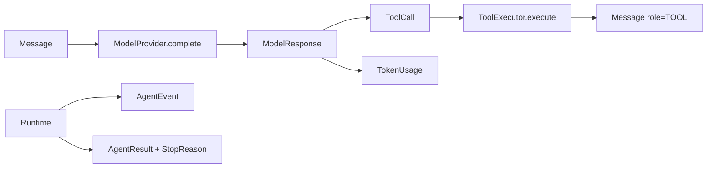
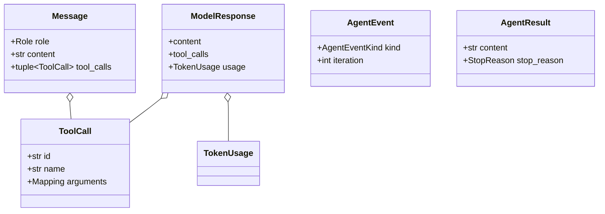

# Typed runtime

## Beginner explanation

A typed runtime represents messages, model responses, tool calls, usage, events, budgets, and outcomes as named validated values instead of loosely related dictionaries and magic strings.
Types make illegal states harder to construct and responsibilities easier to inspect.
Archon implements a **custom typed runtime**; it is not LangChain, LangGraph, or another agent framework.

## Prerequisites and vocabulary

- **Type hint:** static description checked by tools; Python does not enforce every hint at runtime.
- **Dataclass:** generated value-oriented class.
- **Frozen/slotted:** blocks ordinary assignment and arbitrary attributes; not automatically deep immutability.
- **Enum:** closed vocabulary such as `Role` or `StopReason`.
- **Boundary validation:** runtime checks when values enter a trusted domain.
- **Snapshot:** detached copy preventing later mutation from changing bound facts.
- **Protocol:** required collaborator behavior independent of inheritance.
- **Discriminated event:** event kind plus typed/common fields and bounded data.

## Problem and mental model

A runtime is a protocol between components. If “tool call,” “assistant response,” and “stop” are only conventions inside dictionaries, misspellings and missing fields become late production failures.
Typed values are labeled shipping containers; validation checks the seal, while snapshots ensure another party cannot swap contents after inspection.





## Code-grounded type contract

[`Role`](../../../backend/app/runtime/models.py) closes message roles to system, user, assistant, and tool.
[`Message`](../../../backend/app/runtime/models.py) normalizes its role and carries native calls, images, and optional call correlation.
[`ToolCall`](../../../backend/app/runtime/models.py) requires non-empty native ID/name and wraps a top-level argument copy in `MappingProxyType`.
[`ToolDefinition`](../../../backend/app/runtime/models.py) is the provider-facing schema value.
[`TokenUsage`](../../../backend/app/runtime/models.py) rejects negative counts, computes totals, and supports addition.
[`ModelResponse`](../../../backend/app/runtime/models.py) rejects an empty response with neither content nor calls.
[`AgentEventKind`, `AgentEvent`, and `EventSink`](../../../backend/app/runtime/events.py) define incremental observability.
[`RuntimeBudget`, `StopReason`, and `AgentResult`](../../../backend/app/runtime/engine.py) define controls and terminal output.
[`AgentRuntime._snapshot_history` and `_snapshot_provider_tool_calls`](../../../backend/app/runtime/engine.py) deep-copy nested values before collaborators can mutate authorization or execution facts.
[`ModelProvider` and `ToolExecutor`](../../../backend/app/runtime/ports.py) connect these types across adapter boundaries.

## What typing guarantees—and does not

Constructors enforce selected local invariants, such as non-negative token usage and non-empty call identity.
Frozen dataclasses prevent normal reassignment, but `MappingProxyType(dict(arguments))` only freezes the top-level mapping; nested lists/dicts could still be shared.
That is why the runtime takes independent history and execution deep snapshots, and policy mode accepts canonical JSON-compatible values only.
Type hints do not validate provider truthfulness, token accounting accuracy, safe strings, authorization, or external side effects.

## Behavior-focused tests—and their limits

- [`test_typed_tool_round_trip_and_events`](../../../backend/tests/unit/test_runtime_v2.py) proves typed values traverse provider, runtime, tool, and event boundaries. It does not prove static typing coverage across the repository.
- [`test_anthropic_native_tool_schema_and_tool_use`](../../../backend/tests/unit/test_runtime_v2.py) proves one adapter maps schema/native call fields. It does not certify all provider SDK versions.
- [`test_provider_calls_are_snapshotted_before_model_events_can_mutate_them`](../../../backend/tests/unit/test_runtime_policy.py) proves hostile event mutation cannot change bound execution. It does not make arbitrary Python objects immutable.
- [`test_provider_multi_call_snapshots_have_independent_nested_arguments`](../../../backend/tests/unit/test_runtime_policy.py) proves calls do not share nested execution snapshots. It does not recursively validate business schemas.
- [`test_authorization_models_validate_reason_code`](../../../backend/tests/unit/test_runtime_policy.py) proves constrained reason syntax. It does not prove reason semantics are operationally complete.

## Bounded executable exercise

Timebox: 12 minutes. Read `runtime/models.py` in full, then run:

```bash
cd backend
pytest -q \
  tests/unit/test_runtime_v2.py::test_typed_tool_round_trip_and_events \
  tests/unit/test_runtime_policy.py::test_provider_multi_call_snapshots_have_independent_nested_arguments
```

For each class, mark static hint, constructor validation, shallow freeze, and deep snapshot as separate protections.

## Security and failure modes

- Treat provider and adapter values as untrusted even when they satisfy a Protocol.
- Nested mutable containers can violate time-of-check/time-of-use assumptions unless detached.
- Deserializing an enum from unknown future values can fail; version event/persistence schemas deliberately.
- `Any` and generic mappings create escape hatches; validate at every untrusted boundary.
- Typed error fields can still carry secrets; sanitize content and persist only allowlisted metadata.
- A valid `ToolCall` says nothing about permission, risk, or handler safety.

## Observability and evidence

Typed event kinds make dashboards and ledger allowlists stable enough to query.
Record schema/version, kind, iteration, usage, stop reason, and safe binding digests; avoid persisting model/tool content by default.
Validation errors should identify the boundary and sanitized category rather than echoing attacker-controlled values.
Tests that mutate retained references are strong evidence for snapshot ordering because they target behavior, not just `frozen=True` declarations.

## Alternatives and tradeoffs

Raw dictionaries are flexible and easy to serialize but defer mistakes and encourage undocumented keys.
Pydantic adds parsing, JSON-schema generation, and rich validation at runtime cost and dependency coupling.
Protobuf/Avro provide versioned cross-language contracts but add code generation and migration overhead.
Third-party agent frameworks offer established model/tool types; Archon's custom values make its security and budget semantics explicit but require maintained adapters.

## Lab versus production

A lab can instantiate dataclasses directly and use a scripted provider.
Production needs strict adapter validation, backward-compatible event schemas, type checking in CI, adversarial mutation tests, redaction, and measured serialization limits.
Typed values improve the design vocabulary; they do not replace integration tests against live providers and persistence.

## 30-second interview answer

“Archon's custom typed runtime uses frozen dataclasses and enums for `Message`, native `ToolCall`, `ModelResponse`, `TokenUsage`, events, budgets, stop reasons, and results, connected by Protocol-based adapters. Constructors reject selected invalid states, and the runtime deep-snapshots nested provider data before awaits or callbacks. This prevents many stringly typed and mutation bugs, but Python hints and shallow freezing are not security boundaries; validation, policy, sanitization, and behavior tests remain necessary.”

## Self-check questions

1. **What must a `ModelResponse` contain?** Content or at least one tool call.
2. **What does `ToolCall` validate?** Non-empty ID/name and a top-level copied read-only mapping.
3. **Why is a frozen dataclass insufficient?** Nested mutable objects may still change.
4. **What closes terminal outcomes?** `StopReason` in every `AgentResult`.
5. **Do Protocols validate adapters at runtime?** Generally no; only selected runtime-checkable shape tests exist.
6. **Is this runtime framework-based?** No; it is Archon's custom typed runtime.

## Related modules and concepts

- Module: [Typed runtime](../modules/02-typed-runtime/README.md).
- Concepts: [OOP, Protocols, and DI](oop-protocols-dependency-injection.md), [agent anatomy](agent-anatomy.md), [state machines](state-machines.md), and [tool contracts](tool-contracts.md).
