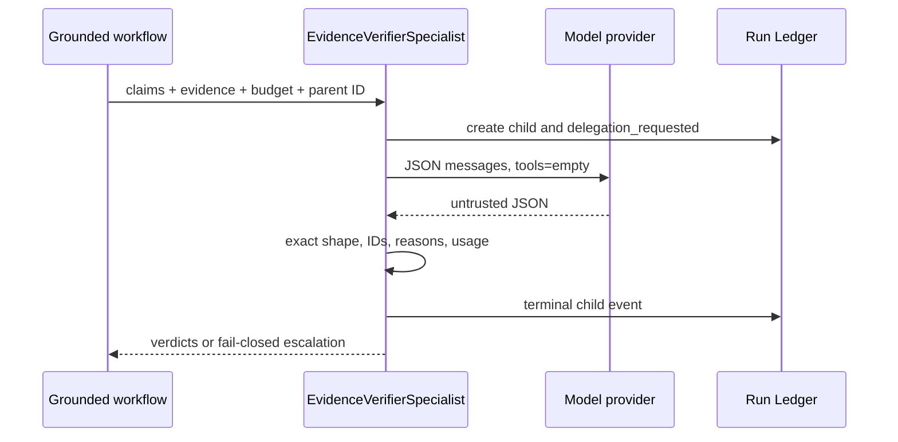

# Evidence-only verifier child

> **Documentation status:** Draft
> **Concept status:** `implemented`
> **Status boundary:** A single model-generated reviewer receives delegated claims/evidence, no tools, and finite budgets. Deterministic validation constrains its output; it does not make its judgment deterministic or necessarily correct.
> **Used by:** [Module 11](../modules/11-bounded-delegation/README.md)

## What the child does

After deterministic grounding has constructed candidate claims and citations, the optional child reviews only that packet. It must return exactly one `supported`, `rejected`, or `escalate` verdict per claim, with a compatible reason and only evidence IDs assigned to that claim.

Prerequisite: [Bounded delegation](bounded-delegation.md).

## Important distinction

The child is not the deterministic claim verifier in the grounded workflow. That earlier rule-based check rejects unsupported, unknown, negated, numeric, and partial claims. The child is an optional second, model-generated review behind strict controls. It also is not post-run `EvaluationService` scoring.

## Source and tests

- [`EvidenceVerifierSpecialist.verify`](../../../backend/app/delegation/service.py) creates and finalizes the child.
- [`_parse_response`](../../../backend/app/delegation/service.py) checks exact output shape and delegated evidence subsets.
- [`GroundedDocumentWorkflow._verify_with_child`](../../../backend/app/services/grounded_rag.py) filters parent results conservatively.
- [`test_malformed_and_foreign_evidence_fail_closed`](../../../backend/tests/unit/test_evidence_verifier.py) and [`test_verifier_failure_fails_closed_and_no_evidence_never_delegates`](../../../backend/tests/unit/test_grounded_rag.py) exercise failure behavior.
- See [implementation evidence](../../IMPLEMENTATION-EVIDENCE.md) for revision-scoped observations.

## Trade-offs and interview answer

The extra call adds latency, cost, and another fallible model. It is justified only when measured benefit exceeds false rejection and operational cost. “The child narrows context and authority; strict code validates what may be returned. The semantic review remains model-generated, so I claim bounded review—not deterministic judgment or truth.”
