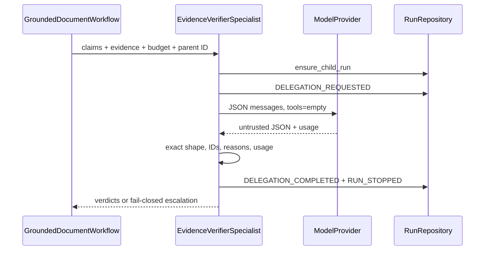
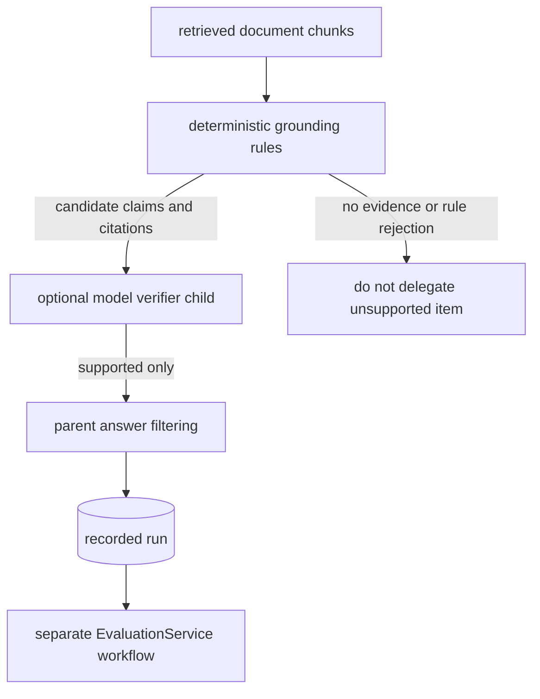

# Evidence-only verifier child

> **Documentation status:** Draft
> **Concept status:** `implemented`
> **Status boundary:** A single model-generated reviewer receives delegated claims/evidence, no tools, and finite budgets. Deterministic validation constrains its output; it does not make its judgment deterministic or necessarily correct.
> **Used by:** [Module 11](../modules/11-bounded-delegation/README.md)

## What the child does

After deterministic grounding constructs candidate claims and citations, an optional child reviews only that packet.
It must return exactly one verdict for every delegated claim.
The allowed statuses are `supported`, `rejected`, and `escalate`.
Each verdict has a compatible `VerificationReasonCode`, finite confidence from 0 to 1, and only allowed evidence IDs.
The parent uses that result conservatively.
Read [Bounded delegation](bounded-delegation.md) first for the authority envelope.

## Three verifiers that must not be confused

The grounded workflow first applies deterministic claim checks.
Those rules handle unsupported, unknown, negated, numeric, and partial claims before delegation.
The child is an optional second review performed by a model.
Post-run `EvaluationService` scoring is a third concern: durable evaluation of recorded runs against versioned data.
Calling all three “verification” hides their different timing, evidence, and trust properties.

This diagram follows claim evidence through the implemented review stages.
The child does not replace deterministic grounding and does not create a durable evaluation record.

## Input contract

`EvidenceSlice` carries `evidence_id`, `document_id`, `chunk_id`, `content_hash`, and a bounded quote.
It has no open metadata dictionary.
`ClaimInput` carries `claim_id`, `claim_hash`, bounded text, and an immutable tuple of evidence IDs.
`ChildVerificationRequest` adds child, parent, user, project, policy, model, and budget identity.
All dataclasses are frozen and slotted.
The empty `tools` tuple is checked during construction and again expressed at provider invocation.

The child does not receive the full user conversation.
It does not receive database repositories, filesystem handles, network tools, memory tools, or credentials.
Narrow context reduces accidental authority and makes the evidence reviewed easier to inspect.
It does not guarantee that quoted evidence is true or that the model interprets it correctly.

## Output contract

`_parse_response` uses duplicate-key-aware JSON handling and exact expected fields.
Verdict claim IDs must match the request exactly: no missing, duplicate, or invented claims.
Verdict evidence IDs must be allowed for the associated claim, not merely present somewhere in the packet.
Status and reason must agree; for example, semantic support cannot be paired with a timeout reason.
Confidence must be finite and bounded.
Provider usage is checked against the budget after every call.

`_fail_closed` creates one `escalate` verdict per requested claim with confidence `0.0`.
It uses `budget_exceeded`, `timeout`, `provider_error`, or `malformed_response` as appropriate.
That gives the parent a complete, typed answer even when the model path fails.
It does not pretend failure is a semantic rejection.

## Parent handling

`GroundedDocumentWorkflow._verify_with_child` delegates only when evidence exists.
A successful model call can still produce rejected or escalated claims.
The parent does not turn those into supported answer content.
Verifier exceptions or failed results are handled conservatively.
This protects the final answer from treating child availability as permission to pass every claim.

## Exact implementation landmarks

- [`EvidenceVerifierSpecialist.verify`](../../../backend/app/delegation/service.py) owns call, timeout, retry, usage, and terminal handling.
- [`_messages`](../../../backend/app/delegation/service.py) constructs the narrow model messages.
- [`_parse_response`](../../../backend/app/delegation/service.py) validates untrusted model JSON.
- [`_fail_closed`](../../../backend/app/delegation/service.py) creates complete escalation verdicts.
- [`EvidenceSlice`](../../../backend/app/delegation/models.py) carries bounded provenance.
- [`ClaimVerdictStatus`](../../../backend/app/delegation/models.py) defines the three semantic outcomes.
- [`VerificationReasonCode`](../../../backend/app/delegation/models.py) defines bounded reasons.
- [`GroundedDocumentWorkflow._verify_with_child`](../../../backend/app/services/grounded_rag.py) applies results to parent claims.

## Tests and evidence

- [`test_valid_call_is_isolated_bounded_and_durable`](../../../backend/tests/unit/test_evidence_verifier.py) proves the provider sees no tools and the lifecycle is recorded.
- [`test_malformed_and_foreign_evidence_fail_closed`](../../../backend/tests/unit/test_evidence_verifier.py) checks invalid model output and evidence escape.
- [`test_models_are_frozen_slotted_and_exclude_context_and_secrets`](../../../backend/tests/unit/test_delegation_contract.py) checks the input surface.
- [`test_verdict_confidence_enum_and_separate_evidence_subset_validation`](../../../backend/tests/unit/test_delegation_contract.py) checks typed verdict limits.
- [`test_verifier_failure_fails_closed_and_no_evidence_never_delegates`](../../../backend/tests/unit/test_grounded_rag.py) checks parent integration.
- [`test_result_is_bounded_and_typed`](../../../backend/tests/unit/test_delegation_contract.py) checks result shape.
- See [implementation evidence](../../IMPLEMENTATION-EVIDENCE.md) for revision-scoped observations.

## Security and failure analysis

Prompt injection inside an evidence quote may influence the model even though the child has no tools.
Therefore no-tools limits consequences; it does not ensure correct interpretation.
A provider can return syntactically valid but semantically wrong support.
Confidence is self-reported model data, not calibrated proof.
Malformed JSON, extra claims, foreign evidence, timeouts, and exhausted budget fail closed.
One retry may happen only for transient provider or connection failures.
Cancellation records a terminal child state and propagates cancellation.
Persisted event payloads use IDs, hashes, counts, and status rather than raw quotes.

## Observability

Inspect `DELEGATION_REQUESTED`, `DELEGATION_COMPLETED`, and `RUN_STOPPED` on the child run.
Join the child to its parent with `parent_run_id` under the same owner scope.
Track attempts, input/output/total tokens, latency, overall status, and verdict counts.
Track reason-code distributions to separate model disagreement from infrastructure failure.
Use claim and content hashes to correlate revisions without writing the raw packet to lifecycle events.
Sample semantic errors through a controlled evaluation set, not production anecdotes alone.

## Lab versus production

The lab proves one provider-shaped call under deterministic fixtures.
It does not prove that another model follows the schema equally well.
Production should pin model versions, define provider retention policy, establish concurrency and spend limits, and maintain a reviewed fixture set.
Measure false support because it can admit unsupported text.
Measure false rejection because conservative filtering can remove useful text.
Roll out in shadow mode before letting the child alter high-impact answers.

## Alternatives and trade-offs

Rule-only checking is predictable and cheap but limited to encoded patterns.
A human review queue is slower but appropriate for consequential escalation.
A constrained classifier could be cheaper than a general model but needs its own evaluation.
Letting the parent self-review in the same prompt is simpler but does not create a reduced-authority child or separate lineage.
The child is worthwhile only if measured quality gain exceeds latency, spend, and false decisions.

## Exercise: inspect one verdict

1. Build a fixture with one claim and one evidence slice using the existing unit-test helpers.
2. Return a valid `supported` verdict from the fake provider and note the accepted fields.
3. Replace its evidence ID with a valid-looking but undelegated ID.
4. Run `pytest backend/tests/unit/test_evidence_verifier.py -q`.
5. Inspect the child ledger payload and confirm raw quote text is absent.
6. State why the failed case is deterministic while the original support decision is not.

Expected conclusion: accepted structure and evidence scope are code-enforced; semantic support originates from the model.

## 30-second answer

“The verifier child reviews only selected claims and evidence. It gets no tools and finite token, time, and retry budgets. Exact parsing requires one typed verdict per claim and only delegated evidence; any malformed, timeout, provider, or budget failure escalates. The parent filters conservatively and records child lineage. The verdict itself is still model-generated, not deterministic truth.”

## Self-check

1. **When does the child run?** After deterministic grounding has produced candidate claims with evidence.
2. **What statuses can it return?** `supported`, `rejected`, or `escalate`.
3. **Can it invent a claim ID?** No; exact claim coverage is validated.
4. **Can it cite evidence assigned to another claim?** No; per-claim delegated subsets are checked.
5. **Is confidence a security guarantee?** No; it is bounded model output.
6. **What happens when no evidence exists?** The grounded parent does not delegate that item.
7. **Is this `EvaluationService`?** No; recorded-run evaluation is a separate durable workflow.
8. **What should operators inspect?** Lifecycle status, reasons, usage, latency, hashes, and measured semantic errors.

## Related concepts

- [Bounded delegation](bounded-delegation.md)
- [Parent-child run lineage](parent-child-lineage.md)
- [Groundedness](groundedness.md)
- [Citations](citations.md)
- [Evaluation harness](evaluation-harness.md)
