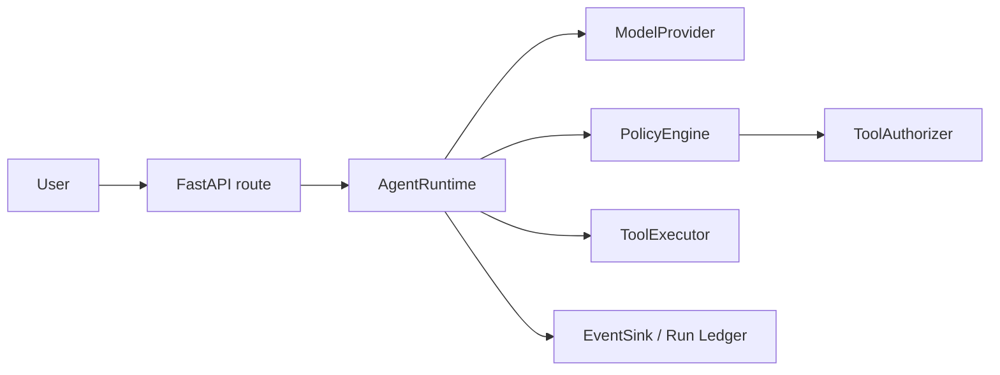
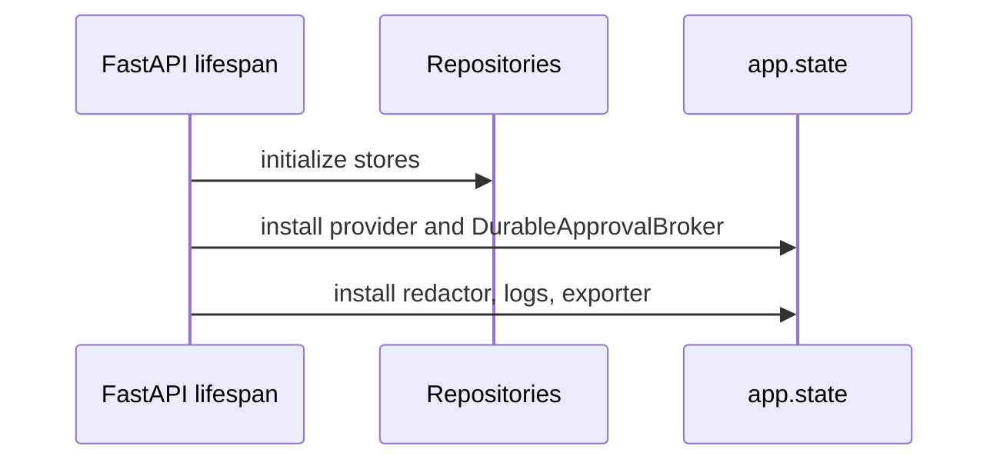
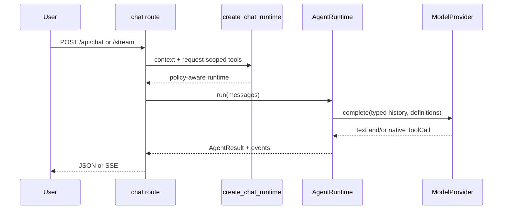

# 00 — Agent anatomy

> **Documentation status:** Draft
> **Capability status:** implemented in the verified local production-like target; public deployment remains deferred

## Outcomes and prerequisites

By the end you can name an agent's boundaries, trace startup and one request, and separate control logic from model behavior. Prerequisites: basic Python functions, HTTP, and the terms *model*, *tool*, *policy*, *event*, and *adapter*. Start with [Agent anatomy](../../concepts/agent-anatomy.md).

## Problem and mental model

A chatbot maps text to text. An agent may ask a model what to do, invoke effects, feed observations back, and stop. Therefore the model is an untrusted planner inside a deterministic control plane—not the application. Archon is a **custom typed runtime**; it does not use an agent framework.



## Startup and request sequences





## Source, tests, and evidence

Inspect [`RunContext` and `create_chat_runtime`](../../../../backend/app/runtime/factory.py), [`AgentRuntime.run`](../../../../backend/app/runtime/engine.py), [`ModelProvider`/`ToolExecutor`](../../../../backend/app/runtime/ports.py), route wiring in [`chat.py`](../../../../backend/app/routes/chat.py), and startup wiring in [`main.py`](../../../../backend/app/main.py). Tests: [`test_runtime_v2.py`](../../../../backend/tests/unit/test_runtime_v2.py), [`test_runtime_sse.py`](../../../../backend/tests/unit/test_runtime_sse.py), and [`test_chat.py`](../../../../backend/tests/unit/test_chat.py). Evidence: [capability matrix](../../../IMPLEMENTATION-EVIDENCE.md#capability-matrix).

## Read/test exercise

```bash
cd backend
uv run pytest -q tests/unit/test_runtime_v2.py tests/unit/test_runtime_sse.py
```

Then draw the path from `RunContext.create` to `AgentResult`, labeling every Protocol boundary. **Done:** tests pass and your map contains provider, policy, authorizer, tools, events, and explicit termination.

## Failure, security, and observability

Provider output cannot directly execute an effect: the runtime snapshots calls, policy evaluates metadata, approval may bind an exact call, and the registry validates arguments. Budgets bound time, tokens, iterations, tool calls, and result size. `AgentEventKind.RUN_STARTED`, model/tool/policy events, and `RUN_STOPPED` expose the trace; persistence redaction applies before supported event storage. A broken provider, event sink, database, or authorizer can stop a run.

## Lab versus production

Archon is verified locally with mock providers and Docker Compose, not under public traffic or production SLOs. Local tests establish contracts, not model quality or universal sandbox safety.

## Interview answer

> Archon is not an LLM wrapped in an endpoint. It is a provider-neutral, typed control loop. FastAPI constructs request-scoped dependencies; `AgentRuntime` owns budgets and transitions; policy and exact-bound approvals gate tools; an event sink records evidence. The model proposes, while deterministic code authorizes and executes.

## Self-check

1. Why is the model a planner rather than the authority?
2. Which object owns stopping?
3. Why are tools request-scoped?
4. What differs between an event and a result?
5. What does local evidence not prove?

## Done criteria

- You can trace startup and both chat transports without calling Archon an agent framework.
- You can locate every named symbol and test.
- You can explain the trust boundary and one failure path.
