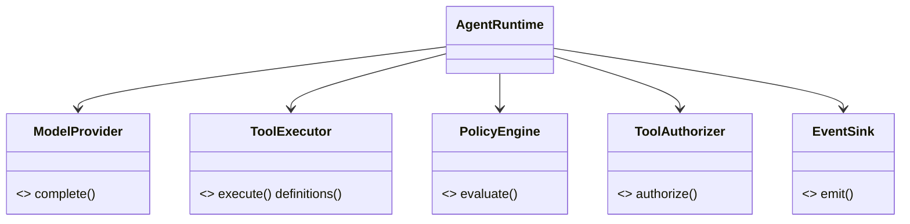
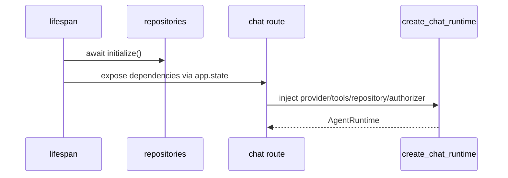
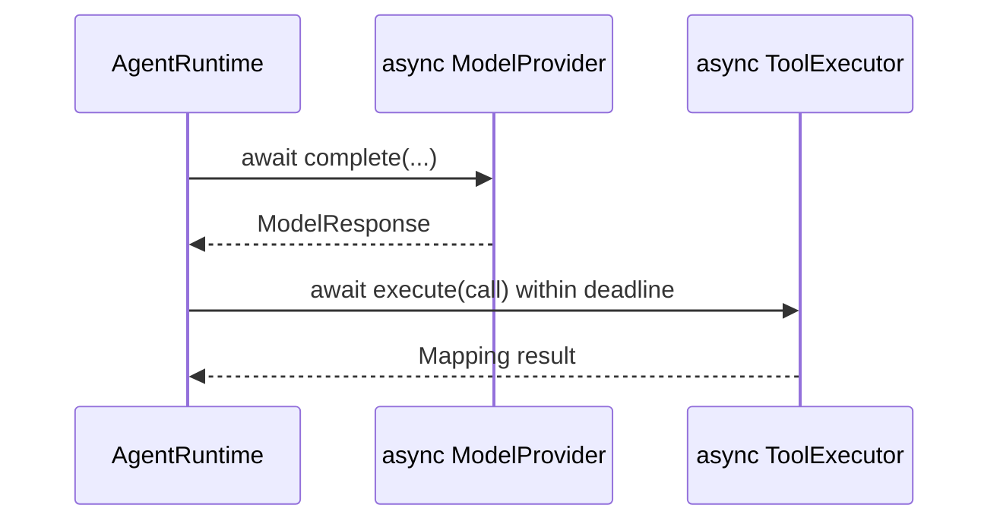

# 01 — Python architecture: OOP, Protocols, DI, and async

> **Documentation status:** Draft
> **Capability status:** implemented for current Protocol/DI composition; provider capability parity remains partial

## Outcomes and prerequisites

You will read Cogentrex's Python boundaries, explain application composition, structural typing and dependency injection (DI), and identify where async work can block or be cancelled. Prerequisites: classes, type hints, `await`, and context managers. Canonical reading: [Application factory, middleware, routers, and application state](../../concepts/application-composition.md), [OOP, Protocols, and DI](../../concepts/oop-protocols-dependency-injection.md), and [Async Python](../../concepts/async-python.md).

## Problem and mental model

The application factory owns process composition: it seeds application state, registers the middleware onion and router groups, and separates liveness from readiness. The runtime should depend on capabilities, not vendors or databases. Frozen dataclasses carry values; Protocols define ports; concrete adapters are injected at application/request composition roots.







## Source, tests, and evidence

Read [`create_app`/`lifespan`](../../../../backend/app/main.py), [`runtime/ports.py`](../../../../backend/app/runtime/ports.py), [`runtime/models.py`](../../../../backend/app/runtime/models.py), [`AgentRuntime.__init__`](../../../../backend/app/runtime/engine.py), and [`create_chat_runtime`](../../../../backend/app/runtime/factory.py). Use the [API map](../../reference/api-map.md) to distinguish router groups from endpoints. Tests: [`test_health.py`](../../../../backend/tests/unit/test_health.py), [`test_adapters.py`](../../../../backend/tests/unit/test_adapters.py), [`test_runtime_v2.py`](../../../../backend/tests/unit/test_runtime_v2.py), and `TestToolRegistration.test_satisfies_protocol` in [`test_tools.py`](../../../../backend/tests/unit/test_tools.py).

### Visual sequence

At `/learn?view=present`, the **Cogentrex From the Code** pack connects this module to Videos 1–4. Use Videos 1–3 for application/process/request composition, then Video 4 for Protocols, adapters, and dependency injection. Each player includes a timed transcript, source links, and evidence limitations.

## Read/test exercise

```bash
cd backend
uv run pytest -q tests/unit/test_adapters.py tests/unit/test_tools.py::TestToolRegistration::test_satisfies_protocol
```

Find each constructor dependency of `AgentRuntime` and classify it as port, value/configuration, callback, or clock. **Done:** your table explains why a scripted model can replace a network provider without changing the runtime.

## Failure, security, and observability

DI makes policy and redaction hard to accidentally replace only when the composition root is canonical; ad-hoc construction can omit them. Async cancellation and deadlines must cross provider/tool/approval waits. Mutable objects crossing an `await` are copied or frozen because another collaborator can mutate them. Events and correlation/run IDs reveal ordering and latency.

## Lab versus production

Protocols provide substitutability, not runtime isolation or operational reliability. Mocks prove orchestration; they do not prove external API behavior. Broad repository Mypy debt remains, although typed runtime boundaries are explicit.

## Interview answer

> I used hexagonal ideas without a framework: Protocols are ports, concrete provider/registry/repository classes are adapters, frozen dataclasses are boundary values, and factories are composition roots. Async is used for I/O and guarded by deadlines; deterministic clocks and injected fakes keep tests fast.

## Self-check

1. Why is `create_app()` an application factory?
2. How does a router differ from one endpoint?
3. Which `app.state` values are constructors versus live service instances?
4. How does a Protocol differ from inheritance?
5. Where does request-level DI occur?
6. Why inject a clock?
7. Why copy values before an `await`?
8. What can type checking not guarantee?

## Done criteria

- You can sketch the class diagram from memory.
- You can identify startup versus request-scoped dependencies.
- The focused tests pass and you can explain one cancellation risk.
