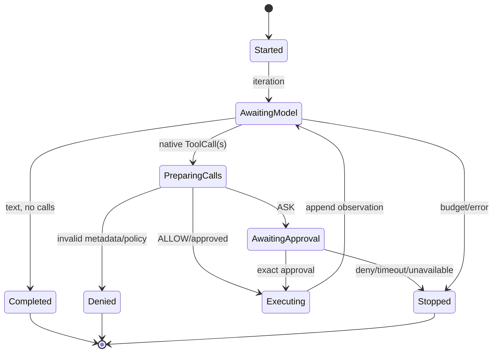
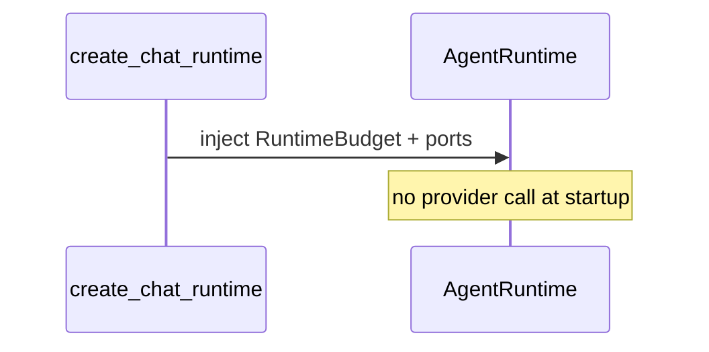
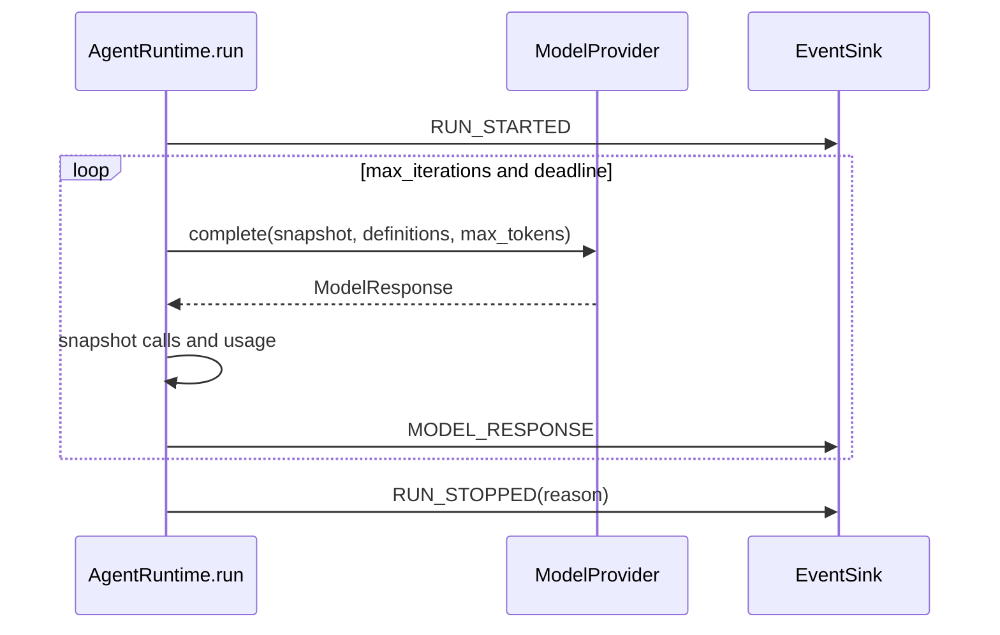

# 02 — Typed runtime and state machine

> **Documentation status:** Draft
> **Capability status:** implemented for the typed bounded runtime

## Outcomes and prerequisites

You will trace immutable messages and native tool calls, model runtime transitions, and interpret every terminal `StopReason`. Prerequisites: Modules 00–01 and Python dataclasses/enums. Read [Typed runtime](../../concepts/typed-runtime.md) and [State machines](../../concepts/state-machines.md), then use the [runtime walkthrough](../../code-walkthroughs/runtime.md).

## Mental model

`AgentRuntime.run` is an explicit bounded state machine even though it is implemented as a loop rather than a state-machine library. Typed values prevent text scraping from becoming an execution protocol.







## Source, tests, and evidence

Core symbols: [`Message`, `ToolCall`, `ModelResponse`, `TokenUsage`](../../../../backend/app/runtime/models.py); [`RuntimeBudget`, `AgentResult`, `StopReason`, `AgentRuntime.run`](../../../../backend/app/runtime/engine.py); [`AgentEventKind`](../../../../backend/app/runtime/events.py). Tests: [`test_runtime_v2.py`](../../../../backend/tests/unit/test_runtime_v2.py), [`test_runtime_budget_regressions.py`](../../../../backend/tests/unit/test_runtime_budget_regressions.py), and [`test_runtime_policy.py`](../../../../backend/tests/unit/test_runtime_policy.py). Evidence: [typed budgeted runtime](../../../IMPLEMENTATION-EVIDENCE.md#capability-matrix).

## Runnable trace exercise

```bash
cd backend
uv run pytest -q tests/unit/test_runtime_v2.py tests/unit/test_runtime_budget_regressions.py
```

Choose one budget test and write the ordered events and final stop reason. **Done:** the trace accounts for iterations, calls, token usage, and terminal reason without relying on provider prose.

## Failure, security, and observability

The runtime snapshots provider-owned calls before yielding to event sinks, blocks duplicate calls, prevalidates policy batches, and bounds final synthesis. Explicit errors distinguish policy denial, approval failure, exhausted budget, and runtime error. Events expose transition order; `AgentResult` exposes summary state. Event persistence can fail and provider usage accounting remains provider supplied.

## Lab versus production

Deterministic unit tests cover adversarial mutation and boundaries. They do not demonstrate external-provider token accuracy, load behavior, or distributed cancellation.

## Interview answer

> The loop is a typed state machine. Providers return `ModelResponse` with native `ToolCall` values; the runtime snapshots them, updates budgets, emits events, gates tools, appends observations, and terminates with a closed `StopReason` enum. This makes control flow testable independently of model wording.

## Self-check

1. Why not parse tool calls from text?
2. When is token usage checked?
3. Why snapshot a provider response before event emission?
4. What is the difference between `COMPLETED` and `ERROR`?
5. Which budget limits effects rather than model calls?

## Done criteria

- You can enumerate all `StopReason` values from source.
- You can reconstruct a tested event trace.
- You can identify the state machine's safety invariants.
