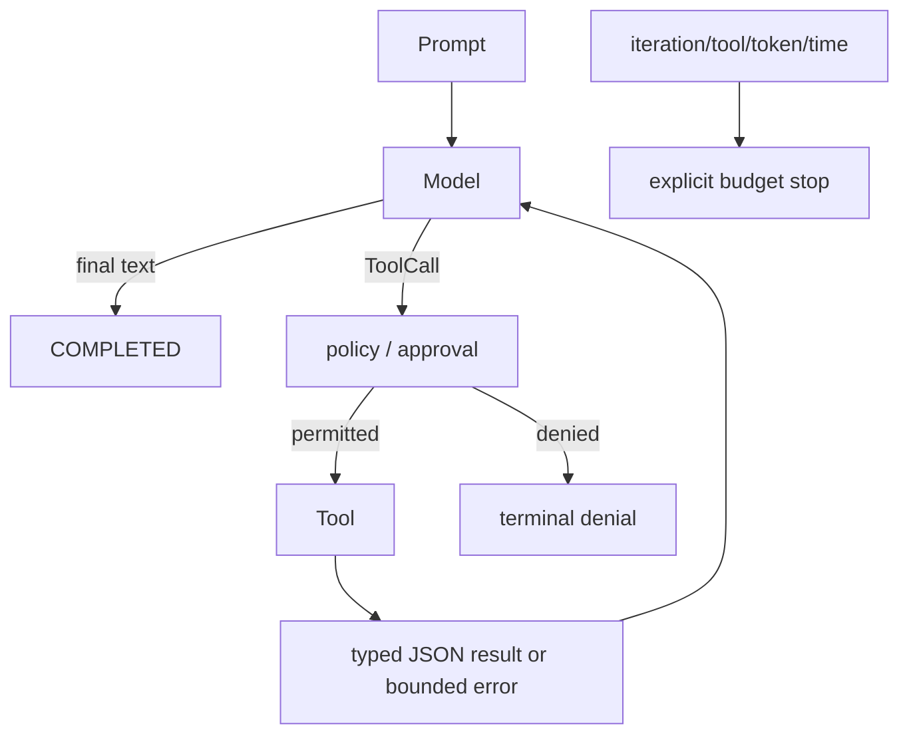
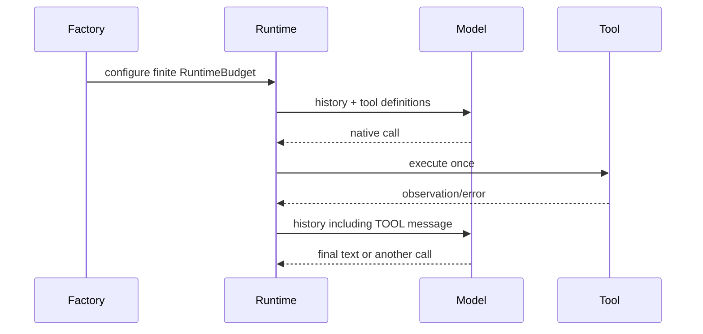

# 03 — ReAct loop, budgets, and stop reasons

**Status:** implemented (ReAct-style tool loop); generic self-reflection is **not implemented**

## Outcomes and prerequisites

You will distinguish reasoning/action/observation iteration from reflection, verifier delegation, and post-run evaluation; then test a bounded recovery path. Prerequisites: Module 02. Read [ReAct](../../concepts/react.md), [State machines](../../concepts/state-machines.md), and [Idempotency](../../concepts/idempotency.md).

## Mental model

ReAct alternates model decisions and tool observations. Archon does not expose hidden chain-of-thought; it handles provider-native calls and visible observations. A tool error can be returned to the model for another bounded attempt. That is local error feedback—not a general critique/rewrite/reflection subsystem. The evidence-only verifier child and recorded-run evaluations are separate features.





## Source, tests, and evidence

Inspect [`AgentRuntime.run`](../../../../backend/app/runtime/engine.py), especially duplicate-call tracking, `_within_deadline`, `_finalize`, and `_stop`; [`RuntimeBudget` and `StopReason`](../../../../backend/app/runtime/engine.py); and typed [`Role.TOOL`](../../../../backend/app/runtime/models.py). Tests: [`test_runtime_v2.py`](../../../../backend/tests/unit/test_runtime_v2.py), [`test_runtime_budget_regressions.py`](../../../../backend/tests/unit/test_runtime_budget_regressions.py), and [`test_reflexion.py`](../../../../backend/tests/unit/test_reflexion.py). The last filename uses historical “reflexion” terminology, but its tests prove only tool-error feedback and retry. See [implementation evidence](../../../IMPLEMENTATION-EVIDENCE.md#capability-matrix).

## Bounded-loop exercise

```bash
cd backend
uv run pytest -q tests/unit/test_reflexion.py tests/unit/test_runtime_budget_regressions.py
```

For `test_reflexion_self_correction`, list three model calls and two tool observations, then state which budget prevents an infinite retry. **Done:** you can explain why this test does not prove generic self-reflection.

## Failure, security, and observability

Loops amplify cost and effects. Iteration, tool, token, wall-clock, and result-size bounds limit damage; duplicate semantic calls are blocked. Policy mode reserves a complete call batch before execution. Tool failures are sanitized/bounded observations, but retries can still repeat non-idempotent external effects unless the tool provides an idempotency boundary. Watch event order and terminal reasons, not “thinking” prose.

## Lab versus production

Mocked recovery demonstrates orchestration, not autonomous reasoning quality. No generic self-reflection workflow is implemented. The bounded verifier specialist validates selected grounded claims and evaluation scores recorded runs; neither is ReAct reflection.

## Interview answer

> Archon implements a bounded ReAct-style control loop: model-native action, deterministic authorization, tool observation, repeat. Every loop consumes explicit budgets and ends with a typed reason. Error feedback allows a model to try a corrected call, but I would not market that as general self-reflection.

## Self-check

1. What constitutes an observation?
2. Why is a retry not necessarily idempotent?
3. Which four ideas must not be conflated with ReAct?
4. Why prevalidate a multi-call batch?
5. Which evidence proves a terminal transition?

## Done criteria

- Focused tests pass.
- Your trace includes a budget and a stop reason.
- You accurately disclaim generic self-reflection.
