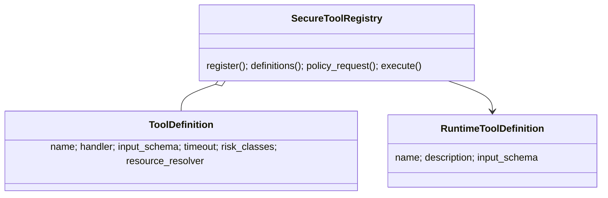
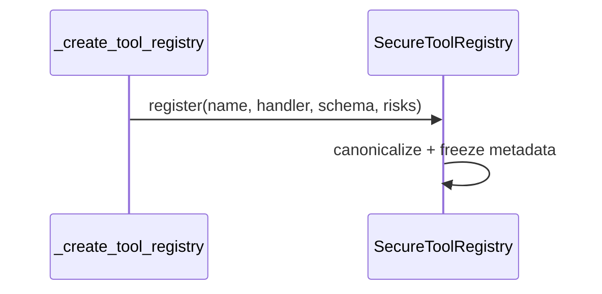
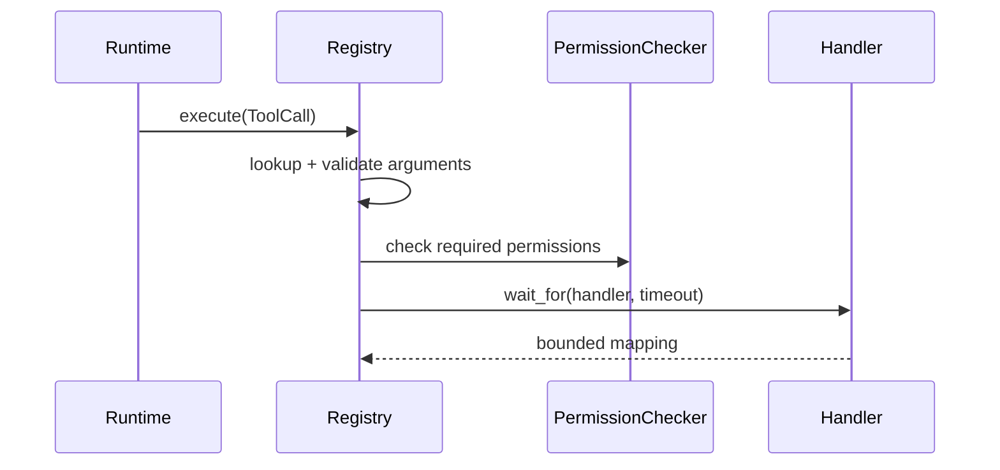

# 04 — Tool contracts and schemas

> **Documentation status:** Draft
> **Capability status:** typed tools implemented with a deliberately partial JSON Schema subset

## Outcomes and prerequisites

You will register a typed tool, explain validation order, and test malformed arguments without executing a handler. Prerequisites: Modules 01–03 and JSON objects. Read [Tool contracts](../../concepts/tool-contracts.md), [JSON Schema](../../concepts/json-schema.md), and the [tool registry walkthrough](../../code-walkthroughs/tool-registry.md).

## Mental model

A tool is an effectful capability behind metadata and gates—not an arbitrary Python function offered directly to a model. Registration validates trusted metadata; execution validates untrusted arguments, permissions, timeout, and audit behavior.







## Source, tests, and evidence

Read [`ToolDefinition`, `SecureToolRegistry.register`, `_validate_arguments`, `execute`, `definitions`, and `policy_request`](../../../../backend/app/tools/registry.py); runtime [`ToolCall` and `ToolDefinition`](../../../../backend/app/runtime/models.py); and live registration in [`_create_tool_registry`](../../../../backend/app/routes/chat.py). Tests: [`test_tools.py`](../../../../backend/tests/unit/test_tools.py) and policy integration in [`test_runtime_policy.py`](../../../../backend/tests/unit/test_runtime_policy.py). Evidence: [tool registry contracts](../../../IMPLEMENTATION-EVIDENCE.md#capability-matrix).

## Register/test exercise

Read the `calculator` registration, then run:

```bash
cd backend
uv run pytest -q \
  tests/unit/test_tools.py::TestToolInputValidation::test_valid_input_passes \
  tests/unit/test_tools.py::TestToolInputValidation::test_invalid_types_and_enums_fail_before_all_hooks \
  tests/unit/test_tools.py::TestToolTimeout::test_timeout_enforcement
```

Draft (do not wire) a `weather(city: str)` registration with `additionalProperties: false`, `RiskClass.NETWORK`, and a finite timeout. **Done:** your contract rejects missing, extra, and wrong-typed inputs before the handler.

## Failure, security, and observability

Unknown tools, duplicate names, malformed schemas, unexpected fields, type/enum mismatch, permission denial, timeout, and handler errors fail explicitly. Resource policy is not filesystem containment; execution must recheck TOCTOU-sensitive paths. Logs include correlation IDs and sanitized exception metadata; audit hooks cover success, denial, and timeout. Never put secrets in descriptions or schemas.

## Lab versus production

The validator supports object roots, required/properties, six primitive/container types, enum, and boolean `additionalProperties`; it is not a complete JSON Schema implementation. Sync handlers run in an executor and cancellation cannot forcibly undo already-started side effects.

## Interview answer

> The registry turns Python callables into governed capabilities. It canonicalizes immutable metadata at registration, exports provider-facing definitions, derives typed policy metadata, validates untrusted arguments before hooks, enforces permissions and timeouts, and audits outcomes.

## Self-check

1. Why validate schema at registration and arguments at execution?
2. What JSON Schema features are supported?
3. Why is a timeout not a transaction rollback?
4. Where are risk classes consumed?
5. Why must containment be checked again at execution?

## Done criteria

- The focused tests pass.
- Your draft schema is within the supported subset.
- You can narrate gate order and limitations.
