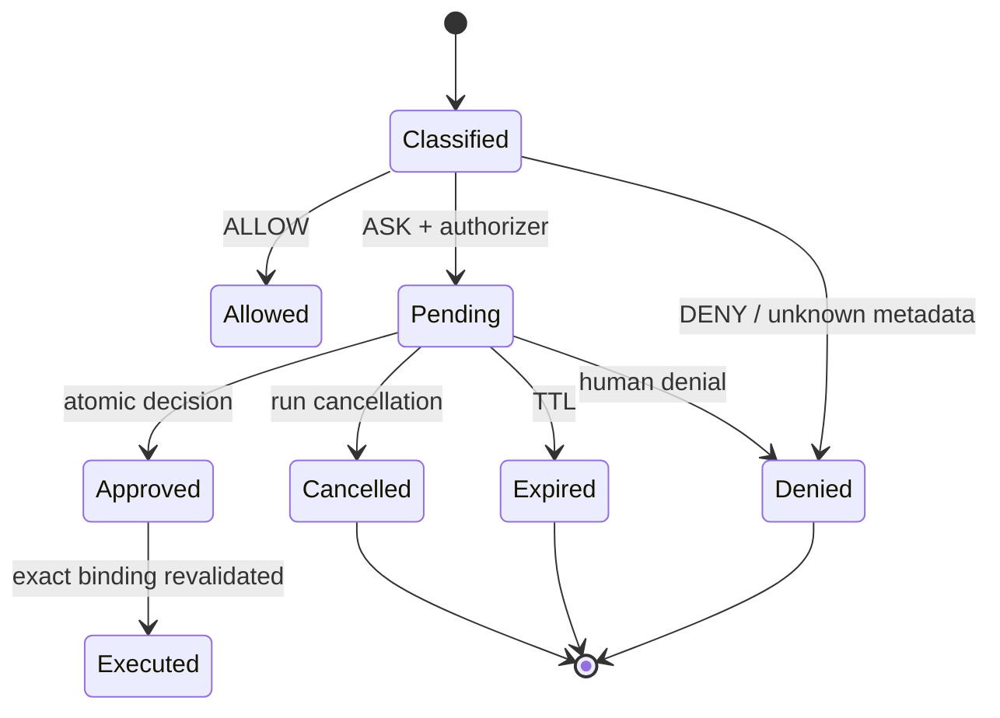
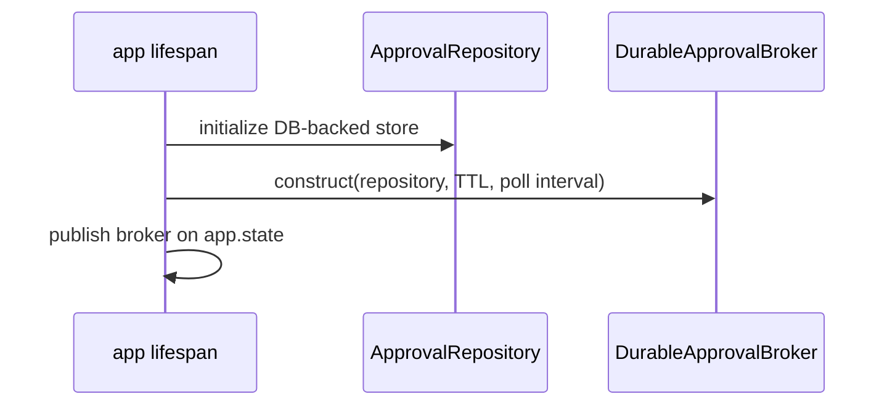
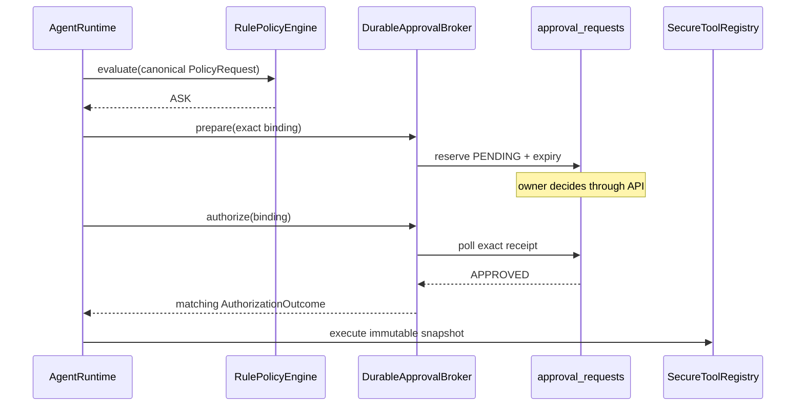

# 05 — Policy and durable approvals

> **Documentation status:** Draft
> **Capability status:** policy and durable exact-bound approvals implemented locally

## Outcomes and prerequisites

You will predict ALLOW/ASK/DENY, explain exact-bound durable approval, and test atomic one-shot decisions. Prerequisites: Modules 02–04, hashes, and database transactions. Read [Policy engine](../../concepts/policy-engine.md), [Durable approvals](../../concepts/durable-approvals.md), [Idempotency](../../concepts/idempotency.md), and the [policy/approval walkthrough](../../code-walkthroughs/policy-and-approval.md).

## Mental model

Policy answers whether a classified request may proceed. Approval supplies a human decision only for `ASK`; it does not replace policy. A receipt binds owner, conversation, run, native call ID, canonical tool name, and canonical argument hash so approval cannot be replayed for changed work.







## Source, tests, and evidence

Inspect [`PolicyRule`, `PolicyRequest`, `PolicyDecision`, `RulePolicyEngine.evaluate`, `canonical_arguments_hash`](../../../../backend/app/security/policy.py); [`default_policy_rules`](../../../../backend/app/security/default_policy.py); [`AuthorizationRequest`/`AuthorizationOutcome.binds`](../../../../backend/app/security/approvals.py); [`ApprovalRepository`](../../../../backend/app/security/approval_repository.py); [`DurableApprovalBroker`](../../../../backend/app/security/live_approvals.py); runtime enforcement in [`AgentRuntime`](../../../../backend/app/runtime/engine.py); startup in [`main.py`](../../../../backend/app/main.py). Tests: [`test_policy_engine.py`](../../../../backend/tests/security/test_policy_engine.py), [`test_runtime_policy.py`](../../../../backend/tests/unit/test_runtime_policy.py), [`test_approval_repository.py`](../../../../backend/tests/unit/test_approval_repository.py), and [`test_durable_live_approvals.py`](../../../../backend/tests/unit/test_durable_live_approvals.py). Evidence: [policy and approvals rows](../../../IMPLEMENTATION-EVIDENCE.md#capability-matrix).

## Deny/ask/allow probe

```bash
cd backend
uv run pytest -q \
  tests/security/test_policy_engine.py \
  tests/unit/test_durable_live_approvals.py \
  tests/unit/test_runtime_policy.py
```

Trace one pure read, one write awaiting approval, and one unclassified side effect. **Done:** predictions match tests; the write executes at most once and changed arguments cannot reuse its receipt.

## Failure, security, and observability

Unknown/empty risk metadata and unmatched side effects fail closed. Missing authorizer, malformed/mismatched outcomes, expiry, cancellation, DB failure, and timeout cannot authorize execution. Conditional SQL transitions make competing decisions one-shot. Raw arguments are deliberately absent from approval records. Policy and approval events carry rule/action/reason metadata without argument secrets.

## Lab versus production

Durability and cross-process polling are tested on supported databases and observed locally. This is not proof of global multi-region consistency or public operational SLOs. Approval controls authorization, not exactly-once behavior in an external service after an ambiguous network failure.

## Interview answer

> Policy is deterministic classification and matching; approval is a durable human decision for one exact request. Archon hashes canonical arguments and binds the receipt to owner/run/call/tool. Atomic terminal transitions, TTL, cancellation, and revalidation prevent broad or replayed consent, while unknown side effects fail closed.

## Self-check

1. Why does ASK require an authorizer?
2. What fields form the exact binding?
3. How are equal-specificity deny rules handled?
4. Why omit raw arguments from approval rows?
5. Why does approval not guarantee exactly-once external effects?

## Done criteria

- Focused tests pass.
- You can predict default rules and fail-closed cases.
- You can explain exact binding, atomicity, expiry, and the external idempotency gap.
